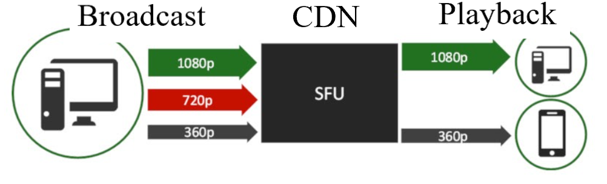
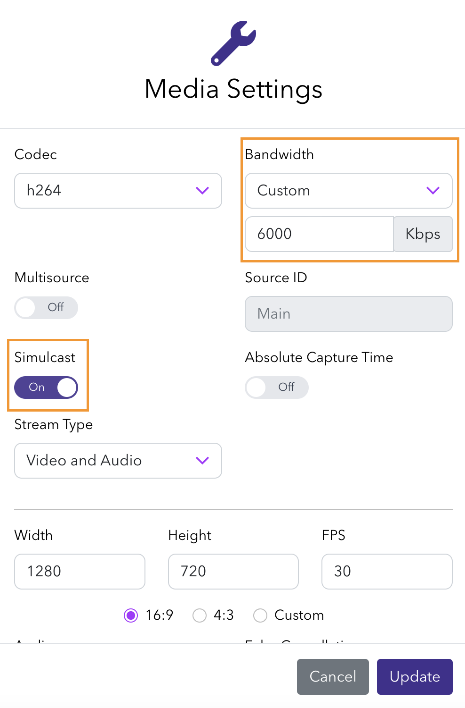
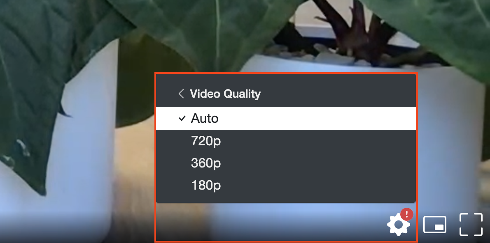
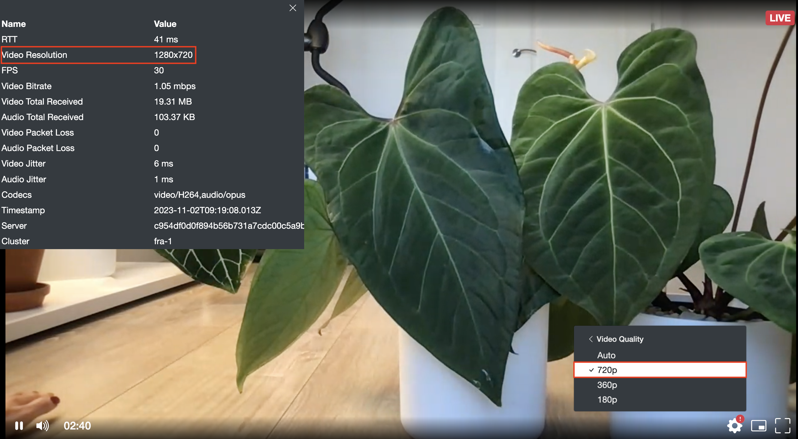
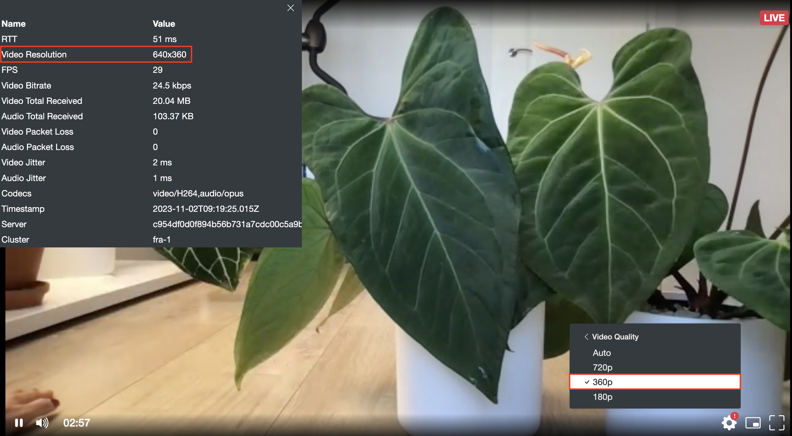
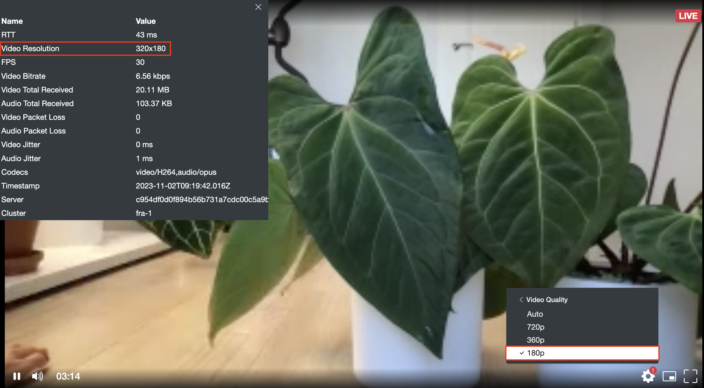

Simulcast is a mechanism for distributing streaming content with variations that are optimized for viewers who are under different network conditions or device resolutions. By using a mechanism of WebRTC to distribute content, multiple sources will be available simultaneously that have been encoded with different bitrates and resolutions (HD, SD, LD).

The platform's _Selective Forwarding Unit (SFU)_ is responsible for distributing the media and adjusts the bit rate so that the streaming player will select the highest quality stream it can reliably playback for each viewer. This is known as **Adaptive Bitrate (ABR) streaming**. The decision is made based on factors like available bandwidth but also other considerations such as device size, video layout, and CPU utilization may be considered. With **Multi-bitrate (MBR)** streaming, the end-user can be given controls to choose which resolution they would like to receive instead of letting the SFU _auto_ select it. 

This bitrate adaptation is available for [RTMP](/millicast/broadcast/using-rtmp-and-rtmps.md), [SRT](/millicast/broadcast/using-srt.md), and [WHIP](/millicast/broadcast/webrtc-whip.mdx) broadcast protocols.

Simulcast provides flexibility that allows viewers to adjust their individual experience for specific circumstances. For _multicast_ use cases of distributing to multiple destinations, review the [Syndication](/millicast/distribution/syndication.md) guide.

> 👍 Getting Started
> 
> If you haven't already, begin by following the [Getting Started](/millicast/introduction-to-streaming-apis.mdx) tutorial to create a Dolby.io application and start your first broadcast.

## Configuring Simulcast

### Requirements

Before broadcasting content using Simulcast, make sure you:

- Enabled the Simulcast setting in the dashboard
- Use [multisource streams](/millicast/broadcast/multi-source-broadcasting.md) either by using an encoder that is capable of transcoding multiple sources or by using multiple devices that each contribute to the broadcast
- Use either Chrome or Edge
- Use the H.264 or VP8 video codec
- Disabled b-frames for better results
- Have adequate bandwidth at the broadcast source to send multiple contribution sources

> 🚧 Bandwidth Usage
> 
> Simulcast is included with plans at no additional cost when enabled. However, since multiple streams will be published, there will be more bits sent to the platform which counts as a bandwidth increase. Conversely, viewers may receive a resolution and bitrate at a lower level which may decrease bandwidth consumption overall.

### How-to enable Simulcast with the Dolby.io dashboard

To activate Simulcast and stream using the [Streaming Dashboard Broadcaster](/millicast/streaming-dashboard/how-to-broadcast-in-dashboard.md#broadcaster), open the _Media Settings_ by clicking on the gear icon. This allows you to toggle the option to be on. The bandwidth settings can also be adjusted to achieve the desired bitrate.

Set the **Bandwidth** as _Custom > 6000_, which will provide sufficient _Kbps_ for a high-quality Simulcast stream. Similarly, the **Width**, **Height**, and **FPS** should be adjusted to match your desired output.

You are now ready to send your live stream and can select the _start_ button on the broadcaster. The browser will provide multi-bitrate contributions during broadcast when using the _Streaming Dashboard_. 

You can use the [Hosted Player](/millicast/playback/hosted-viewer.md) to check the results.

### How-to enable Simulcast from an encoder

You may choose to use a [Hardware Encoder](../broadcast/hardware-encoders.mdx) that can support multi-bitrate encoding directly or [Software Encoders](../broadcast/software-encoders.mdx) that use additional plugins and configuration to enable separate renditions. Regardless of whether you are using RTMP, SRT, or WHIP as your broadcast protocol, you will need to configure multiple contributions to the broadcast with various quality layer settings.

Specific integration examples:

- [How-to Setup Multi-Bitrate Simulcast with OBS](/millicast/software-encoders/using-obs.md#multi-bitrate-simulcast-contribution)
- [How-to Setup Multi-Bitrate Simulcast with vMix](/millicast/software-encoders/broadcasting-with-vmix.md#setup-multi-bitrate-rtmp-streaming-with-vmix)
- [How-to Setup Multi-Bitrate Simulcast with Videon](/millicast/hardware-encoders/videon.md#how-to-use-multi-bitrate-on-videon-edgecaster)

As long as the WHIP, RTMP, or SRT client makes a Simulcast offer the media server will accept it.

#### Publish URL

The following parameters are significant to determine the server endpoint:

- **simulcastId**: An identifier that assigns feeds produced by a single camera as Simulcast layers. All feeds that have the same **simulcastId** are published together as different quality layers. You can identify each layer using a different **sourceId**.
- **token**: The publish token used for the broadcast.
- **sourceId**: A unique identifier for a specific feed. Two feeds can have the same **sourceId** only when they are the same and used as backup feeds in [Redundant Ingest](/millicast/broadcast/redundant-ingest/index.md).

The following table presents an example of using **simulcastId** and **sourceId** for five different feeds. Video 1 and 2 is published using two Simulcast layers, video 3 is published without Simulcast.

| Content | Feed | Simulcast | Resolution | SourceId         | SimulcastId  |
| ------- | ---- | --------- | ---------- | ---------------- | ------------ |
| Video 1 | 1    | Enabled   | 640x360    | 1low             | sim_source_1 |
| Video 1 | 2    | Enabled   | 1280x720   | 1high            | sim_source_1 |
| Video 2 | 3    | Enabled   | 854x480    | 2low             | sim_source_2 |
| Video 2 | 4    | Enabled   | 1920x1080  | 2high            | sim_source_2 |
| Video 3 | 5    | Disabled  | 640x360    | non_sim_source_3 | -            |

Some broadcast tools will use a single **URL** and others may require separate **publish path** and **stream name**.

For WebRTC Simulcast  append `?simulcastId&sourceId=1` to the stream **URL**, with each quality layer having a different **sourceId**. _(note that the [publishing parameters](/millicast/broadcast/broadcast-parameters.md) are appended to the URL and not the token)._

#### RTMP Multi-Bitrate Publishing Example

For example you can have a WebRTC broadcast with four qualities, 1080p, 720p, 480p, and 360p like so:

- 1080p stream URL (attach audio if desired to this first one): `rtmp://rtmp-auto.millicast.com:1935/v2/pub
  myStreamName?token=9797201bbb26f7f7...bae738464f36b1eb8a05473d03c04b&sourceId=0&simulcastId`
- 720p stream URL: `rtmp://rtmp-auto.millicast.com:1935/v2/pub
  myStreamName?token=9797201bbb26f7f7...bae738464f36b1eb8a05473d03c04b&sourceId=1&simulcastId&videoOnly`
- 480p stream URL: `rtmp://rtmp-auto.millicast.com:1935/v2/pub
  myStreamName?token=9797201bbb26f7f7...bae738464f36b1eb8a05473d03c04b&sourceId=2&simulcastId&videoOnly`
- 360p stream URL: `rtmp://rtmp-auto.millicast.com:1935/v2/pub
  myStreamName?token=9797201bbb26f7f7...bae738464f36b1eb8a05473d03c04b&sourceId=3&simulcastId&videoOnly` 

#### WebRTC via WHIP and Multi-Bitrate Publishing Example

For example you can have a WebRTC broadcast with four qualities, 1080p, 720p, 480p, and 360p:

- 1080p stream URL: `https://director.millicast.com/api/whip/myStreamName?simulcastId&sourceId=0` + publishing token
- 720p stream URL: `https://director.millicast.com/api/whip/myStreamName?simulcastId&sourceId=1` +  publishing token
- 480p stream URL: `https://director.millicast.com/api/whip/myStreamName?simulcastId&sourceId=2` + publishing token
- 360p stream URL: `https://director.millicast.com/api/whip/myStreamName?simulcastId&sourceId=3` + publishing token

> 👍 Multi-Source Builder
> 
> The [Multi-source Builder](/millicast/streaming-dashboard/multi-source-builder.md) tool within the dashboard can assist with constructing these target endpoints. When using RTMP, SRT, and WHIP contributions you will use a separate publish url for each source. The _Multi-source Builder_ will help construct these URLs which you can export and download the configuration as a reference while setting up each device you will be broadcasting from.

### Recommended settings for Simulcast

The specific settings available may vary depending on your available [Hardware](../broadcast/hardware-encoders.mdx) or [Software](../broadcast/software-encoders.mdx) encoders. A few settings that are common:

- **Encoder**: H.264 (AVC), x264, ffmpeg, or nvenc
- **Encoding Mode**: variable bitrate
- **H.264 Profile**: High
- **Keyframe Interval**: 0.5
- **Quality**: Lowest (if optimizing for real-time performance and minimal latency)

Individual source contributions can be customized however you like, but typically follow High, Medium (or Standard), and Low.

#### High quality layer

|            |           |
| :--------- | :-------- |
| Source ID  | 1         |
| Name       | 1080p     |
| Resolution | 1920x1080 |
| Bitrate    | 6000kbps  |
| Keyframe   | 2         |
| B-Frames   | 0         |

#### Medium quality layer

|            |          |
| :--------- | :------- |
| Source ID  | 2        |
| Name       | 720p     |
| Resolution | 1280x720 |
| Bitrate    | 2000kbps |
| Keyframe   | 2        |
| B-Frames   | 0        |

#### Low quality layer

|            |         |
| :--------- | :------ |
| Source ID  | 3       |
| Name       | 360p    |
| Resolution | 640x360 |
| Bitrate    | 500kbps |
| Keyframe   | 2       |
| B-Frames   | 0       |

## View multi-bitrate streams with the hosted player

During [Playback](/millicast/playback/index.mdx), stream quality defaults to _Auto_ and will be determined by a few factors:

- The stream quality available from the broadcaster
- The stream quality requested by the receiver if switched from _Auto_
- The stream quality is estimated based on the receiver's available bandwidth

When using the [Hosted Player](/millicast/playback/hosted-viewer.md), viewers will be automatically served video quality with an adaptive bitrate appropriate for them. It may take a brief amount of time for the bandwidth estimation to determine the ideal quality setting. Setting the bandwidth to the highest quality setting of 6000kbps during broadcast can help reduce the amount of time this adaptation takes.

The desired Video Quality can also be chosen manually. This is done within the viewer by clicking the _gear_ icon in the bottom right and selecting video quality, as shown below.

On the viewer, you can also check the **bitrate throughput** by selecting a quality level and then selecting the [Media Stats](/millicast/analytics/media-stats.md) within the _gear_ settings icon.

> 📘 Building Your Own Custom Player To Support Multi-bitrate Streams
> 
> If you are using the Millicast [Web SDK](/millicast/client-sdks/web.mdx) to build your own playback experience and want to support Simulcast, see the [Multisource Playback](/millicast/playback/source-and-layer-selection.md) guide for details on handling events and layer selection.

## Simulcast demo video

Here is a video showing the Simulcast playback using the [hosted player](/millicast/playback/hosted-viewer.md) built with the Javascript [Web SDK](/millicast/client-sdks/web.mdx).

  <iframe width="560" height="315" src="https://www.youtube.com/embed/kXkwNyA6X24?si=_tnQTf2Fympb0K9O" title="YouTube video player" frameborder="0" allow="accelerometer; autoplay; clipboard-write; encrypted-media; gyroscope; picture-in-picture; web-share" allowfullscreen></iframe>

## Troubleshooting

To diagnose simulcast issues, it can be helpful to review details about the broadcast source and playback client:

- Operating system and web browser
- Hardware encoders or software applications used
- Publishing encoder settings (framerate, bitrate, resolution, etc.)
- Bandwidth of both broadcast source and playback client
- Video quality selection
- The [cluster regions](/millicast/distribution/multi-region-support/index.md) used for broadcasting and playback

### How-to check network conditions

There are some tools that can test the packet loss and bitrate giving details on the network conditions.

- View the [Media Stats](/millicast/analytics/media-stats.md) from the hosted player.
- Visit https://rtctest.com or https://packetlosstest.com/ for WebRTC testing tools of a local network.
- Incorporate the [dolbyio/web-webrtc-stats](https://github.com/DolbyIO/web-webrtc-stats) project into your custom applications for additional WebRTC diagnostics.

There are network limiter test tools that can help simulate conditions when trying to reproduce a problem.

## Learn more

Learn more by exploring the [developer blog](https://dolby.io/blog/tag/distribution/) and [code samples](https://github.com/orgs/dolbyio-samples/repositories?q=distribution).

