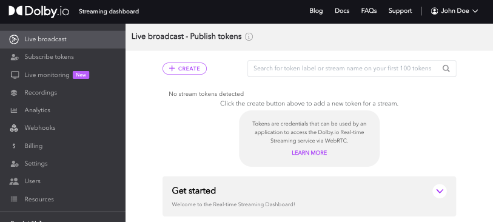
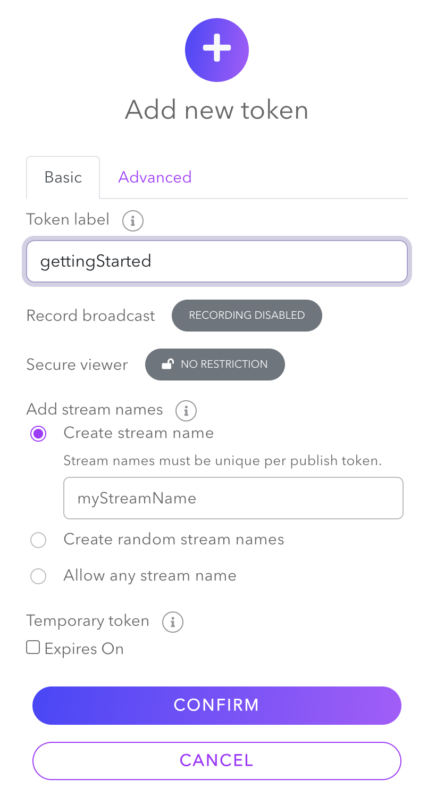
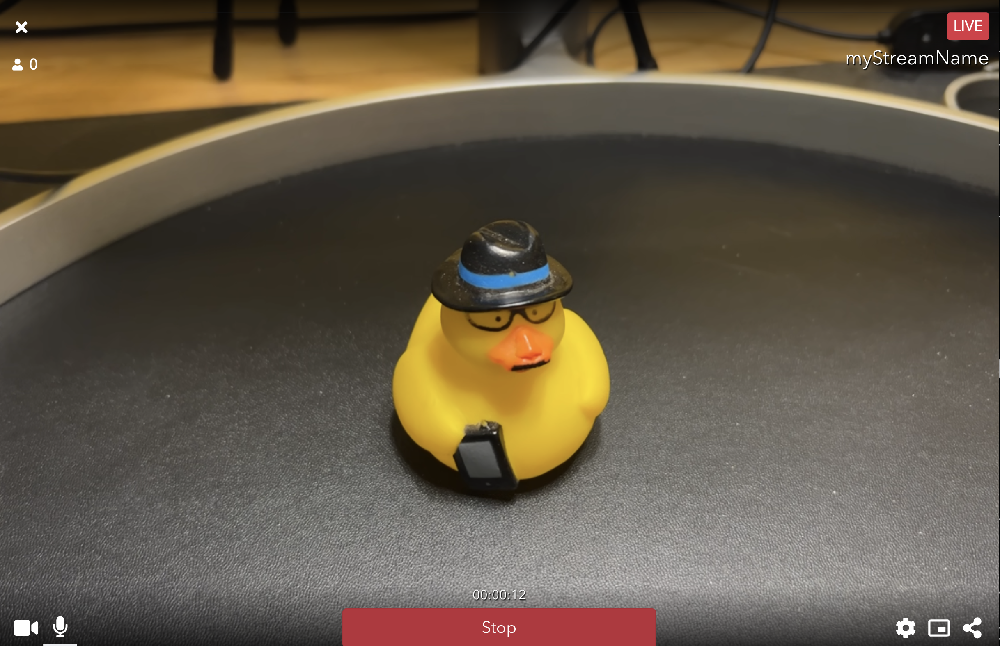
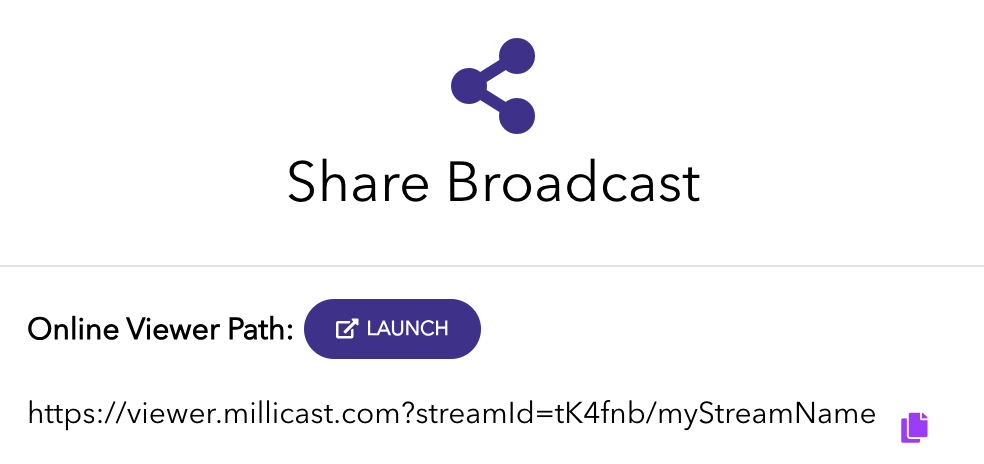
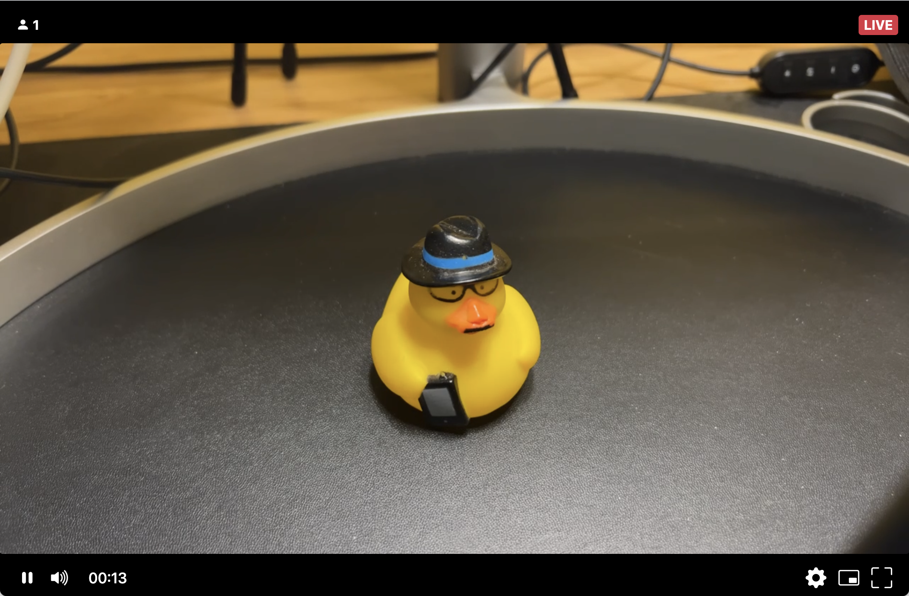

This part explains how to get started using just the Dolby.io Streaming Dashboard to both broadcast and playback a real-time stream without writing any code.

This tutorial is split into two sections:

- [Broadcast from the Dolby.io Dashboard](/millicast/getting-started/getting-started-using-the-dashboard.md)11-capture-and-broadcast-from-the-dolbyio-dashboard)
- [Playback with the Streaming Viewer](/millicast/getting-started/getting-started-using-the-dashboard.md)12-playback-content-with-the-streaming-viewer)

# 1.1 Capture and broadcast from the Dolby.io dashboard

We will begin by [broadcasting](/millicast/broadcast/index.md) directly from the Dolby.io Streaming Dashboard, [capturing](/millicast/capture/index.md) audio and video with a web camera.

## a. Create a publish token

When you log into your Dolby.io account you should select the **Streaming** tab. If you haven't used your account before, you'll see a screen similar to Figure 1a below.

Click the `+ CREATE` button and you'll be prompted to configure a new token.  The token is used to authenticate an application for publishing a live stream from your account.

Give this token a meaningful label such as _gettingStarted_ and click the `CONFIRM` button. You can have more than one stream using the same token, so each can be labeled independently such as this one having the default _myStreamName_.

## b. Start broadcast

Return to the _Live broadcast_ section and click the `BROADCAST` button.

From the dashboard broadcast application that opens, click the green `Start` button to begin a broadcast. You will need to give permission to access your microphone and camera. Once the stream begins, you can see the _LIVE_ box in the upper right corner and a timecode for the duration of the stream above the `Stop` button.

> 📘 Broadcast Guide
> 
> Visit the [How to Broadcast in Dashboard](/millicast/streaming-dashboard/how-to-broadcast-in-dashboard.md) guide to learn more details about the options available for configuring the publish token and working with this dashboard broadcast application.

# 1.2 Playback content with the streaming viewer

In the previous section, you created a publishing token and started to broadcast. Next, we will open a hosted streaming viewer to [playback](/millicast/playback/index.md) the real-time stream.

In the lower right-hand corner of the dashboard broadcast application are some icons. Click on the sharing icon like the one circled in Figure 2a.

Click the `LAUNCH` button to open the hosted live viewer.

It may seem like you are watching a local mirror of your video camera, but this feed is making a full round-trip to the servers and back to the browser again. Note the low delay between capture from the webcam and playback within the browser.

The viewer has some user controls to pause the stream, configure settings, and view the number of other stream viewers.

# Continue learning

In this tutorial, we were able to start and view a real-time stream. To continue with your project, you may want to customize the experience. The next part will help with getting started to build [a custom web application](/millicast/getting-started/getting-started-creating-real-time-streaming-web-app.md).
