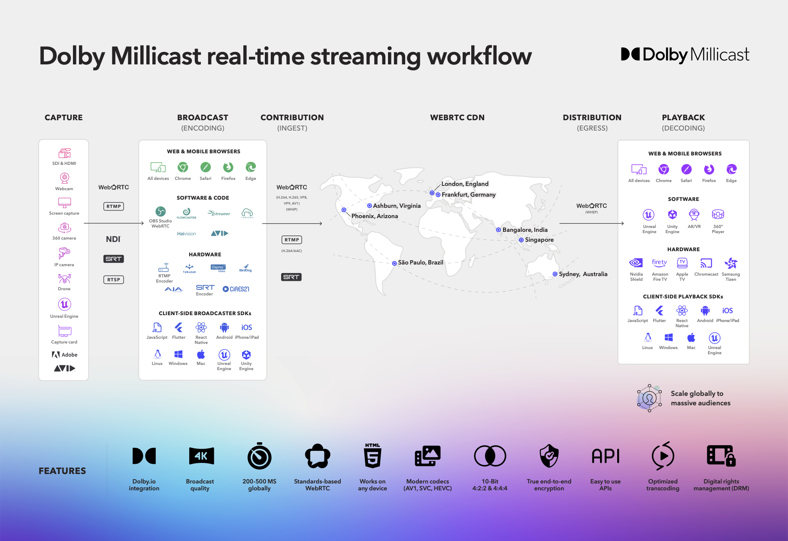

Dolby.io Streaming APIs were created to make it easier to stream your high-value content at scale with ultra-low latency.

Deliver 4k video and audio streams to massive audiences while maintaining under half a second of latency anywhere in the world. With the scale, speed, and quality of the service, the Dolby.io Real-time Streaming APIs support a range of use cases including live events, sports betting, virtual auctions, remote production, and more.

# Real-time Streaming

    
  <a class="dolbyio-card" href="/streaming-apis/docs/capture">
    

      
    

    
Capture

    

      Capture audio and video from a wide range of devices.
    

  </a>
  
  <a class="dolbyio-card" href="/streaming-apis/docs/broadcast">
    

      
    

    
Broadcast

    

    	Encode content for broadcasting.
    

  </a>

  
   <a class="dolbyio-card" href="/streaming-apis/docs/distribution">
    

      
    

    
Distribution

    

      Distribute WebRTC at scale with our WebRTC CDN.
    

  </a>
  
  <a class="dolbyio-card" href="/streaming-apis/docs/playback">
    

      
    

    
Playback

    

      Decode content for any device with our client SDKs.
    

  </a>
  
  
  

# What is Real-time Streaming?

_Low Latency Streaming_ has been available for a number of years to deliver media content over HTTP within about 10 seconds. With _Real-time Streaming_, we can deliver content glass to glass from capture, encoding it for broadcast, distributing it over a content delivery network so that an end-user can playback that experience globally at scale on average _**under 1 second**_!

This enables a wider range of use cases where precision matters for timely high-value streaming content.

<iframe width="560" height="315" src="https://www.youtube.com/embed/rxjlxHNMmdg" title="YouTube video player" frameborder="0" allow="accelerometer; autoplay; clipboard-write; encrypted-media; gyroscope; picture-in-picture; web-share" allowfullscreen></iframe>

# How it works

Supporting many <a href="https://dolby.io/solutions/" target="_blank">use cases</a>, real-time streaming has components that support the required capabilities for [Capture](/millicast/capture/index.md), [Broadcast](/millicast/broadcast/index.md), [Distribution](/millicast/distribution/index.md), and [Playback](/millicast/playback/index.md).

## Capture streaming content

To [capture](/millicast/broadcast/index.md) content you need either a physical camera capturing the content, a virtual camera from within a game engine, or a source of content available via another content creation tools such as OBS or Adobe Premiere. 

Many devices are able to capture a compatible media stream encoding:

✓ **SDI & HDMI**, Serial Digital Interface (SDI) and High-Definition Multimedia Interface (HDMI) connections are common across many professional cameras and capture devices.

✓ **NDI**, Network Device Interface, is a commonly used protocol for Video over IP that is supported by video mixers, capture cards, and other devices.

✓ **RTSP**, Real-time Streaming Protocol, is commonly supported in media streaming servers that capture and process video and audio feeds.

Check with your specific hardware provider for direct support of WebRTC or one of these common device interfaces.

  

      
    <a class="small-text-only-btn" style={{width: "50%", backgroundColor: "rgba(81,111,247,.2)"}} href="https://docs.dolby.io/streaming-apis/docs/capture">
      
📚 Continue to the Capture Guide

    </a>
      
  

## Broadcast encoded media

[Broadcasting](/millicast/broadcast/index.md) content requires access to the public internet and encoding, which can be accomplished via the browser, software, hardware, and via the [Dolby.io Client-side broadcaster SDKs](https://docs.dolby.io/streaming-apis/docs/client-sdks). 

The Dolby.io CDN can ingest streams encoded in a few main formats: 

✓ **WebRTC**, an internet transfer protocol that supports video codecs H.264, H.265, VP8, VP9, AV1, and the Opus audio codec. Broad support is made possible through implementations of **WebRTC HTTP Ingest Protocol (WHIP)**.

✓ **SRT**, a video transfer protocol that can be transmuxed to WebRTC via the Dolby.io CDN and supports H.264 video and AAC audio codecs.

✓ **RTMP and RTMPs**, internet transfer protocols that can be transmuxed to WebRTC via the Dolby.io CDN that supports only the H.264 video codec. 

_SRT and RTMP will automatically have AAC audio converted to Opus via the CDN_

  

      
    <a class="small-text-only-btn" style={{width: "50%", backgroundColor: "rgba(81,111,247,.2)"}} href="https://docs.dolby.io/streaming-apis/docs/broadcast">
      
📚 Continue to the Broadcast Guide

    </a>
      
  

## Distribution with WebRTC CDN

The Dolby.io Streaming CDN offers a range of server-side features that users can toggle and adjust via [the REST APIs](/millicast/https://docs.dolby.io/streaming-apis/docs/basic-api-tutorial) or the Dashboard to ensure [distribution](/millicast/distribution/index.md) of streams is secure, stable, and scalable. 

✓ **Scalability** to distribute content to large audiences across multiple regions in real-time.

✓ **Stability** with features like simulcast that provide redundancy and adaptability to maintain a good user experience across different network and device conditions while maintaining a high uptime and Quality of Experience (QoE).

✓ **Security** through features that protect your content by securing streams with subscriber tokens, self-signed tokens, allowing only specific origins, geo-blocking, and IP filtering.

Distribution of streaming content requires scalability, stability, and security along with a collection of robust features including stream recordings, multi-source streams, multi-bitrate delivery, backup publishing, stream syndication, and streaming analytics.

  

      
    <a class="small-text-only-btn" style={{width: "50%", backgroundColor: "rgba(81,111,247,.2)"}} href="https://docs.dolby.io/streaming-apis/docs/distribution">
      
📚 Continue to the Distribution Guide

    </a>
      
  

## Playback streaming media

The final component of the streaming workflow is taking the stream, after it has been passed through the Dolby.io CDN, and playing it back to the end viewer. Similar to the broadcasting side, decoding and [playback](/millicast/playback/index.md) is supported via web and mobile browsers, software, hardware, and via client-side broadcast SDKs.

✓ Hosted streaming player with low-code drop-in support for many applications.

✓ Interactive playback for streams that support dynamic tracks, multiple layers, multiple views, and playback events.

✓ Support with **Client SDKs** for building custom playback viewers for Web, iOS, Android, React-Native, Flutter, Unity, Unreal, .NET, and desktop applications.

✓ Broad support is made possible through implementations of **WebRTC HTTP Egress Protocol (WHEP)**.

✓ Preview streams with poster images and thumbnails.

✓ **REST and GraphQL APIs** that provide analytics for tracking individual streams and user bandwidth tracking for who is viewing a stream.

  

      
    <a class="small-text-only-btn" style={{width: "50%", backgroundColor: "rgba(81,111,247,.2)"}} href="https://docs.dolby.io/streaming-apis/docs/playback">
      
📚 Continue to the Playback Guide

    </a>
      
  

