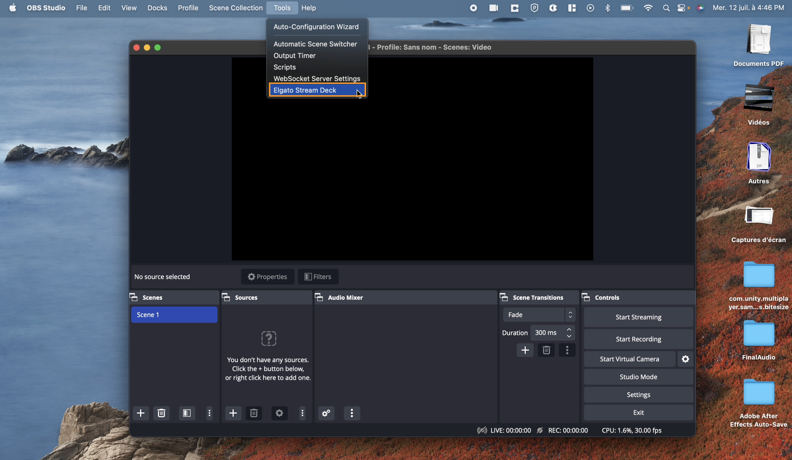
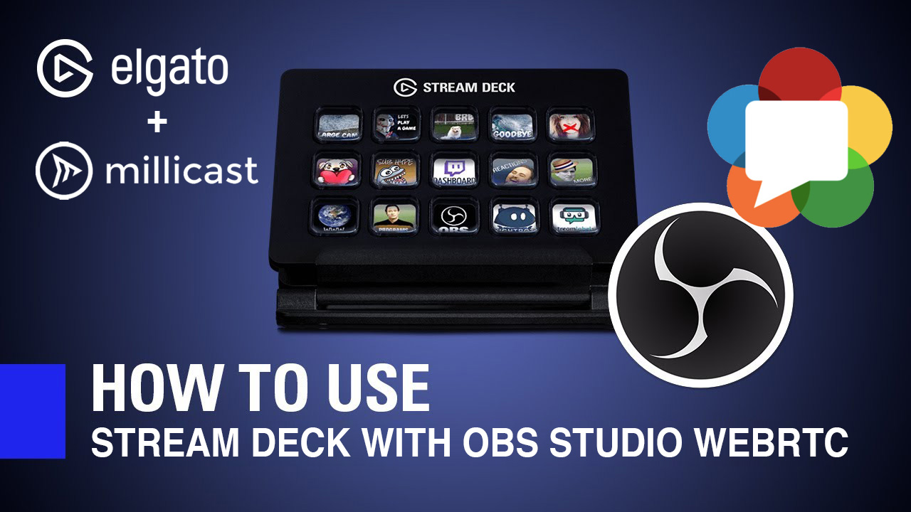
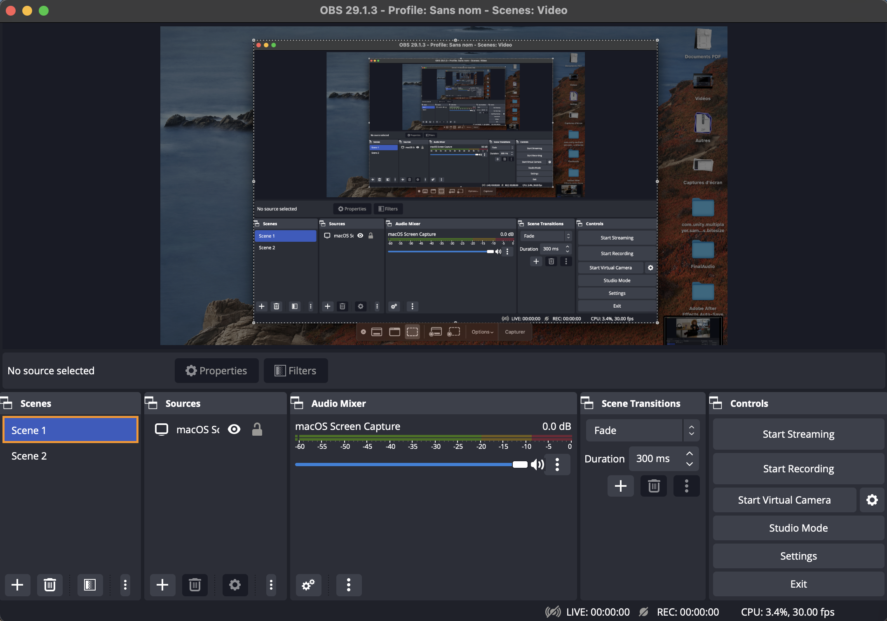
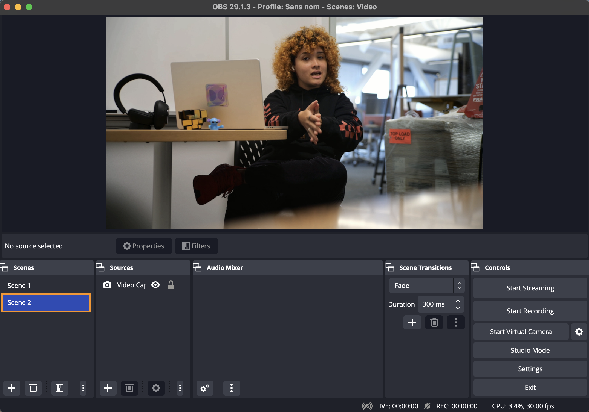
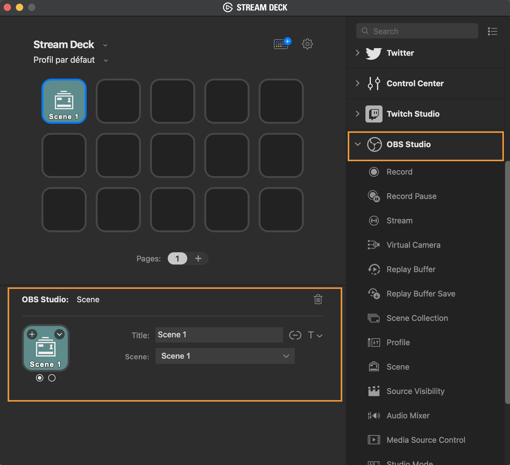
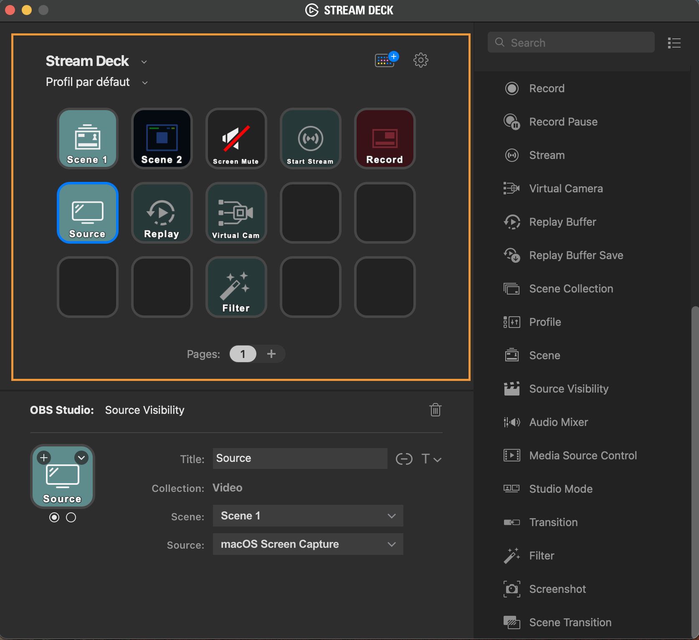
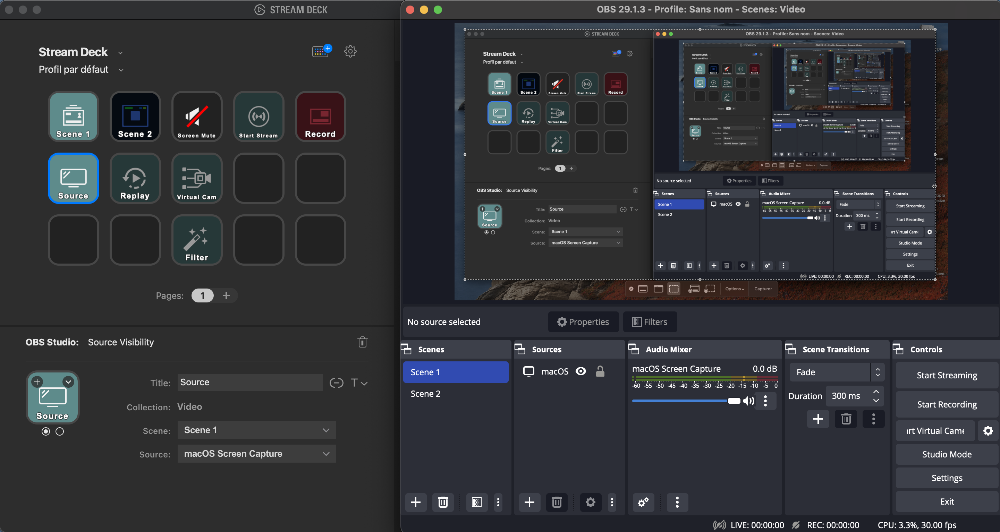

**Elgato** is a world-leading provider of audiovisual technology for content creators in streaming platforms. Focused on revolutionizing creative workflows, Elgato has a growing ecosystem with cross-compatibility and seamless user experience.

Within their myriad of products exists Stream Deck, a physical LCD panel with 15 shortcut keys that can be used to trigger any designated action from drop-in overlays to camera switching, adjusting audio, and more.  

> 👍 Getting Started
> 
> If you haven't already, begin by following the [Getting Started](/millicast/getting-started/index.md) tutorial to start your first broadcast. You'll need your _publish token_ and _stream name_ for the steps described below.

See the official [Elgato](https://www.elgato.com/us/en) site for documentation, installation instructions, and additional support.

# Stream deck

## Installing Elgato plug-in on macOS

To configure, install [Elgato software](https://www.elgato.com/us/en/s/downloads) on your computer and make sure you have the latest version of the regular [OBS Studio](https://obsproject.com/download) and the [OBS-WebRTC](https://github.com/CoSMoSoftware/OBS-studio-webrtc/releases) installed. We are going to need the regular OBS Studio version to download the Elgato plugin. 

- Note: If you have an existing version of OBS-WebRTC, delete it first before installing the newest version. 

After installing OBS Studio, open a Finder window and visit the _Go_ menu at the top. Inside, press on _Go To Folder..._

Put the following folder path: 

`/Library/Application Support`

Within this directory, you should see a folder named "obs-studio". Make a duplicate of that folder and rename it "obs-webrtc". If there is an existing folder called this, replace the previous version. Now, launch OBS-WebRTC. 

At the top, on the Top menu bar, you should see the Elgato plugin. 

For any troubleshooting, verify if you have the most up-to-date version of the [forked OBS-WebRTC](https://github.com/CoSMoSoftware/OBS-studio-webrtc/releases) and the [Elgato Stream Deck](https://www.elgato.com/us/en/s/downloads) software. Remove any previous versions of OBS-WebRTC and the _obs-webrtc_ folder from `/Library/Application` Support is also necessary, as it might conflict with the current version's installation of the plugin.

## Installing Elgato plug-in on Windows

For Windows, there is a couple of extra steps. Download the latest version of [Stream Deck](https://www.elgato.com/us/en/s/downloads) and unzip the files. Right-click the installation file and open the archive. Rename the following files so they end with .dll and .pdb:

\*Note: Remove the long random string at the end of the name. 

- StreamDeckPlugin.dll
- StreamDeckPlugin.pdb
- StreamDeckPluginQt6.dll
- StreamDeckPluginQt6.pdb

Then, copy the above files to your OBS Plugin Folder (C:\\Program Files\\obs-studio\\obs-plugins\\64bit). Now, launch OBS-WebRTC and, similarly, go to the Tools tab on the menu bar, and you will see the Elgato plugin available. 

## How-to use StreamDeck inside OBS-WebRTC

The following steps will be the same for either development environment. With OBS open, create two scenes with a different video source each. Here, Scene 1 will be desktop screen sharing, and Scene 2 will be a [NDI source](/millicast/broadcast/using-ndi.md). If you aren't familiar with NDI, [visit our guide](/millicast/broadcast/using-ndi.md) dedicated to this topic. 

At this time, open the [Elgato Stream Deck](https://www.elgato.com/en/stream-deck) and make sure you have the StreamDeck connected to the computer. This is where we are going to define or modify what each key mean. In the software, there are unlimited actions that can be assigned for a specific operation. For the guide, the focus will be on OBS Studio.

On the available action within OBS Studio is the capacity to assign a key to a specific scene. Therefore, drag and drop the Scene action to an empty key above. There, assign it a title, and if properly connected to OBS, your scenes from OBS will show up; e.g. Scene 1 is assigned to Scene 1 - Desktop screensharing.

Afterward, assign another empty key to the other OBS scene in a similar fashion. Fill out the rest of the keys with any important actions you would like to physically control on the interface. 

Tap between the different keys on the physical Stream Deck to see the actions that occur inside OBS. 

Concurrently, the actions can be seen through Dolby.io Streaming dashboard\*. Visit the stream token, and under the Publishing tab, copy in a new tab the Hosted Player Path URL\*\*.

\*Note: OBS needs to have the stream token configured for this step to be possible. Visit the [dedicated OBS guide](/millicast/software-encoders/using-obs.md)  on how to set up a WebRTC stream. 

\*\*Note: Verify in the OBS controls that the streaming has started.

# Learn more

Learn more by exploring the [developer blog](https://dolby.io/blog/tag/broadcast/) and [code samples](https://github.com/orgs/dolbyio-samples/repositories?q=broadcast).

