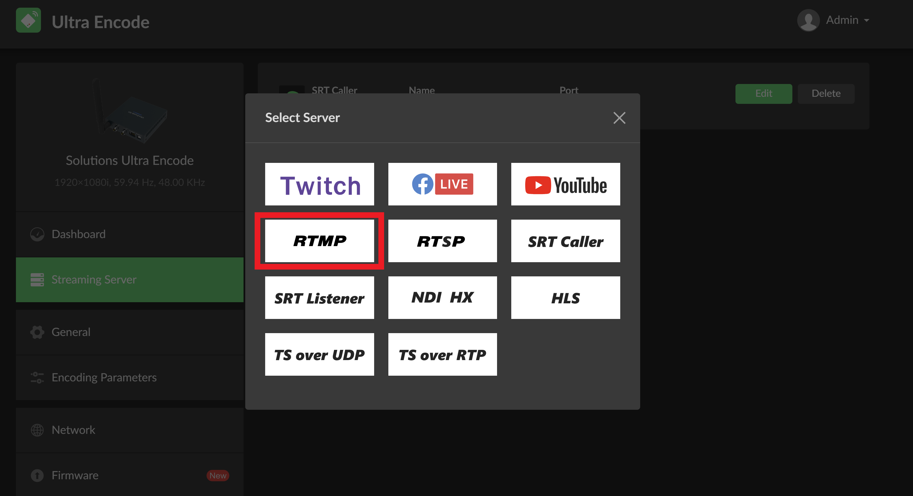
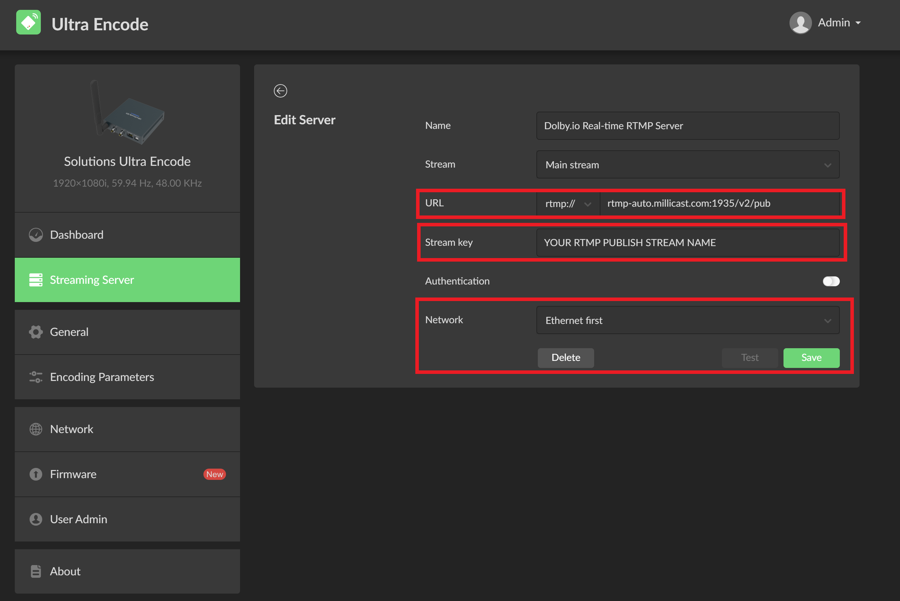
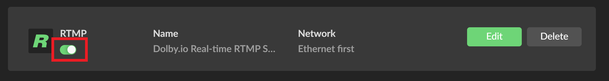
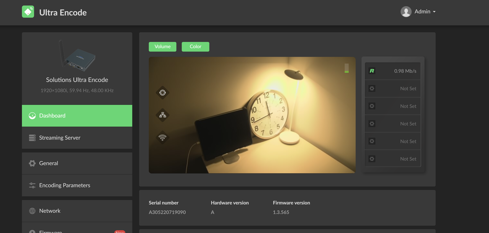
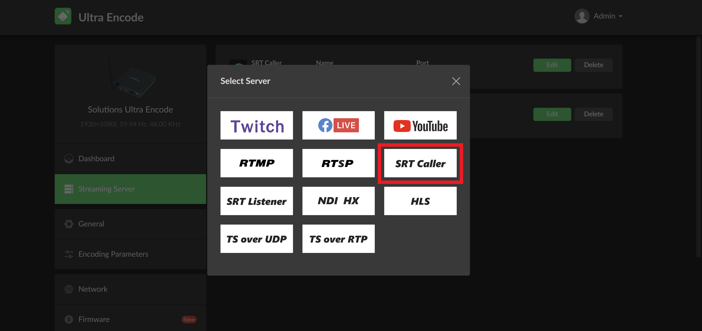
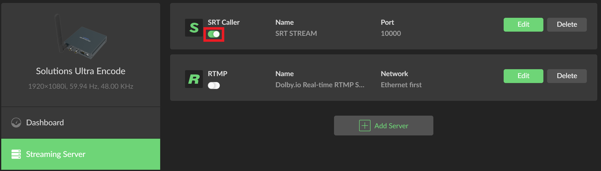
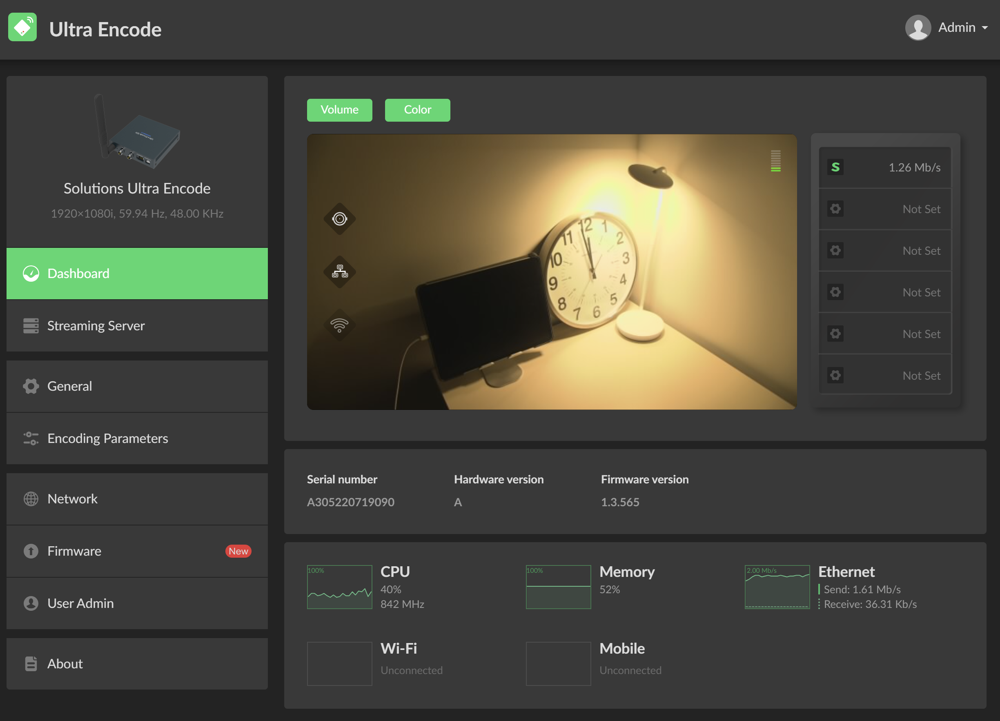

[Magewell](https://www.magewell.com/) is a leading encoder manufacturer that supports connecting to the Dolby.io Real-time Streaming Service for broadcasting real-time streams. This guide outlines a number of different options for broadcasting streams from a Magewell device to the Dolby.io servers.

> 👍 Getting Started
> 
> If you haven't already, begin by following the [Getting Started](/millicast/getting-started.mdx) tutorial to start your first broadcast. You'll need your _publish token_ and _stream name_ for the steps described below.

See the official [Magewell site](https://www.magewell.com/support-contacts) for documentation, installation instructions, and additional support.

## Using the Ultra Encode to broadcast RTMP

The [Magewell Ultra Encode](https://www.magewell.com/ultra-encode) supports broadcasting RTMP streams, which can be ingested by the Dolby.io Real-time Streaming service. 

To begin, first power on your Ultra Encode, connect it to the internet (Ethernet or WiFi), and connect your video capture device. Once connected, [log in](https://www.magewell.com/files/documents/User_Manual/ultra_encode_user_manual_en.pdf) to the Ultra Encode dashboard and navigate to the `Streaming Server` tab on the left side panel. Inside of `Streaming Server` click the `+ Add Server` button and select `RTMP`.

Next, navigate to your [Dolby.io Dashboard](https://dashboard.dolby.io/signin) and [gather your RTMP token credentials](/millicast/broadcast/using-rtmp-and-rtmps.md#how-to-find-your-rtmp-publish-url). Add the `RTMP publish path` from your Dolby.io Dashboard to the `URL`, and add your `RTMP Publish Stream Name`, also from the Dolby.io dashboard, to the `Stream key`. 

Finally, select which network you'd like the encoder to use to connect, and save the settings.

Once saved, make sure the stream is activated by toggling the server switch on the `Streaming Server` page.

With the stream enabled, you can navigate back to the main Dashboard page of the encoder and see your stream connect.

## Using the Ultra Encode to broadcast SRT

The [Magewell Ultra Encode](https://www.magewell.com/ultra-encode) supports broadcasting SRT streams, which can be ingested by the Dolby.io Real-time Streaming service. 

To begin, first power on your Ultra Encode, connect it to the internet (Ethernet or WiFi), and connect your video capture device. Once connected, [log in](https://www.magewell.com/files/documents/User_Manual/ultra_encode_user_manual_en.pdf) to the Ultra Encode dashboard and navigate to the `Streaming Server` tab on the left side panel. Inside of `Streaming Server` click the `+ Add Server` button and select `SRT Caller`.

Next, navigate to your [Dolby.io Dashboard](https://dashboard.dolby.io/signin) and [gather your SRT token credentials](/millicast/broadcast/using-srt.md#how-to-find-your-srt-publish-path). Add the `SRT publish path` from your Dolby.io Dashboard to the `Address`, set the `Port` to `10000`, and add your `SRT Stream ID`, also from the Dolby.io dashboard, to the `Stream ID`.

Additionally, if you have `Passphrase encryption` enabled on the Dolby.io Dashboard, you can enable it on the encoder side by setting `Encryption` to `AES-128`. 

Once saved, make sure the stream is activated by toggling the server switch on the `Streaming Server` page.

With the stream enabled, you can navigate back to the main Dashboard page of the encoder and see your stream connect.

