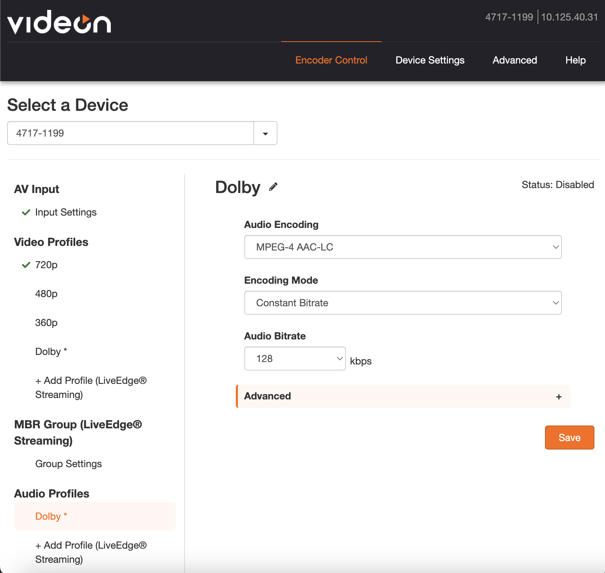
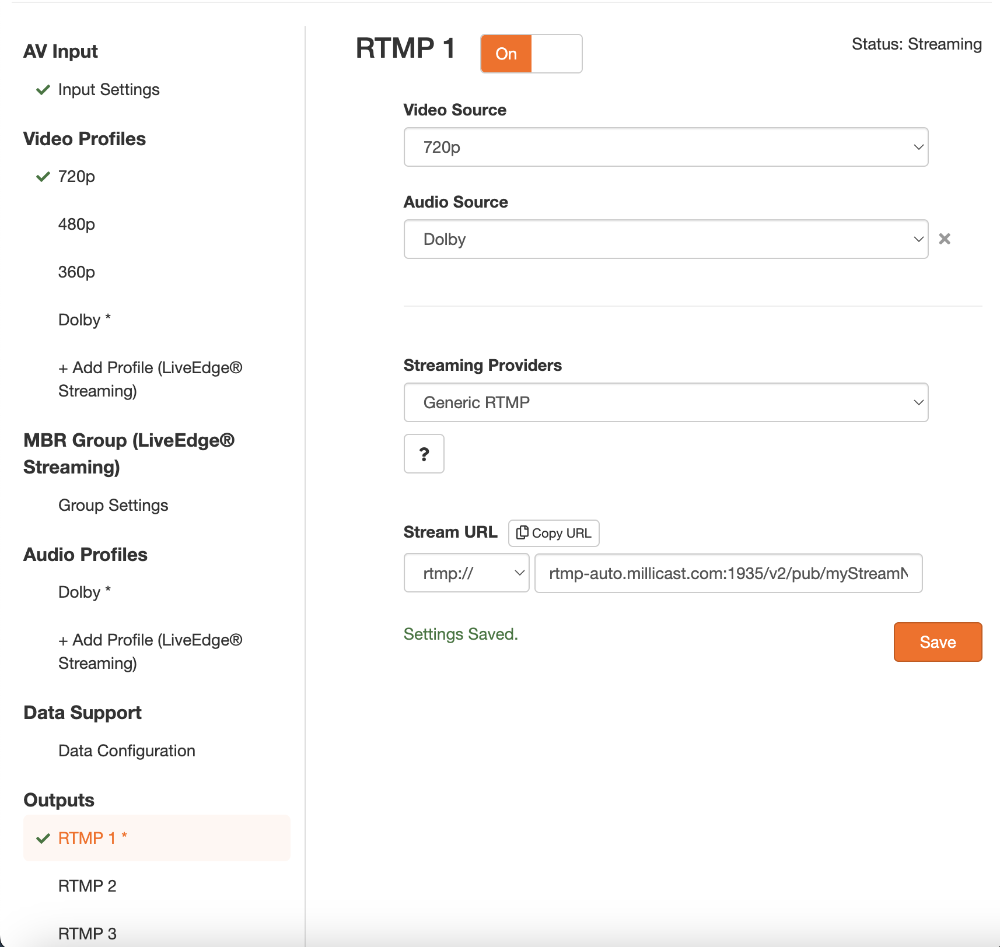
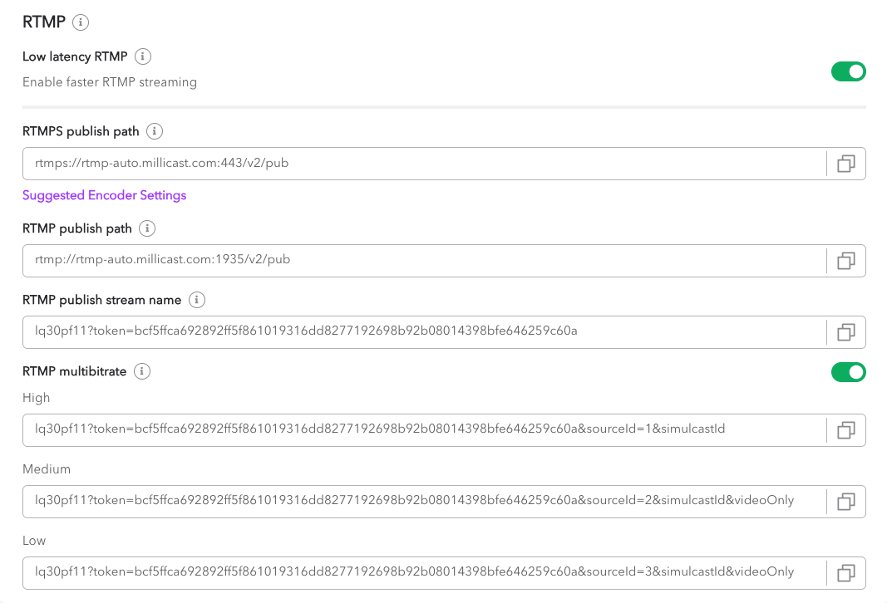
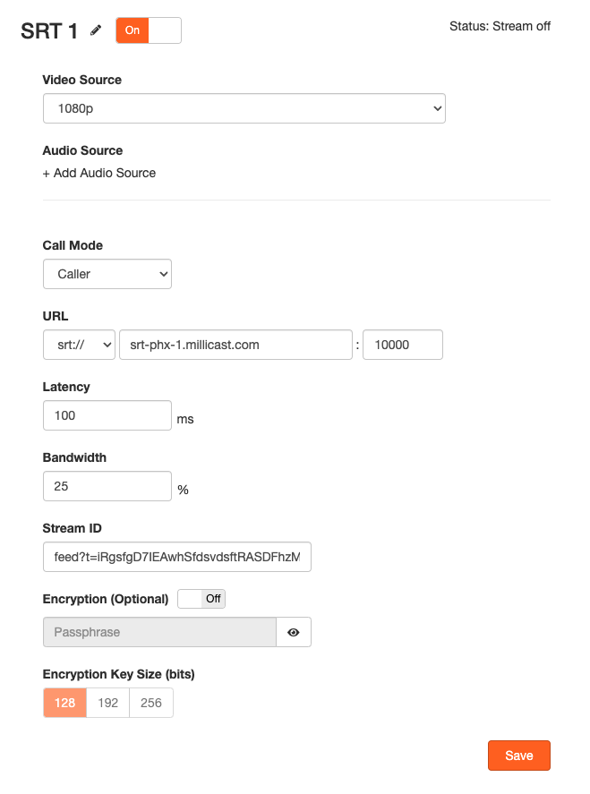

**Videon** is a leading video streaming company offering innovative solutions to enhance content delivery and quality. Their flagship product, [EdgeCaster](https://www.videonlabs.com/edgecaster), optimizes video streaming with low-latency and high-quality playback across platforms, empowering service providers to deliver seamless and engaging viewing experiences.

> 👍 Getting Started
> 
> If you haven't already, begin by following the [Getting Started](/millicast/getting-started/index.md) tutorial to start your first broadcast. You'll need your _RTMP publish path_ and _RTMP publish stream name_ for the steps described below.

See the official [Videon](https://www.videonlabs.com/) site for documentation, installation instructions, and additional support.

# Videon EdgeCaster

## How-to use multi-bitrate on Videon EdgeCaster

Inside the Videon web UI, under **Video Profiles**, create three profiles of distinct bitrate (1080p, 720p, 360p): 

| Name              | 1080p             |
| :---------------- | :---------------- |
| Video Scaling     | 1920x1080p (16:9) |
| Encoding Mode     | Variable Bitrate  |
| Video Bitrate     | 5,000 kbps        |
| Video Encoding    | H.264 (AVC)       |
| H.264 Profile     | High Profile      |
| Keyframe Interval | 0.5 seconds       |
| Quality/Latency   | Lowest            |

| Name              | 720p             |
| :---------------- | :--------------- |
| Video Scaling     | 1280x720p (16:9) |
| Encoding Mode     | Variable Bitrate |
| Video Bitrate     | 3,000 kbps       |
| Video Encoding    | H.264 (AVC)      |
| H.264 Profile     | High Profile     |
| Keyframe Interval | 0.5 seconds      |
| Quality/Latency   | Lowest           |

| Name              | 360p             |
| :---------------- | :--------------- |
| Video Scaling     | 640x360p (16:9)  |
| Encoding Mode     | Variable Bitrate |
| Video Bitrate     | 700 kbps         |
| Video Encoding    | H.264 (AVC)      |
| H.264 Profile     | High Profile     |
| Keyframe Interval | 0.5 seconds      |
| Quality/Latency   | Lowest           |

Under **Audio Profiles**, set up your preferred audio encoding and audio bitrate settings.

### Using RTMP

Open your Dolby.io dashboard and copy the [**RTMP publishing paths**](https://docs.dolby.io/streaming-apis/docs/using-rtmp-and-rtmps). Additionally, enable the** RTMP multi-bitrate** toggle. You can also use the [Multi-Source builder](/millicast/streaming-dashboard/multi-source-builder.md) to generate those URLs.

Under **Outputs**, for each **RTMP**, select **Video Source** corresponding to the RTMP profile (1080p for the highest profile and 360p for the lowest profile). Make sure to set **Streaming Providers** to _Generic RTMP_ and paste the **Stream URL** from the Dolby.io RTMP dashboard.

For the **Stream URL**, combine the **RTMP publish path** (use **RTMPS publish path** and select _rtmps://_ if you prefer to publish to an RTMPS endpoint), with the **RTMP multibitrate** corresponding value: **High** for RTMP 1, **Medium** for RTMP 2, and **Low** for RTMP 3. 

Example:

| Output name | Video source | Protocol  | URL                                                                                                                                                    |
| :---------- | :----------- | :-------- | :----------------------------------------------------------------------------------------------------------------------------------------------------- |
| RTMP 1      | 1080p        | `rtmp://` | `rtmp-auto.millicast.com:1935/v2/pub/lq30pf11?token=bcf5ffca692892ff5f861019316dd8277192698b92b08014398bfe646259c60a&sourceId=1&simulcastId`           |
| RTMP 2      | 720p         | `rtmp://` | `rtmp-auto.millicast.com:1935/v2/pub/lq30pf11?token=bcf5ffca692892ff5f861019316dd8277192698b92b08014398bfe646259c60a&sourceId=2&simulcastId&videoOnly` |
| RTMP 3      | 360p         | `rtmp://` | `rtmp-auto.millicast.com:1935/v2/pub/lq30pf11?token=bcf5ffca692892ff5f861019316dd8277192698b92b08014398bfe646259c60a&sourceId=3&simulcastId&videoOnly` |

### Using SRT

Under **Outputs**, for each **SRT**, select **Video Source** corresponding to the SRT profile (1080p for the highest profile and 360p for the lowest profile). For the **URL**, select the _srt://_ protocol, enter the URL of the **SRT publish path** from the Dolby.io dashboard, and enter port 10000. For the **Stream ID**, use the **SRT stream ID** from the dashboard and append **&simulcastId** for the first layer, **&sourceId=1&simulcastId&videoOnly** for the second layer, and **&sourceId=2&simulcastId&videoOnly** for the third layer. You can also use the [Multi-Source builder](/millicast/multi-source-builder) to generate those URLs.

Example:

| Output name | Video source | URL                                        | Stream ID                                                                                 |
| :---------- | :----------- | :----------------------------------------- | :---------------------------------------------------------------------------------------- |
| SRT 1       | 1080p        | `srt://` `srt-auto.millicast.com` :`10000` | `lq30pf11?t=vPX_ymkokv9fhhAZMW3YJ3GSaYuSsIAUOYv-ZGJZxgo&simulcastId`                      |
| SRT 2       | 720p         | `srt://` `srt-auto.millicast.com` :`10000` | `lq30pf11?t=vPX_ymkokv9fhhAZMW3YJ3GSaYuSsIAUOYv-ZGJZxgo&sourceId=1&simulcastId&videoOnly` |
| SRT 3       | 360p         | `srt://` `srt-auto.millicast.com` :`10000` | `lq30pf11?t=vPX_ymkokv9fhhAZMW3YJ3GSaYuSsIAUOYv-ZGJZxgo&sourceId=2&simulcastId&videoOnly` |

## How-to apply a multi-viewer with Videon EdgeCaster

You can also use the [Multi-Source builder](/millicast/multi-source-builder) to generate the URLs. For information on Simulcast, refer to [the documentation](https://dolby-io.readme.io/streaming-apis/docs/selecting-simulcast-layers) to understand its usage.

### Using RTMP

To enable the multi-view, add this to the end of your stream URL, add the `sourceId` parameter with a unique value. Example: `&sourceId=1`. The name of your source will be set using the `simulcastId` parameter. Your main source does not need a value for this parameter so leave it empty `&simulcastId`. Your other feeds must be defined as `&simulcastId=SourceName`.

Example:

| Encoder      | Source name | Protocol  | URL                                                                                                                                                    |
| :----------- | :---------- | :-------- | :----------------------------------------------------------------------------------------------------------------------------------------------------- |
| EdgeCaster 1 | Main        | `rtmp://` | `rtmp-auto.millicast.com:1935/v2/pub/lq30pf11?token=bcf5ffca692892ff5f861019316dd8277192698b92b08014398bfe646259c60a&sourceId=1&simulcastId`           |
| EdgeCaster 2 | Backstage   | `rtmp://` | `rtmp-auto.millicast.com:1935/v2/pub/lq30pf11?token=bcf5ffca692892ff5f861019316dd8277192698b92b08014398bfe646259c60a&sourceId=2&simulcastId=Backstage` |
| EdgeCaster 3 | VIP         | `rtmp://` | `rtmp-auto.millicast.com:1935/v2/pub/lq30pf11?token=bcf5ffca692892ff5f861019316dd8277192698b92b08014398bfe646259c60a&sourceId=3&simulcastId=VIP`       |

If you are combining multi-view and multi-bitrate, for each source, usually only the first layer contains the audio track, so for the other layers, add the parameter `&videoOnly` to the Stream URL.

Example:

| Encoder      | Source name | Layer  | Protocol  | URL                                                                                                                                                              |
| :----------- | :---------- | :----- | :-------- | :--------------------------------------------------------------------------------------------------------------------------------------------------------------- |
| EdgeCaster 1 | Main        | High   | `rtmp://` | `rtmp-auto.millicast.com:1935/v2/pub/lq30pf11?token=bcf5ffca692892ff5f861019316dd8277192698b92b08014398bfe646259c60a&sourceId=1&simulcastId`                     |
|              |             | Medium | `rtmp://` | `rtmp-auto.millicast.com:1935/v2/pub/lq30pf11?token=bcf5ffca692892ff5f861019316dd8277192698b92b08014398bfe646259c60a&sourceId=2&simulcastId&videoOnly`           |
|              |             | Low    | `rtmp://` | `rtmp-auto.millicast.com:1935/v2/pub/lq30pf11?token=bcf5ffca692892ff5f861019316dd8277192698b92b08014398bfe646259c60a&sourceId=3&simulcastId&videoOnly`           |
| EdgeCaster 2 | Backstage   | High   | `rtmp://` | `rtmp-auto.millicast.com:1935/v2/pub/lq30pf11?token=bcf5ffca692892ff5f861019316dd8277192698b92b08014398bfe646259c60a&sourceId=4&simulcastId=Backstage`           |
|              |             | Medium | `rtmp://` | `rtmp-auto.millicast.com:1935/v2/pub/lq30pf11?token=bcf5ffca692892ff5f861019316dd8277192698b92b08014398bfe646259c60a&sourceId=5&simulcastId=Backstage&videoOnly` |
|              |             | Low    | `rtmp://` | `rtmp-auto.millicast.com:1935/v2/pub/lq30pf11?token=bcf5ffca692892ff5f861019316dd8277192698b92b08014398bfe646259c60a&sourceId=6&simulcastId=Backstage&videoOnly` |
| EdgeCaster 3 | VIP         | High   | `rtmp://` | `rtmp-auto.millicast.com:1935/v2/pub/lq30pf11?token=bcf5ffca692892ff5f861019316dd8277192698b92b08014398bfe646259c60a&sourceId=7&simulcastId=VIP`                 |
|              |             | Medium | `rtmp://` | `rtmp-auto.millicast.com:1935/v2/pub/lq30pf11?token=bcf5ffca692892ff5f861019316dd8277192698b92b08014398bfe646259c60a&sourceId=8&simulcastId=VIP&videoOnly`       |
|              |             | Low    | `rtmp://` | `rtmp-auto.millicast.com:1935/v2/pub/lq30pf11?token=bcf5ffca692892ff5f861019316dd8277192698b92b08014398bfe646259c60a&sourceId=9&simulcastId=VIP&videoOnly`       |

### Using SRT

To enable the multi-view, add this to the end of your stream URL, add the `sourceId` parameter with a unique value. Example: `&sourceId=1`. The name of your source will be set using the `simulcastId` parameter. Your main source does not need a value for this parameter so leave it empty `&simulcastId`. Your other feeds must be defined as `&simulcastId=SourceName`.

Example:

| Encoder      | Source name | URL                                        | Stream ID                                                                                 |
| :----------- | :---------- | :----------------------------------------- | :---------------------------------------------------------------------------------------- |
| EdgeCaster 1 | Main        | `srt://` `srt-auto.millicast.com` :`10000` | `lq30pf11?t=vPX_ymkokv9fhhAZMW3YJ3GSaYuSsIAUOYv-ZGJZxgo&simulcastId`                      |
| EdgeCaster 2 | Backstage   | `srt://` `srt-auto.millicast.com` :`10000` | `lq30pf11?t=vPX_ymkokv9fhhAZMW3YJ3GSaYuSsIAUOYv-ZGJZxgo&sourceId=1&simulcastId=Backstage` |
| EdgeCaster 3 | VIP         | `srt://` `srt-auto.millicast.com` :`10000` | `lq30pf11?t=vPX_ymkokv9fhhAZMW3YJ3GSaYuSsIAUOYv-ZGJZxgo&sourceId=2&simulcastId=VIP`       |

If you are combining multi-view and multi-bitrate, for each source, usually only the first layer contains the audio track, so for the other layers, add the parameter `&videoOnly` to the Stream URL.

Example:

| Encoder      | Source name | Layer  | URL                                        | Stream ID                                                                                           |
| :----------- | :---------- | :----- | :----------------------------------------- | :-------------------------------------------------------------------------------------------------- |
| EdgeCaster 1 | Main        | High   | `srt://` `srt-auto.millicast.com` :`10000` | `lq30pf11?t=vPX_ymkokv9fhhAZMW3YJ3GSaYuSsIAUOYv-ZGJZxgo&sourceId=1&simulcastId`                     |
|              |             | Medium | `srt://` `srt-auto.millicast.com` :`10000` | `lq30pf11?t=vPX_ymkokv9fhhAZMW3YJ3GSaYuSsIAUOYv-ZGJZxgo&sourceId=2&simulcastId&videoOnly`           |
|              |             | Low    | `srt://` `srt-auto.millicast.com` :`10000` | `lq30pf11?t=vPX_ymkokv9fhhAZMW3YJ3GSaYuSsIAUOYv-ZGJZxgo&sourceId=3&simulcastId&videoOnly`           |
| EdgeCaster 2 | Backstage   | High   | `srt://` `srt-auto.millicast.com` :`10000` | `lq30pf11?t=vPX_ymkokv9fhhAZMW3YJ3GSaYuSsIAUOYv-ZGJZxgo&sourceId=4&simulcastId=Backstage`           |
|              |             | Medium | `srt://` `srt-auto.millicast.com` :`10000` | `lq30pf11?t=vPX_ymkokv9fhhAZMW3YJ3GSaYuSsIAUOYv-ZGJZxgo&sourceId=5&simulcastId=Backstage&videoOnly` |
|              |             | Low    | `srt://` `srt-auto.millicast.com` :`10000` | `lq30pf11?t=vPX_ymkokv9fhhAZMW3YJ3GSaYuSsIAUOYv-ZGJZxgo&sourceId=6&simulcastId=Backstage&videoOnly` |
| EdgeCaster 3 | VIP         | High   | `srt://` `srt-auto.millicast.com` :`10000` | `lq30pf11?t=vPX_ymkokv9fhhAZMW3YJ3GSaYuSsIAUOYv-ZGJZxgo&sourceId=7&simulcastId=VIP`                 |
|              |             | Medium | `srt://` `srt-auto.millicast.com` :`10000` | `lq30pf11?t=vPX_ymkokv9fhhAZMW3YJ3GSaYuSsIAUOYv-ZGJZxgo&sourceId=8&simulcastId=VIP&videoOnly`       |
|              |             | Low    | `srt://` `srt-auto.millicast.com` :`10000` | `lq30pf11?t=vPX_ymkokv9fhhAZMW3YJ3GSaYuSsIAUOYv-ZGJZxgo&sourceId=9&simulcastId=VIP&videoOnly`       |

# Learn more

Learn more by exploring the [developer blog](https://dolby.io/blog/tag/broadcast/) and [code samples](https://github.com/orgs/dolbyio-samples/repositories?q=broadcast).

