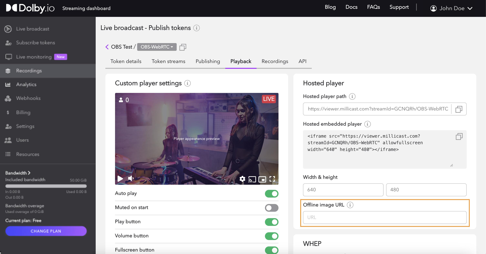
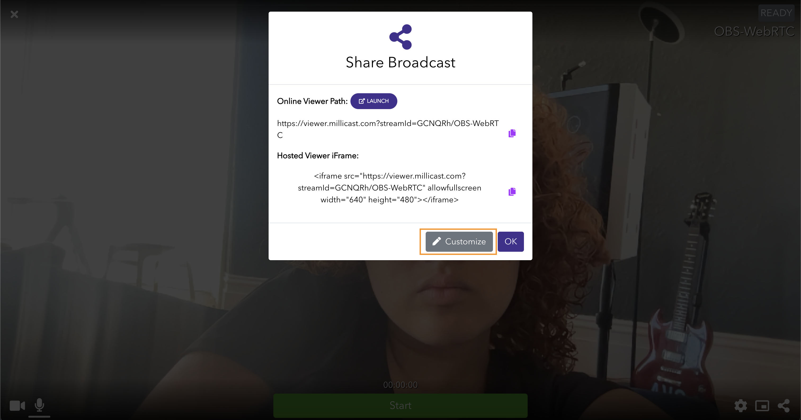
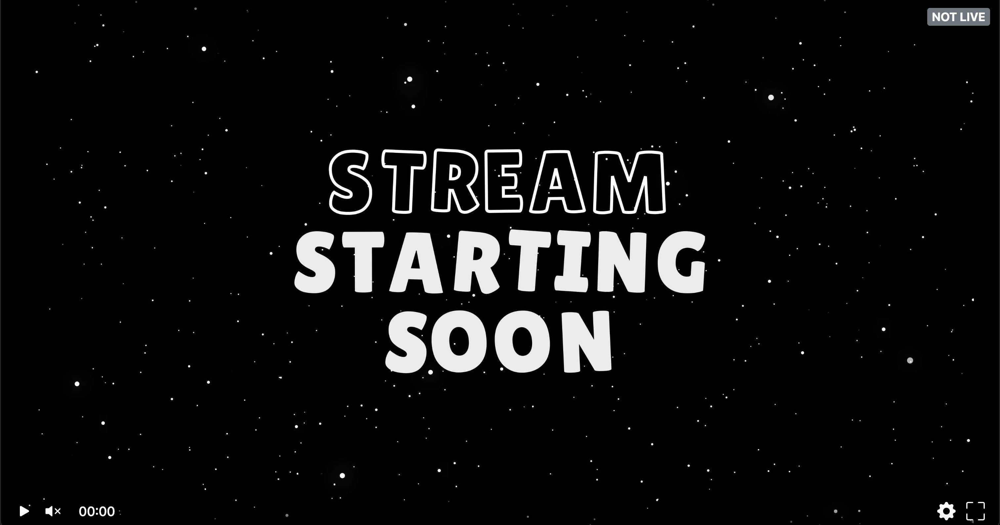
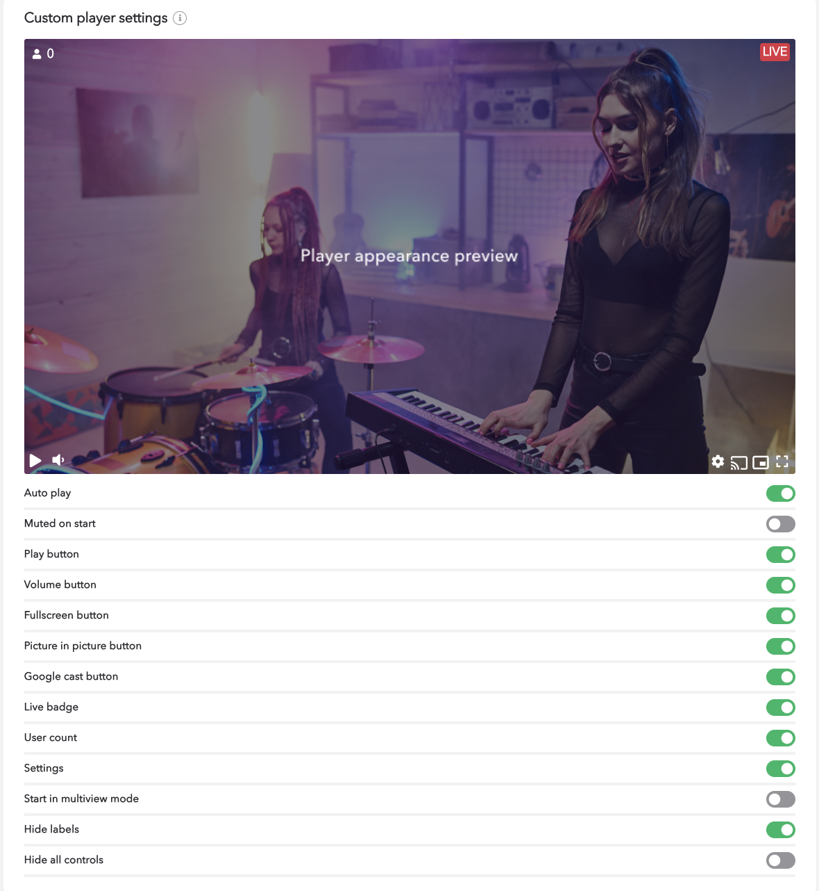

When having a stream, it is possible to set up a loading screen before your event goes live. Having a stream-loading screen is a valuable asset as it serves as a polished introduction to the streaming experience, presenting a seamless and professional image to viewers. Beyond its aesthetic appeal, a **Stream preview ** maintains the audience's engagement during critical moments, as it can serve to provide a buffer for brief technical adjustments or seamless transitions between scenes. 

## How to add a stream preview to your event

> 👍 Getting Started
> 
> If you haven't already, begin by following the [Getting Started](/millicast/introduction-to-streaming-apis.mdx) tutorial to create a Dolby.io application and start your first broadcast. You'll need your _publish token_ and _stream name_ for the steps described below.

Open up the management screen of your stream token and visit the Playback tab. To the right on the _Hosted player path_, there will be a space for an **Offline image URL**.  Here place the image's link with an HTTP-compliant URL. 

Additionally, this feature can be accessed from inside the Broadcaster via the share icon. Under the Hosted Player iFrame URL, click on the Customize button, where a new window will show up with options to customize the player settings. 

To ensure the image has been correctly added to the live stream, visit the Hosted player path URL, and you should see the image displayed as the stream is not live. 

This is not the only customizable setting available for your event. The following are available to be enabled: 

**_Auto Play_**

Autoplay is a feature that automatically plays media content, such as videos or music, without requiring the user to initiate each play action manually.

**_Muted on Start_**

The stream initiates playback without audio when first loaded or displayed.

**_Play Button Show_**

The start button can be erased from the player from the viewer's perspective.

_**Volume Button**_

The volume button can be erased from the player from the viewer's perspective.

**_Fullscreen Button_**

The fullscreen button can be disabled during the live stream.

**_Picture in Picture Button_**

The option of picture-in-picture can be disabled for the viewers.

_**Google Cast Button**_

The option of casting to the TV through Google Cast can be enabled or disabled.

**_Live Badge_**

A live badge can be eliminated from the player from the viewer's perspective.

**_User Count_**

An overall count of the total viewers on the stream can be enabled/disabled.

**_Settings_**

The settings icon can be voided from the viewer's screen disabling their ability to view the Media Stats or Report Playback Issues.

**_Start in Multiview Mode_**

This feature will automatically start the stream with the viewer's perspective being the multiview layout if the stream has been set up as such.

**_Hide Labels_**

This will hide all logos or labels during the livestream.

**_Hide all Controls_**

This feature will hide all options from the viewer's perspective.

## Learn more

Learn more by exploring the [developer blog](https://dolby.io/blog/tag/distribution/) and [code samples](https://github.com/orgs/dolbyio-samples/repositories?q=distribution).

