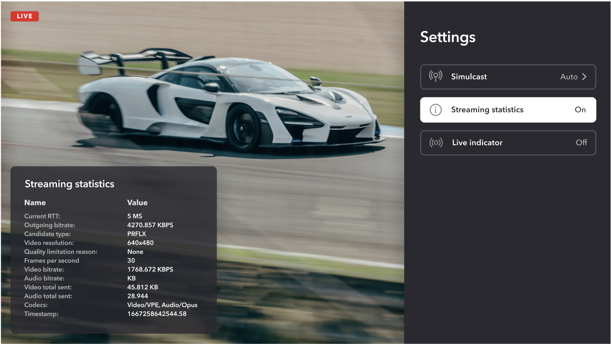

# Native viewer sample app for iOS, iPad OS, and tvOS devices

The application available in this repository demonstrates the capabilities of Dolby.io's Real-time Streaming monitoring experience, built for iOS, iPad OS, and tvOS devices.

import DocCard from '@theme/DocCard';

<DocCard
  item={{
    type: 'link',
    href: 'https://github.com/dolbyio-samples/rts-app-ios-viewer',
    customProps: {
      icon: '📱',
    },
    label: 'iOS Viewer Sample App',
    description: 'Sample app repository on GitHub',
  }}
/>

This repository demonstrates how to develop a real-time streaming viewer or monitoring app using Dolby.io's Real-time Streaming solution which features ultra low-latency (sub 500ms).

The application provided can be used as it is or with your own modifications to create or embed a real-time streaming viewer on iOS/TvOS app. You can clone the repository yourself, run the application locally or customize it to make it your own. Learn more about Dolby.io’s Real-time Streaming capabilities [here](https://dolby.io/products/real-time-streaming/).

You can start monitoring a stream with the stream name and account ID, which you can create and start streaming from the [Dolby.io dashboard](https://dashboard.dolby.io/).

If you run into problems, the full Dolby.io Real-time Streaming SDK for iOS documentation can be found [here](/millicast/client-sdks/ios/index.mdx).

Supported features:

- Native viewer for iOS, iPad OS, and tvOS devices
- Ability to remember previously viewed streams
- Simulcast support

You can experience pre-built versions of these apps for [tvOS](https://dolby.io/project-gallery/real-time-streaming-monitor-apps/) or [iPhones/iPads](https://dolby.io/project-gallery/real-time-streaming-monitor-apps/) on the Apple App Store.

# Discover more sample apps and projects

Check out the [Project Gallery](https://dolby.io/project-gallery/) and [GitHub sample repository](https://github.com/dolbyio-samples).
