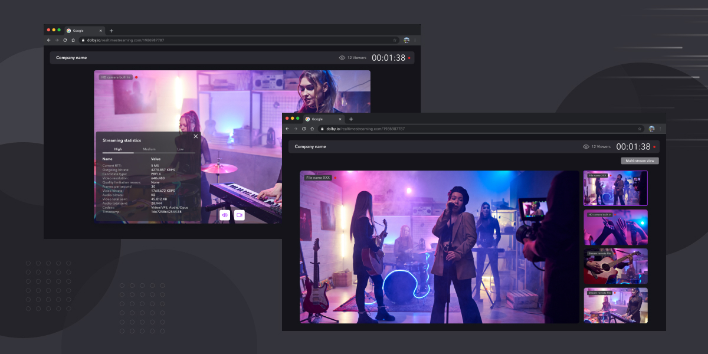

# Publisher and viewer sample app for react

The application available in this repository demonstrates the capabilities of Dolby.io's Real-time Streaming solution for browser applications, built using React.

 <a class="dolbyio-card" href="https://github.com/dolbyio-samples/rts-app-react-publisher-viewer">
 

 
 

 
Publisher and Viewer React Sample App

 

 Sample app repository on GitHub
 

  </a>

This repository demonstrates how to develop an app that showcases the capabilities of Dolby.io's Real-time Streaming SDK and how it can be used to design solutions that require ultra low-latency (sub 500ms). If you run into problems, the full Dolby.io Real-time Streaming SDK for JavaScript documentation can be found [here](/millicast/client-sdks/web.md).

The application provided allows you to evaluate solutions offered by Dolby.io Real-time Streaming APIs. You can clone the repository yourself, run the application locally and verify that it meets your requirements. Learn more about Dolby.io’s Real-time Streaming capabilities [here](https://dolby.io/products/real-time-streaming/).

The application allows you to publish from up to four sources, including more than one camera on the Millicast Publisher. You will have fine grained control over each stream's configuration, which includes bitrate and resolution settings, where applicable. The application also allows you to view multiple sources on the Millicast Viewer, and view stream statistics for each source individually.

Its scope covers:

** Real-time Streaming Publisher**

- Publish streams
- Publish with simulcast (only on Chrome)
- Microphone and camera device selection
- Invite viewers to watch your stream
- Screen sharing
- Mute audio and video
- Resolution, bandwidth, codec, and bitrate selection
- Ability to stream from up to four sources. See [Create a Multi-view Web Application](/millicast/playback/multiview.md) for bandwidth limitations.
- Ability to stream a local video file
- Observing stream statistics for each simulcast layer

**Real-time Streaming Viewer**

- View streams
- Mute audio and video
- Observing stream statistics
- Select incoming stream quality with simulcast
- Ability to see stats for each individual source

# Discover more sample apps and projects

Check out the [Project Gallery](https://dolby.io/project-gallery/) and [GitHub sample repository](https://github.com/dolbyio-samples).
