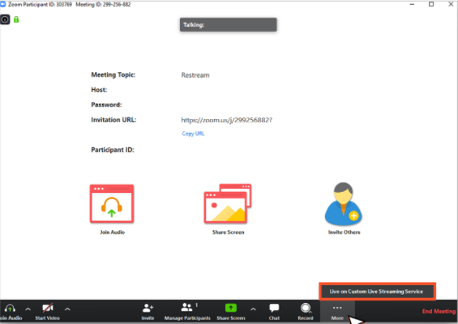
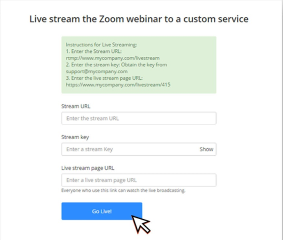

[Zoom](https://zoom.us/) is a video collaboration tool for hosting conferences and meetings. Zoom supports streaming to consumer platforms or any [RTMP](/millicast/broadcast/using-rtmp-and-rtmps.md) source such as distributing Real-time Streaming content with Dolby.io.

See the official [zoom](https://zoom.us/) site for documentation, installation instructions, and additional support.

> 📘 Interested in Building Your Own Video Conferencing App?
> 
> Dolby.io real-time streaming is great for broadcasting solutions, however, Dolby.io has another product, [Dolby.io Communications](https://dolby.io/products/video-call/) which is designed for building audio and video conferencing solutions. Learn more by exploring the [Dolby.io Communications documentation](https://docs.dolby.io/communications-apis/docs).

# Get your Dolby.io RTMP publish URL

In order to broadcast with RTMP, you will need to have your **RTMP publish path** and **RTMP publish stream name** available.

> 👍 Getting Started
> 
> If you haven't already, begin by following the [Getting Started](/millicast/getting-started/index.md) tutorial to create a Dolby.io application and start your first broadcast.

See the [RTMP Broadcast Guide](/millicast/broadcast/using-rtmp-and-rtmps.md#how-to-find-your-rtmp-publish-url) for details on how to retrieve these values.

# How-to stream a Zoom meeting or webinar with RTMP

First, you must need a Zoom paid account in order to ingest your Zoom meetings into Dolby.io Real-time Streaming via RTMP so you can broadcast it massively in almost real-time.

- Note: The account needs to be either a Pro, Business, Education, or Enterprise plan.  

To enable all members of your organization to have access to live-streaming meetings 

## 1. Start a webinar

Start the webinar as usual by doing one of the following:

- From your calendar — if you have added the webinar to your calendar, click the link displayed on your calendar reminder.
- From the Zoom website — sign into Zoom, find the webinar in the My Webinars tab and click Start.

## 2. View more settings

Click the ** More** button on your control panel to view available options.

## 3. Choose custom live stream service

Choose Live on Custom Live Stream Service. A browser window will open to show the progress as Zoom prepares the live stream of your webinar. If you haven’t set up this webinar for live custom streaming, you should simply enter the values provided in the instructions.

## 4. Enter your Dolby.io RTMP publish details

Enter your Dolby.io Real-time Streaming RTMP publish token details.

| Zoom field | Dolby.io field           | Example value                                                                           |
| :--------- | :----------------------- | :-------------------------------------------------------------------------------------- |
| Stream URL | RTMP publish path        | rtmp://live-rtmp-pub.millicast.com:1935/v2/pub/                                         |
| Stream key | RTMP publish stream name | **kxhtzabx**?token=**0a0d272fd50eec7d477aa85d72504cf0968bc82c63b1931386e7c062341807ce** |
