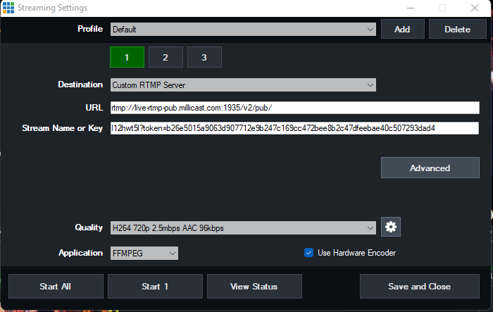
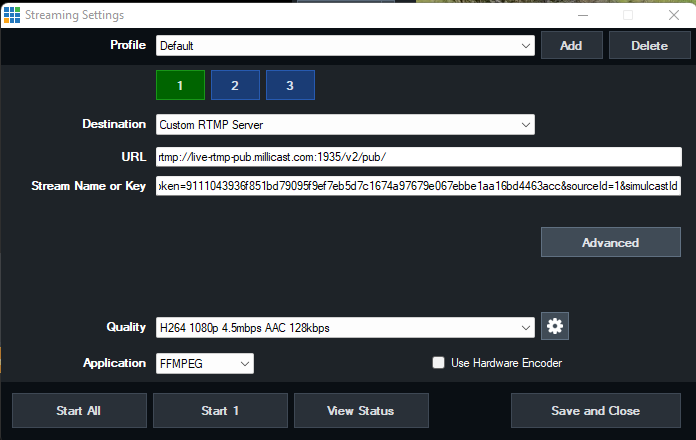
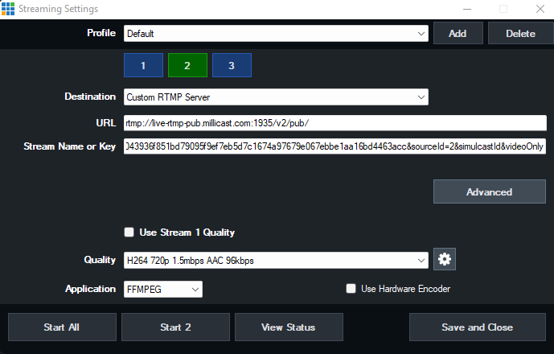
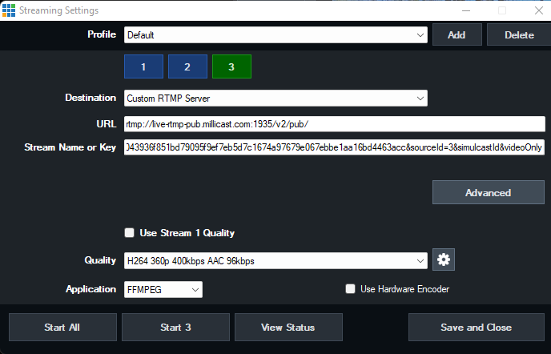
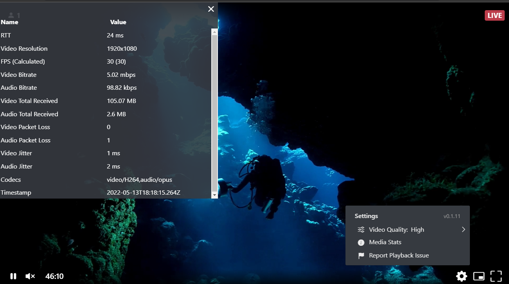
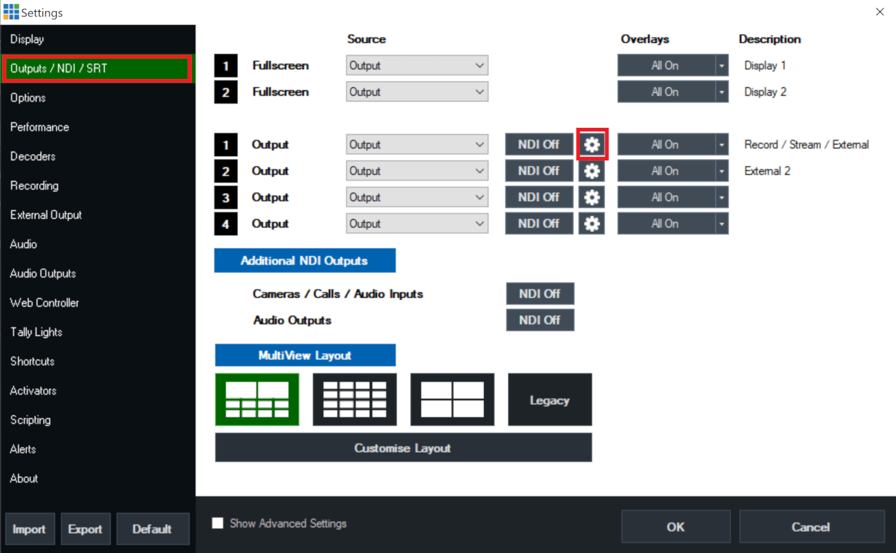
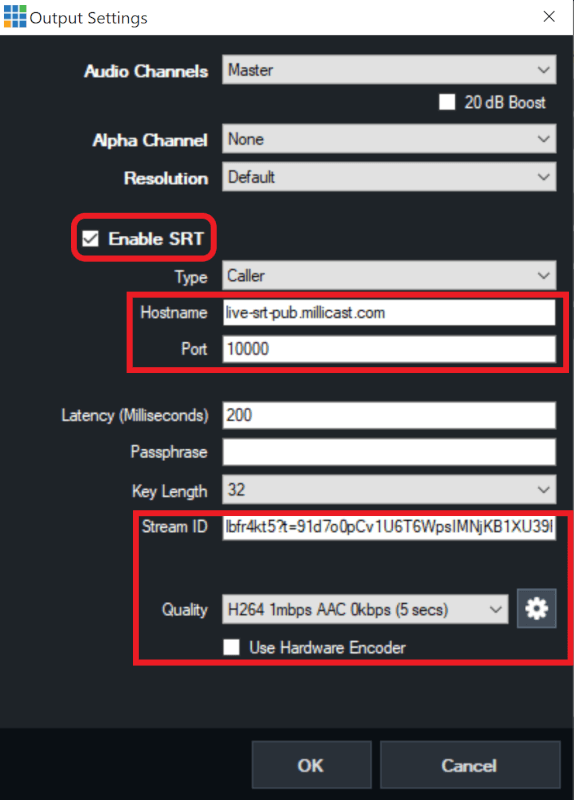
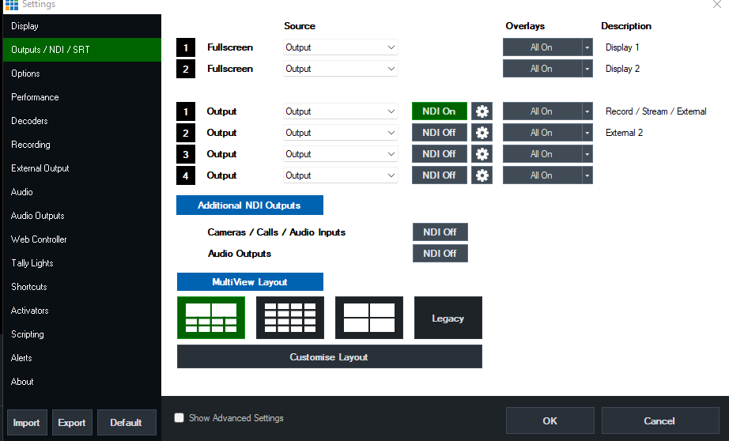

**vMix** is a desktop application that provides a software vision mixer and encoder for the Windows operating system. It allows users to switch inputs, mix audio, record output, and live stream cameras, video files, audio, and more. 

You can originate a broadcast from vMix and forward that stream over [RTMP](/millicast/broadcast/using-rtmp-and-rtmps.md), [SRT](/millicast/broadcast/using-srt.md), or as an [NDI](/millicast/broadcast/using-ndi.md) source.

- [Configure RTMP](/millicast/software-encoders/broadcasting-with-vmix.md#how-to-use-vmix-with-rtmp)
- [Configure SRT](/millicast/software-encoders/broadcasting-with-vmix.md#how-to-use-vmix-with-srt)
- [Configure NDI](/millicast/software-encoders/broadcasting-with-vmix.md#how-to-use-vmix-with-ndi)

> 👍 Getting Started
> 
> If you haven't already, begin by following the [Getting Started](/millicast/getting-started.mdx) tutorial to create a Dolby.io application and start your first broadcast.

See the official [vmix.com](https://vmix.com) site for documentation, installation instructions, and additional support.

## How-to use vMix with RTMP

In order to broadcast with RTMP, you will need to have your **RTMP publish path** and **RTMP publish stream name** available.

See the [RTMP Broadcast Guide](/millicast/broadcast/using-rtmp-and-rtmps.md#how-to-find-your-rtmp-publish-url) for details on how to retrieve these values.

### Configure a custom RTMP server

Within vMix, select the _Streaming Settings_ menu to enter your publishing destination.

- **URL:** use your _RTMP publish path_
- **Stream Name or Key:** use your _RTMP publish stream name_

Set the **Application** to _FFMPEG_.

Select the Quality settings. Make sure the **Profile** is set to _Baseline_. You may experience stutters when using another profile.

You can configure the other Audio and Video settings based on your preferences and network capacity.  
Save your publishing profile and you are ready to start publishing with vMix.

### Setup multi-bitrate RTMP streaming with vMix

With vMix you have the ability to send a live stream simultaneously to up to three separate streaming destinations. This vMix feature combined with Dolby.io [Multisource Streams](/millicast/broadcast/multi-source-broadcasting.md) enables Simulcast of multiple renditions of the stream. Viewers with bandwidth constraints would receive a stream optimized for that condition. Keep in mind, the broadcaster will be sending multiple streams so will need adequate bandwidth.

> 📘 Enable Multisource for Your Dolby.io Publish Token
> 
> To utilize [multisource](/millicast/broadcast/multi-source-broadcasting.md) it must be enabled for the publish token. You can do this from the Dolby.io dashboard. For more information, review [Managing Tokens](/millicast/streaming-dashboard/managing-your-tokens.md).

#### Streaming destination 1: 1080p

The first destination **URL** and **Stream Name** would remain much as it was configured in the previous section with a few adjustments.

- **sourceId=1**: add this query parameter to the Stream Name to differentiate from the other sources
- **simulcastId**: add this query parameter to indicate it should be a Simulcast stream

You might also adjust the **Quality Settings** to use 1080p for this source.

| Name        | 1080p                                             |
| :---------- | :------------------------------------------------ |
| RTMP Server | rtmp://live-rtmp-pub.millicast.com:1935/v2/pub/   |
| RTMP Key    | \{StreamName\}?token=\{Token\}&sourceId=1&simulcastId |
| Encoder     | FFMPEG                                            |
| Resolution  | 1920x1080                                         |
| Bitrate     | 6000kbps or as shown 4500kbps                     |
| Keyframe    | 2                                                 |

#### Streaming destination 2: 720p

Select a second target destination. Update the **sourceId** to reflect that this is the second source.

Adjust the quality settings to be a lower framerate, bitrate, and resolution to conserve bandwidth.

| Name        | 720p                                                        |
| :---------- | :---------------------------------------------------------- |
| RTMP Server | rtmp://live-rtmp-pub.millicast.com:1935/v2/pub/             |
| RTMP Key    | \{StreamName\}?token=\{Token\}&sourceId=2&simulcastId&videoOnly |
| Encoder     | FFMPEG                                                      |
| Resolution  | 1280x720                                                    |
| Bitrate     | 2000kbps or as shown 1500kbps                               |
| Keyframe    | 2                                                           |

#### Streaming destination 3: 360p

As with the other example, update the **sourceId** and adjust the quality settings to provide a constrained bandwidth solution.

| Name        | 360p                                                        |
| :---------- | :---------------------------------------------------------- |
| RTMP Server | rtmp://live-rtmp-pub.millicast.com:1935/v2/pub/             |
| RTMP Key    | \{StreamName\}?token=\{Token\}&sourceId=3&simulcastId&videoOnly |
| Encoder     | FFMPEG                                                      |
| Resolution  | 640x360                                                     |
| Bitrate     | 500kbps                                                     |
| Keyframe    | 2                                                           |

### Start and view streams

In vMix click start all streams. You can then watch this stream from a [playback](/millicast/playback/index.md) viewer. If you select the viewer settings, you can see that there are multiple Video Quality renditions available.

## How-to use vMix with SRT

In order to broadcast with SRT, you will need to have your **SRT publish path** and **SRT stream ID** available.

See the [SRT Broadcast Guide](/millicast/broadcast/using-srt.md) for details on how to retrieve these values.

### vMix settings

1. Select the **Output / NDI / SRT** settings and configure an output by clicking the gear icon.

2. Check the `Enable SRT` setting.
3. Input the **SRT path** in for `Hostname`. The `Port` can be removed and put in the additional field.
4. Input the **SRT stream ID** in the `Stream ID` field.

It is recommended to set the `Quality` as **H264 1mbps AAC 0kbps (5 secs).

## How-to use vMix with NDI

vMix can also be set as an [NDI](/millicast/broadcast/using-ndi.md) source with [OBS](/millicast/software-encoders/using-obs.md). This can give you the flexibility to use vMix as your switcher and OBS with WebRTC and playback in a [Hosted Player](/millicast/playback/hosted-viewer.md).

To configure this, choose the Outputs / NDI / SRT configuration.

> 🚧 Network Traffic
> 
> It is recommended to use a hard-wired connection between NDI sources or a dedicated network with Quality of Service (QoS) enabled. You may observer 40 Mbps or more of network traffic with this type of configuration. This network traffic congestion and limited bandwidth can create issues with playback audio and/or video quality.
