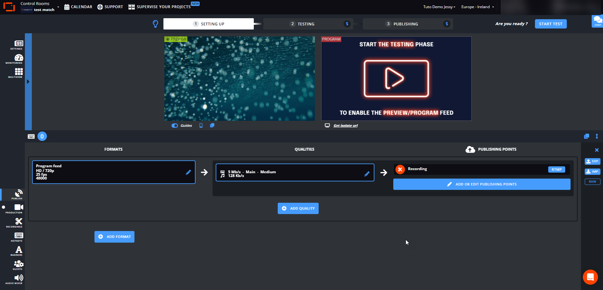
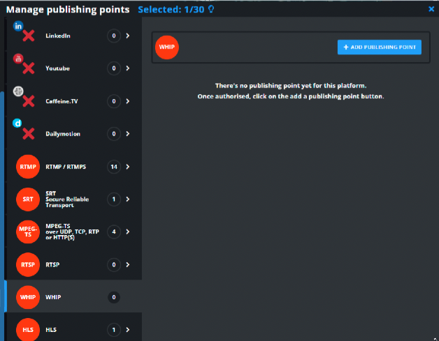
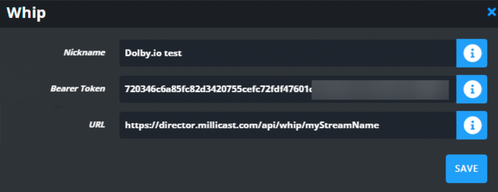
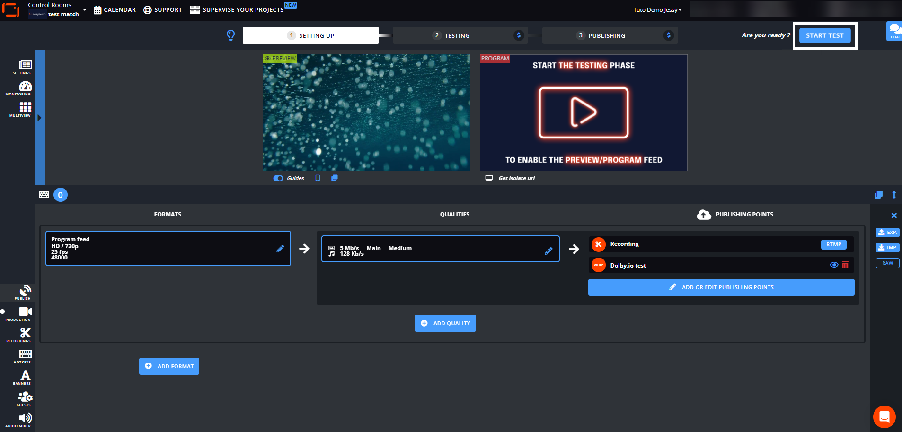
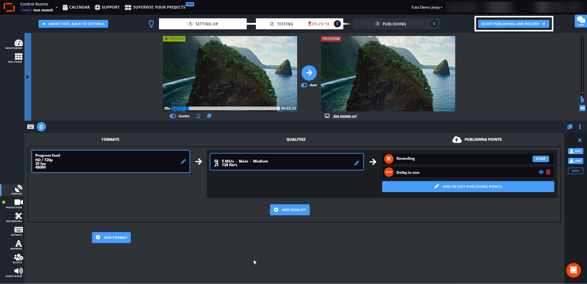
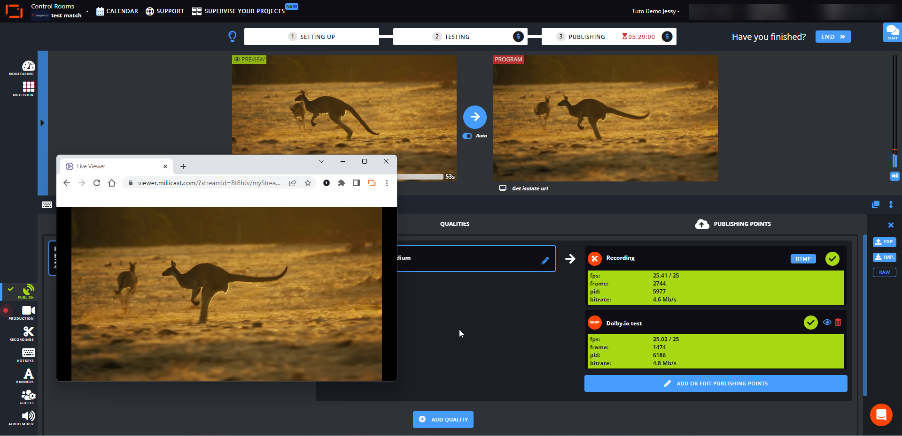

[LiveU Studio](https://www.liveu.tv/products/produce/liveu-studio) is a cloud production studio for live video that supports WebRTC streaming to the Dolby.io platform with [WHIP](/millicast/broadcast/webrtc-whip.md). This guide outlines how to create and broadcast a high-quality low-latency stream globally with Dolby.io streaming.

> 👍 Getting Started
> 
> If you haven't already, begin by following the [Getting Started](/millicast/getting-started.mdx) tutorial to create a Dolby.io application and start your first broadcast. You'll need your _bearer token_ and _WHIP endpoint_ for the steps described below.

See the official [LiveU Studio](https://www.liveu.tv/support) site for documentation, installation instructions, and additional [support](https://knowledge-base.studio.liveu.tv/en/).

# LiveU

## How-to use LiveU with WHIP

To get started, [create a token](/millicast/streaming-dashboard/managing-your-tokens.md) in your Dolby.io dashboard. On the Publishing tab of the newly created token, copy the WHIP endpoint URL and your Publishing token as shown in the [WebRTC | WHIP guide](/millicast/broadcast/webrtc-whip.md).

Open LiveU Studio and click on "PUBLISH" in the left-side menu. Click on "ADD OR EDIT PUBLISHING POINTS".

Select "WHIP" from the menu and Click "+ ADD PUBLISHING POINT".

Paste the WHIP endpoint URL and your Publishing token copied from the Dolby.io dashboard. Save the publishing point and select it.

Click "START TEST" from LiveU Studio.

Click "START PUBLISHING AND RECORD" to start publishing from LiveU Studio to Dolby.io.

LiveU Studio will publish to the Dolby.io Real-time Streaming service using WHIP. To view the stream, navigate back to your newly created token and switch to the "Playback" tab. From the "Playback" tab, copy the "Hosted Player path" URL and open it in your browser.

Your LiveU broadcast should now be playing in your browser.

> 🚧 Publishing Bitrates
> 
> LiveU Studio recommends publishing to the Dolby.io Real-time Streaming service with a max bitrate of 4 Mbps. A bitrate of 4 Mbps up to 6 Mbps may cause instabilities or artifacts. A bitrate above 6 Mbps may cause visible problems and/or your stream will not start.

# Learn more

Learn more by exploring the [developer blog](https://dolby.io/blog/tag/broadcast/) and [code samples](https://github.com/orgs/dolbyio-samples/repositories?q=broadcast).

