**Open Broadcaster Software (OBS)** is a free open-source software created for broadcasting and recording on your desktop. You can take advantage of this tool to stream high-quality video to your viewers in real time using the [Dolby.io Real-time Streaming](https://dolby.io/products/real-time-streaming/) service. 

See the official <a href="https://obsproject.com/" target="_blank">obsproject.com</a> documentation for installation instructions and additional support about using OBS.

# Setting Up a Broadcast

With OBS, you can broadcast using [RTMP](/millicast/broadcast/using-rtmp-and-rtmps.md), [SRT](/millicast/broadcast/using-srt.md), or [WHIP](/millicast/broadcast/webrtc-whip.md).

## RTMP

Setting up an RTMP broadcast with OBS is a common workflow. You can use the Dolby Millicast Service provider to configure your broadcast. 

It should be noted that broadcasting with RTMP may add some additional latency between the broadcast location and the origin server. 

### Dolby Millicast Service

The Dolby Millicast Service was added as a Stream option in more recent releases (after 30.x) of OBS.

#### 1. Choose Dolby Millicast as the Stream Service

Open profile **Settings** and select the **Stream** section. From the **Service** dropdown you should see `Dolby Millicast` among the options. 

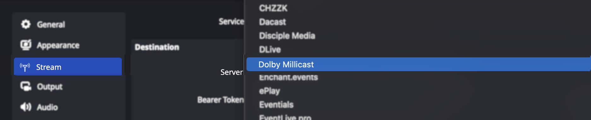

#### 2. Pick Your Server and Enter Your Stream Key

From the **Server** dropdown menu, you can select _Global_ to have your broadcast location automatically determined or choose from any of our [cluster regions](/millicast/distribution/multi-region-support/index.md).

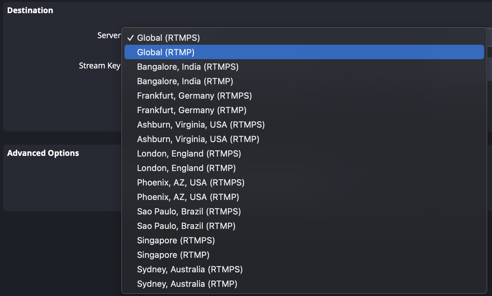

You'll need to copy your _RTMP publish stream name_ from the [Streaming Dashboard](/millicast/streaming-dashboard/index.md) and enter it as the **Stream Key**. For RTMP, this value would be the name of your stream with the publishing token as a query parameter and can be found on the Publishing tab.

#### 3. Start Streaming

You'll be able to start broadcasting by clicking the `Start Streaming` button. You can verify this by using the [Hosted Player](/millicast/playback/hosted-viewer.md) in the dashboard. 

## WHIP

The introduction of WHIP support in OBS 30.0 has made it easier to configure a WebRTC broadcast with OBS. For workflows that must use prior versions, we've also provided a WebRTC fork of OBS to use.

### OBS 30.x Setup

#### 1. Choose WHIP

Open profile **Settings** and select the **Stream** section. From the **Service** dropdown you should see `WHIP` among the options.

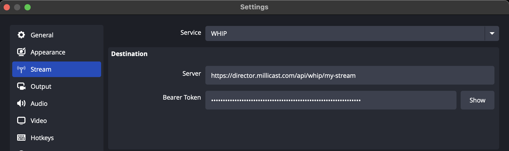

#### 2. Copy WHIP Settings

From the [Streaming Dashboard](/millicast/streaming-dashboard/index.md) you can select the _Publishing_ tab to find the WHIP settings you'll need to configure your broadcast.

| OBS Setting  | Streaming Dashboard                              |
| :----------- | :----------------------------------------------- |
| Server       | This is your **WHIP endpoint**.                  |
| Bearer Token | This should be set to the WHIP **Bearer token**. |

#### 3. Start Streaming

You'll be able to start broadcasting by clicking the `Start Streaming` button. You can verify this by using the [Hosted Player](/millicast/playback/hosted-viewer.md) in the dashboard.

### OBS WebRTC Fork

Prior to OBS 30.0 it was necessary to use a custom fork. For certain workflows this may be desirable so you can continue to download releases from the project GitHub repository: [OBS-studio-webrtc](https://github.com/CoSMoSoftware/OBS-studio-webrtc/releases).

You can choose either WebRTC or RTMP from the Stream menu. There are additional configuration options as well for [multi-source broadcasting](/millicast/broadcast/multi-source-broadcasting.md) or [simulcast](/millicast/distribution/using-webrtc-simulcast.md).

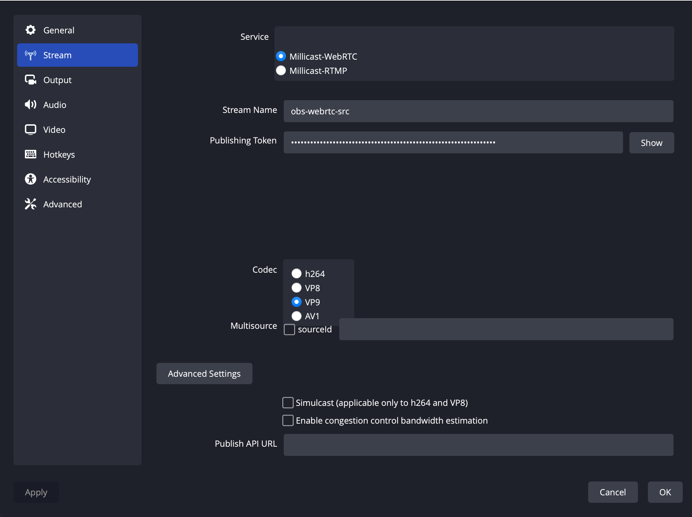

## SRT

Beginning with OBS 25.x you can stream with [SRT](/millicast/broadcast/using-srt.md). 

### Configure Custom Stream Settings

#### 1. Open Settings

Open the **Settings** panel to configure your broadcast.

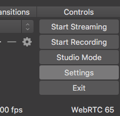

Select _Custom_ for the **Service**. 

#### 2. Enter Publish Token Settings

You'll need to gather a few details from the [Streaming Dashboard](/millicast/streaming-dashboard/index.md) for your publish token.

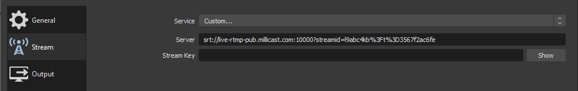

| OBS Setting | Streaming Dashboard                                      |
| :---------- | :------------------------------------------------------- |
| Server      | This is the **SRT publish path** for your publish token. |
| Stream Key  | This is the **SRT stream ID** for your publish token.    |

#### 3. Start Streaming

You'll be able to start broadcasting by clicking the `Start Streaming` button. You can verify this by using the [Hosted Player](/millicast/playback/hosted-viewer.md) in the dashboard.

# Multi-bitrate Simulcast Contribution

**Simulcast** is a mechanism for distributing streaming content with renditions that are optimized for viewers who may be under constrained network or device conditions. With Dolby Millicast, you can contribute multiple sources that contribute layers that are passed through for playback.

## Configuring MBR with Multi-Source RTMP

You will need adequate bandwidth to stream to multiple destinations from the broadcast location.

### 1. Install obs-multi-rtmp Plugin

To begin, install the [obs-multi-rtmp](https://github.com/sorayuki/obs-multi-rtmp/releases/) plugin. This is a plugin for streaming to multiple RTMP servers concurrently. 

The plugin can also be used with standalone encoders and basic configurations (bitrate). See the troubleshooting section if you run into trouble installing the plugin.

### 2. Configure Publish Token

> 📘 Enable multisource on your publish token
> 
> Make sure you have enabled multi-source on your publish token. For more information explore the [Multi-source guide](/millicast/broadcast/multi-source-broadcasting.md). The [Multi-source Builder](/millicast/streaming-dashboard/multi-source-builder.md) may also be particularly helpful to get your settings.

### 3. Add RTMP Destinations

You'll use the **multiple output** dock or panel to enter the RTMP connection details. You'll be using [Publishing Parameters](/millicast/broadcast/broadcast-parameters.md) to uniquely identify each layer. 

The format will follow the pattern:

`{StreamName}?token={Token}&sourceId={number of source}&simulcastId`

The **sourceId** should be a number (1, 2, or 3) with `simulcastId` enabled (boolean).

Here is example using 3 bitrates (1080p, 720p, 360p) as inputs using the obs-multi-rtmp plugin:

| RTMP 1      |                                                       |
| :---------- | :---------------------------------------------------- |
| Name        | 1080p                                                 |
| RTMP Server | rtmp://live-rtmp-pub.millicast.com:1935/v2/pub/       |
| RTMP Key    | _{StreamName}_?token=_{Token}_&sourceId=1&simulcastId |
| Encoder     | x264 or nvenc                                         |
| Resolution  | 1920x1080                                             |
| Bitrate     | 6000kbps                                              |
| Keyframe    | 2                                                     |
| BFrames     | 0                                                     |

| RTMP 2      |                                                                 |
| :---------- | :-------------------------------------------------------------- |
| Name        | 720p                                                            |
| RTMP Server | rtmp://live-rtmp-pub.millicast.com:1935/v2/pub/                 |
| RTMP Key    | _{StreamName}_?token=_{Token}_&sourceId=2&simulcastId&videoOnly |
| Encoder     | x264 or nvenc                                                   |
| Resolution  | 1280x720                                                        |
| Bitrate     | 2000kbps                                                        |
| Keyframe    | 2                                                               |
| BFrames     | 0                                                               |

| RTMP 2      |                                                                 |
| :---------- | :-------------------------------------------------------------- |
| Name        | 360p                                                            |
| RTMP Server | rtmp://live-rtmp-pub.millicast.com:1935/v2/pub/                 |
| RTMP Key    | _{StreamName}_?token=_{Token}_&sourceId=3&simulcastId&videoOnly |
| Encoder     | x264 or nvenc                                                   |
| Resolution  | 640x360                                                         |
| Bitrate     | 500kbps                                                         |
| Keyframe    | 2                                                               |
| BFrames     | 0                                                               |

### 4. Start Streaming

Click the **start** button for each target.

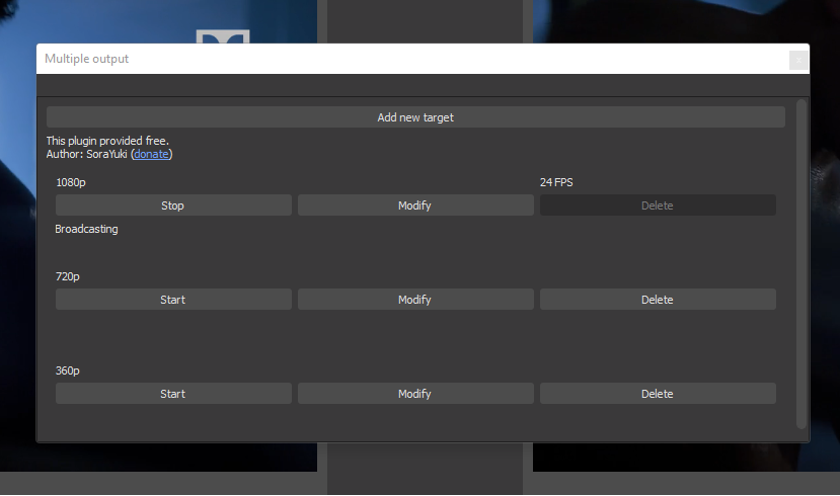

You may need to click **start streaming in OBS** to update the current configuration, then click **stop streaming** and return to the **multiple output panel**. When you click **start streaming** again, the config will be updated, and the RTMP MBR renditions will stream to Dolby.io Real-time Streaming CDN.

### 5. Playback

You can verify that simulcast is working by using the [Hosted Player](/millicast/playback/hosted-viewer.md) in the dashboard. Selecting the gear / settings menu will show each video quality allowing you to manually switch to a lower quality layer.

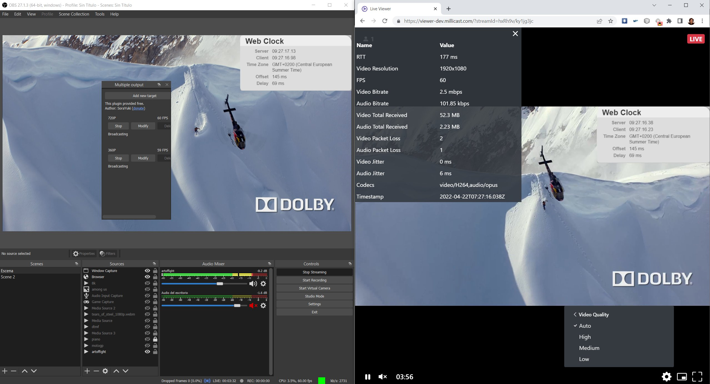

## Configuring MBR with Single-Source WHIP

You'll need to use the [OBS-studio-webrtc](https://github.com/CoSMoSoftware/OBS-studio-webrtc/releases) fork because advanced simulcast settings are not yet available in OBS 30.x with WHIP support.

Add your stream name and token from your Dolby.io Real-time Streaming token into OBS's settings. Select either _ H.264_ or _VP8_ for the **codec** as Simulcast only works for those two codecs. Click on the **advanced settings** button and check the **Simulcast** box to enable the feature inside OBS. Finally, apply the changes.

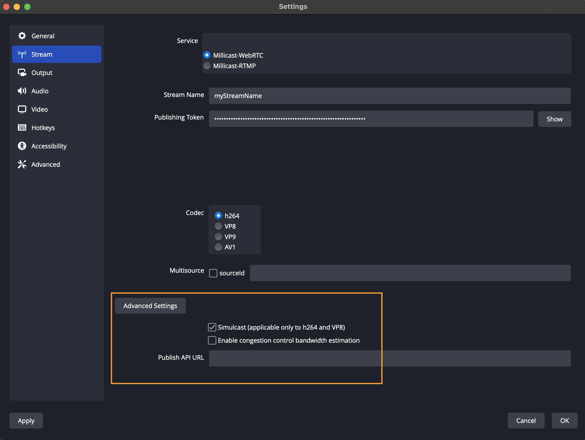

Next, we are going to set the output settings in OBS to see the different video qualities. Under **stream**, click on **output** and set the **output mode** to _advanced_. Set the **encoder** to _NVIDIA NVENC H.264_ (if available). Next, change the **rate control** to _CBR (Constant Bitrate)_, and modify the **bitrate** to _6000 Kbps_.

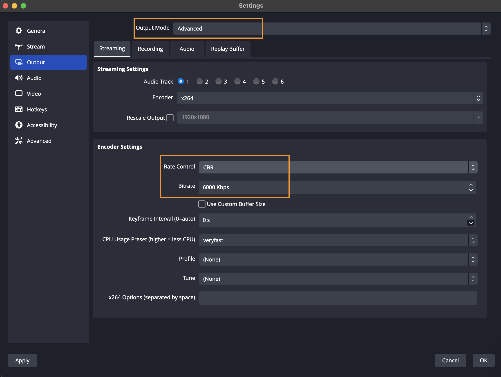

Next, set the **Base Resolution** and your **Output Resolution** to be matching. Apply all changes, and you are now ready to start your stream.

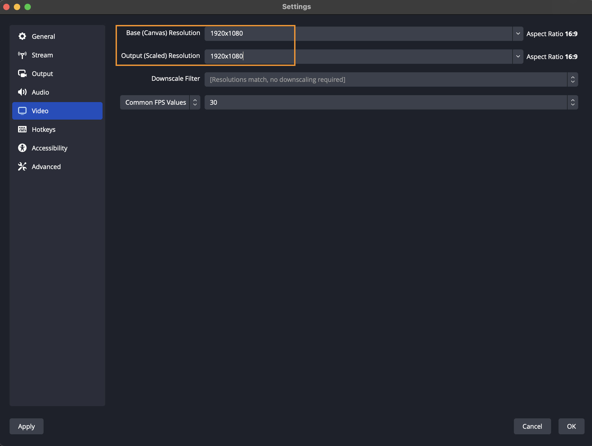

, 

# Troubleshooting

## B-Frames May Cause Stream Stuttering

You should disable B-Frames.

Review your Encoder Settings from the **Output** configuration with _Advanced_ Output Mode.

## Surround Sound Audio

Dolby Millicast supports delivering up to 8 audio channels enabling ** surround sound**. The audio channels can be surround sound channels or more general multichannel ones. The [Hosted Player](/millicast/playback/hosted-viewer.md) will support the playback of surround sound.

### 1. Setup Your DAW

Digital Audio Workstations (DAW) are used to manage media tracks as inputs for OBS studio. You need to download and install one and assign it as an input source for the audio on OBS. Some common ones include:

| Windows                                                                          | MacOS                                                  |
| :------------------------------------------------------------------------------- | :----------------------------------------------------- |
| [SAR](http://sar.audio/)  (requires an ASIO driver)                              | [Soundflower](https://soundflower.en.softonic.com/mac) |
| [Voicemeeter](https://vb-audio.com/Voicemeeter/index.htm)                        | [Jack server](https://github.com/jackaudio)            |
| [Virtual Audio Cable](https://vac.muzychenko.net/en/) (requires v.4.50 or later) | [Loopback](https://rogueamoeba.com/loopback/)          |

Reroute (from Reaper, with up to 256 channels) if using the [ASIO plugin](https://github.com/Andersama/obs-asio)

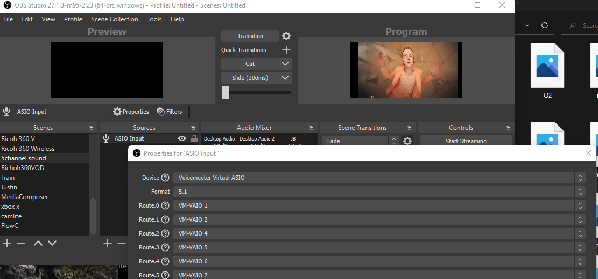

#### Ambisonics

If you have an Ambisonic it is also possible to publish spatial audio using the same setup. Here for the demo a [Zoom H3-VR](https://zoomcorp.com/en/us/handheld-recorders/handheld-recorders/h3-vr-360-audio-recorder/) can be used. Set for Dolby.io OBS WebRTC is the same as 5.1 and with Zoom mic you will see for channels to capture and stream to your surround sound set up. 

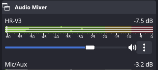

Properly set up for 4-channel ambisonics. This can be paired with a 360 camera.

### 2. Configure OBS

To get started make sure you have OBS installed on your device. Once installed head to **settings** then **audio**.  Select a channel different from _mono_ or _stereo_ in the **channels** list in general. 

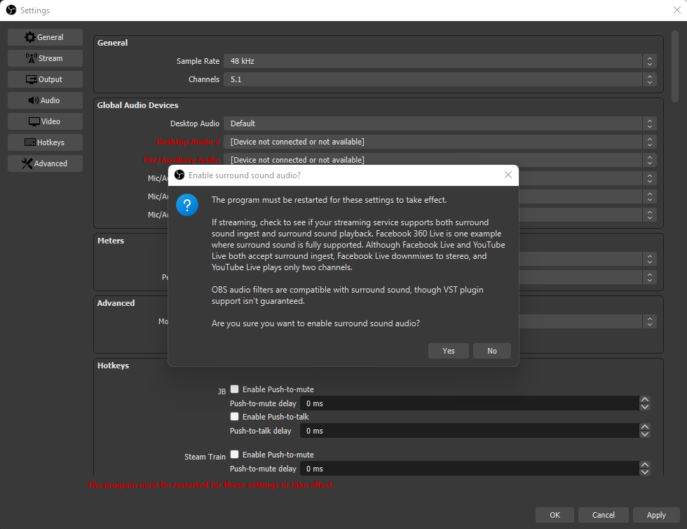

Click **OK** on the warning pop-up and restart OBS.

### 3. Set Audio Bitrates

Next switch to **output** and select _advanced_ for **output mode**. Select the **audio** tab and pick a large bitrate. By default, OBS-Studio selects 160 kbps for stereo. This is insufficient for surround sound. As a rule of thumb, 64 kbps multiplied by the number of channels should be an appropriate amount of bandwidth.

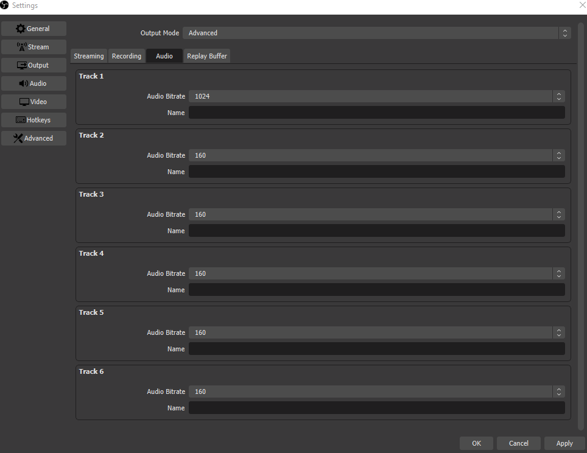

### 4. Start Streaming and Playback

When you begin streaming with surround sound you'll need an appropriate player to verify the experience.

#### Windows

Set up requires proper sound settings enabled on your speakers. The setup shown is on a Vizio 5.1.2 Atmos sound bar.

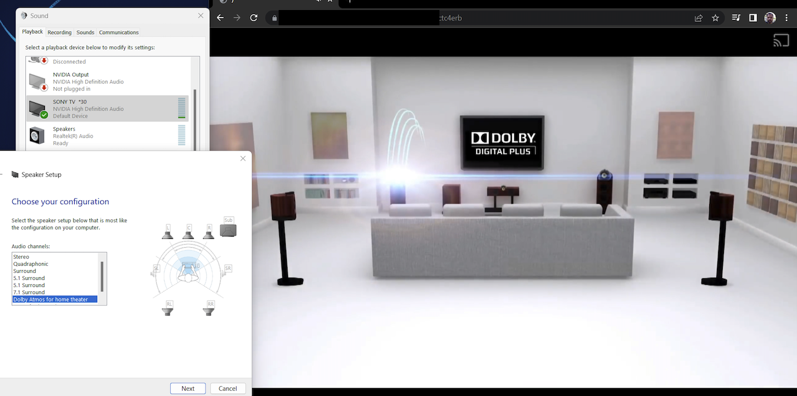

On your Windows make sure you are using Chrome browser for your viewer.

#### Mac

Surround sound playback should be enabled by default on your Mac. You can listen to the stream in-browser or via the [Dolby.io Stream Monitor](https://dolby.io/project-gallery/real-time-streaming-monitor-apps/) app can be installed for free on your iPad or AppleTV.

## Installing OBS-Multi-RTMP Plugin

Additional instructions for installing the [obs-multi-rtmp](https://github.com/sorayuki/obs-multi-rtmp/releases/) plugin.

### Windows

For Windows broadcasting:

1. Download the latest release from [OBS-Multi-RTMP](https://github.com/sorayuki/obs-multi-rtmp/releases/). 
2. Unzip the zip file and extract it into the OBS folder.  
   **OBS Studio** `C:\\Program Files\\obs studio`  
   **OBS WebRTC** default location. `C:\\Program Files\\OBS WebRTC (64bit)\\obs-plugins`

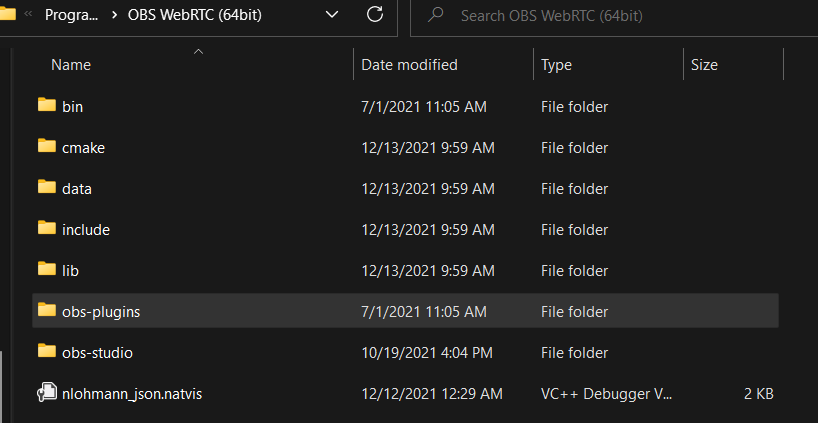

You should see the following `obs-multi-rtmp.dll` in your plugins folder.

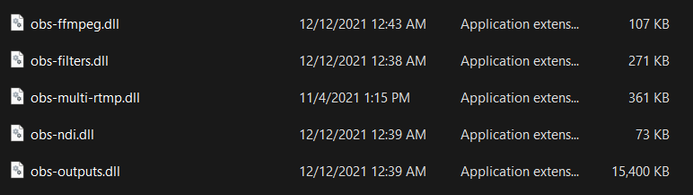

Once you have the `obs-multi-rtmp.dll` in your `C:\\Program Files\\OBS WebRTC (64bit)\\obs-plugins folder`, you can start OBS.

When you open OBS-WebRTC now, you will see the ability to add multiple RTMP targets.

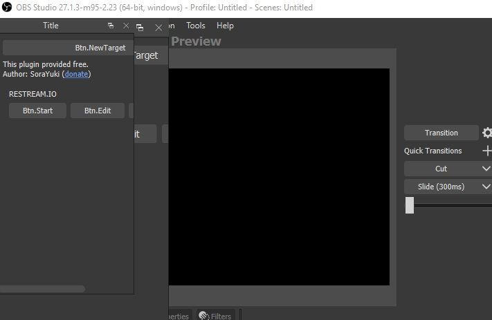

, 

### Mac

Additional instructions for installing the [obs-multi-rtmp](https://github.com/kilinbox/obs-multi-rtmp) plugin.

> 🚧 Match OBS Plugin Versions
> 
> For macOS, an alternate plugin can be found at [kilinbox/obs-multi-rtmp](https://github.com/kilinbox/obs-multi-rtmp). The plugin's version needs to match the OBS-WebRTC's version.

For this setup, download the ZIP file and unpack it. Copy the _obs-multi-rtmp.plugin_.

1. Next, go to _Applications_, right-click on OBS-WebRTC, and select show package content. 
2. Inside go to `Contents > PlugIns` and paste within the folder's content.
3. Open OBS-WebRTC, and on the top menu bar, under **docks**, **multiple output** will be checked off. 

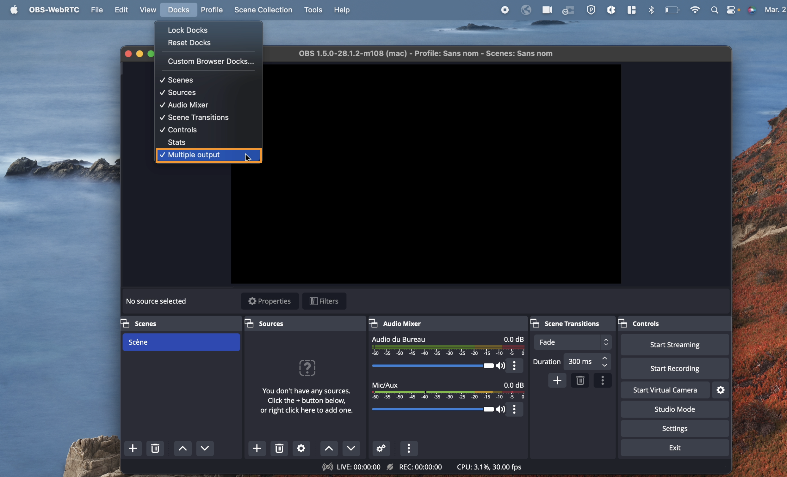

Next, go to the **multiple output** dock. If it is not showing up on your OBS, visit the dock menu at the top and reset it. Enable the **multiple output** option. Click on **Add new target** to create an RTMP destination.

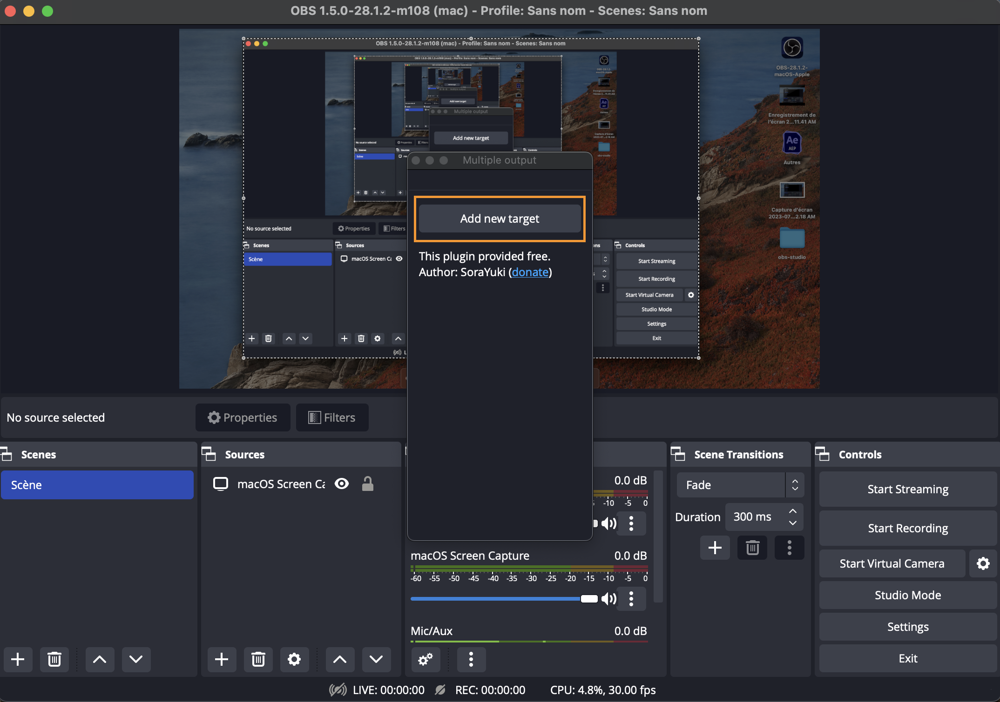

, 

# Learn More

## A Deep Dive Into WHIP, WebRTC, RTMP & SRT

This video guide walks through setup and capabilities of an OBS workflow.

<iframe width="560" height="315" src="https://www.youtube.com/embed/B1rjc14FzDc?si=Pztx7kiNwtC6GjO8" title="YouTube video player" frameborder="0" allow="accelerometer; autoplay; clipboard-write; encrypted-media; gyroscope; picture-in-picture; web-share" referrerpolicy="strict-origin-when-cross-origin" allowfullscreen></iframe>

