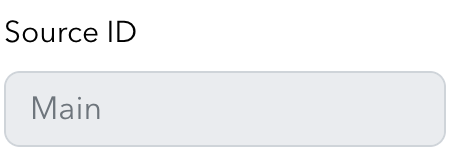

The **Live broadcast** section of the [Streaming Dashboard](/millicast/streaming-dashboard/index.md) is the place to manage all of your [Publish Tokens](/millicast/streaming-dashboard/managing-your-tokens.md). You use these tokens to securely broadcast. You can also launch a hosted **Broadcaster** web app to start a broadcast.

> 👍 Getting Started
> 
> If you haven't already, begin by following the [Getting Started](/millicast/introduction-to-streaming-apis.mdx) tutorial to create a Dolby.io application and start your first broadcast.
> 
> You can follow the steps in [Part 1](/millicast/getting-started/using-the-dashboard.mdx) to learn how to use the [Live Broadcast](/millicast/streaming-dashboard/how-to-broadcast-in-dashboard.md) and [Hosted Viewer](/millicast/playback/hosted-viewer.md).

## Quick actions

Each token item has a quick action menu that provides various options: Disable/Enable token, Delete Token, Online Broadcaster, and Token Settings.

<ul>
<li>
 **Disable/Enable token** 
  This allows you to quickly disable the token to prevent anyone from using it. Note: this will not disrupt any feed that was broadcasting live at the moment it was set.
</li>
<li>
 **Delete token** 
  Simply deletes the selected token. Keep in mind that once your token is deleted, it will not be recoverable, so it is important to be careful when using this feature.
</li>
<li>
 **Broadcast** 
  Allows you to broadcast a live feed quickly and easily from the dashboard.
</li>
</ul>

## Broadcaster

The Live Broadcaster interface is a lightweight hosted web application which allows you to instantly begin broadcasting your live stream to your global audience without installing any software.

The Broadcaster has the following user interface controls:

 **Video Devices** 
 **Audio Devices** 
 **Record** 
 **Settings** 
 **Picture-in-Picture** 
 **Share Broadcast** 

More detail about each of these can be found below.

### Video devices

By choosing the camera icon you will see the available [capture](/millicast/capture/index.mdx) devices from your computer. This may include built-in cameras or accessories such as a USB camera. Virtual cameras may also be present such as with OBS or NDI devices. You can also begin [screen sharing](/millicast/capture/screensharing.mdx) from this menu.

#### Video test

There is a **Video Test** option you can use that may be helpful alternative to sharing your video for testing a live streaming setup end-to-end.

You can also disable the camera option entirely and send an audio-only stream.

### Audio devices

The Mic input selector allow you to select between the microphone inputs that are active on your computer. 

You can alternatively **mute** the audio entirely for video only streaming.

### Start broadcast

Click the green `Start` button to begin a broadcast. The timecode above the button displays the duration of the stream. Click the red `Stop` button when you are finished publishing.

### Record

When [recording](/millicast/distribution/stream-recordings/index.mdx) is enabled for a publish token a record button will be present.

You can toggle the record feature only when you are not broadcasting live. If you are in a live broadcasting, you must stop the broadcast first to toggle the button and begin recording.

### Settings

The settings menu provides a few options to change the behavior of the broadcaster. It allows you to modify media settings, adjust the video display, and report issues with the Publisher. 

It allows you to manipulate camera quality, capture size, frame rate and aspect ratio. You can use these controls to tune the stream for quality, size and even codec (eg. H264, VP9 or AV1) which can provide certain benefits and capabilities. These adjustments can be very helpful when streaming to a wide variety of devices and network conditions. For example if the broadcaster is streaming from a very bandwidth-limited location, you have the ability to lower the quality, capture-size and framerate to maintain a smooth stream. More details about this pop-up are described below.

- Media Settings
- [Media Stats](/millicast/analytics/media-stats.md) provides diagnostic details about the performance of the broadcast stream
- **Video Display Adjust** 
- Report Publisher Issue can be used to request help from support and identify problems that occur while streaming.

### Media settings

> ❗️ Disabled Settings Cannot Be Changed
>
> Some settings must be set before beginning to publish your broadcast. If the item is _greyed_ out and disabled it is because the publish token may not have the feature enabled or a broadcast is already live and can no longer be changed such as: Codec, Simulcast, Absolute Capture Time, Stream Type, Audio, and Echo Cancellation.

<ul>
<li>
**Codec**

Choose from one of the codecs supported by your browser:

- VP8
- H264
- AV1
- VP9

</li>
<li>

**Bandwidth**

Choose an available bandwidth setting. There are trade-offs between video and audio quality and bandwidth which depends on the priority of your usage.

- Default
- 2Mbps
- 1Mbps
- 500 Kbps
- 250 Kbps
- 125 Kbps
- Custom

</li>
<li>
 **Multisource**

With the multisource feature, you are available to publish different independent feeds (each one identified with a different source id) under the same stream, this enables multiple audio and video tracks from different sources to be available to viewers. The **Source ID** can be specified to identify individual streams.

</li>
<li>
 **Simulcast**

Inside the Media settings, there is the option to activate the Simulcast feature, which will tell the system to make available three alternative quality streams for users that require lower bandwidth settings to gain speed and fluidity.

> 📘 Chrome
>
> Currently, our browser-based [simulcast](/millicast/using-webrtc-simulcast) feature is supported only when publishing via **Chrome**, however, the stream can be viewed with any browser. Only the broadcaster is required to be using Chrome.

</li>
<li>
**Absolute Capture Time**

Capture the timecode for the broadcast to be used for synchronization in the playback viewer.

</li>
<li>
**Stream Type**

Choose Video or Audio only podcasts.

</li>
<li>
**Priority**

Set the priority of the feed when publishing multiple backup feeds. For more information, see [backup publishing](/millicast/broadcast/redundant-ingest/index.mdx).

</li>
<li>
**Resolution**

> 🚧 Unsupported Camera Dimensions
>
> Some capture settings like width and height can disable your camera if the camera cannot support the requested dimensions. The browser will throw an over-constrained error. To learn more see [Mozilla Docs - OverconstrainedError](https://developer.mozilla.org/en-US/docs/Web/API/OverconstrainedError) or [W3C Docs - Overconstrained Object](https://w3c.github.io/mediacapture-main/getusermedia.html#overconstrainederror-object).

</li>
<li>
**FPS**

</li>
<li>
 **Echo Cancellation**

This feature enables the cancellation of echo on your audio's stream.

</li>
<li>
 **Audio**

This feature enabled stereo audio with your Dolby.io Real-time Streaming streams, however, stereo-enabled microphone is required.In addition, echo cancellation must be disabled while using the stereo setting. Doing this may cause an audio feedback loop so it is best practice to use headphones while listening to your stream to prevent echo.

</li>
</ul>

### Picture-in-picture

This button allows you to toggle picture-in-picture viewing.

### Share

The share button opens up a panel that provides links to the viewer for sharing your stream, as well as information about your stream. The share panel provides a link to a hosted viewer that you can share, as well as iFrame code for you to embed the player on your website. More details about this pop-up are described below.

<ul>
<li>
 **Online Viewer Path**

Within the share panel, the viewer path provides a URL to share out to those engaging with your live stream.

</li>
<li>
 **Hosted Viewer iFrame**

Within the share panel, an iFrame for an embeeded player is provided. This is beneficial if no development wants to be used in building a Broadcaster.

</li>
<li>
 **Customize**

Within the share panel, there is the option to adjust and change the iFrame code which will load an interface that allows you to manipulate the iFrame code to customize the hosted player.

</li>
</ul>

### Live stream status

After clicking the `Start` button you will begin broadcasting. The status and stream name will be displayed in the upper right corner as confirmation.

<ul>
<li>
 **LIVE** 
You are currently broadcasting live.
</li>
<li>
 **READY** 
You are not currently broadcasting.
</li>
<li>
 **LIVE + REC** 
You are actively publishing live and recording the stream.
</li>
</ul>

## Learn more

Feel free to use this broadcasting interface as much as you like. If you want to build your own or customize the experience by hosting your own you can by using the [Web SDK](/millicast/client-sdks/web.mdx) or using a [Sample App](/millicast/sample-apps/index.md) to get started.

- [Hosted Viewer](/millicast/playback/hosted-viewer.md)
