The Dolby.io dashboard enables you to easily provision tokens, broadcast streams, and manage account settings.

   <iframe width="560" height="315" src="https://www.youtube.com/embed/I6tasX-C2_w" title="YouTube video player" frameborder="0" allow="accelerometer; autoplay; clipboard-write; encrypted-media; gyroscope; picture-in-picture; web-share" allowfullscreen></iframe>

## Live broadcast

Live broadcasting is instant and secure using the dashboard’s online broadcaster. The interface guides you through creating a secure token allowing your viewers to connect securely to your live stream via WebRTC. Once you have successfully created your [Publish token](/millicast/streaming-dashboard/managing-your-tokens.md), you can publish a live stream instantly. A URL to a Viewer interface is created for you to instantly share your live stream with your audience, making publishing a complete, secure, and simple process. 

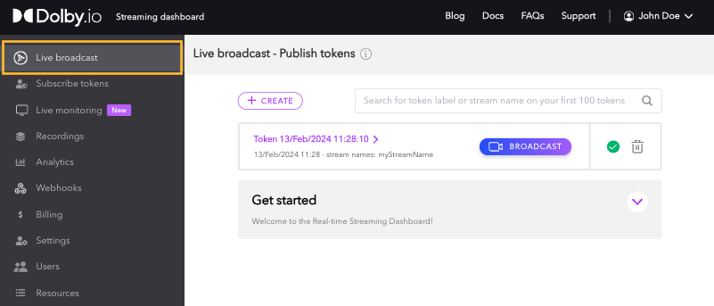

## Broadcaster

The broadcaster interface allows you to stream instantly from your account and gives you a link to share with your viewers. Your video is streamed via WebRTC to the Dolby.io Real-time Streaming service, which globally distributes the feed to all of your viewers with sub-second latency. For more information on how to navigate this interface, go to the [Live Broadcast Dashboard](/millicast/streaming-dashboard/how-to-broadcast-in-dashboard.md) guide. 

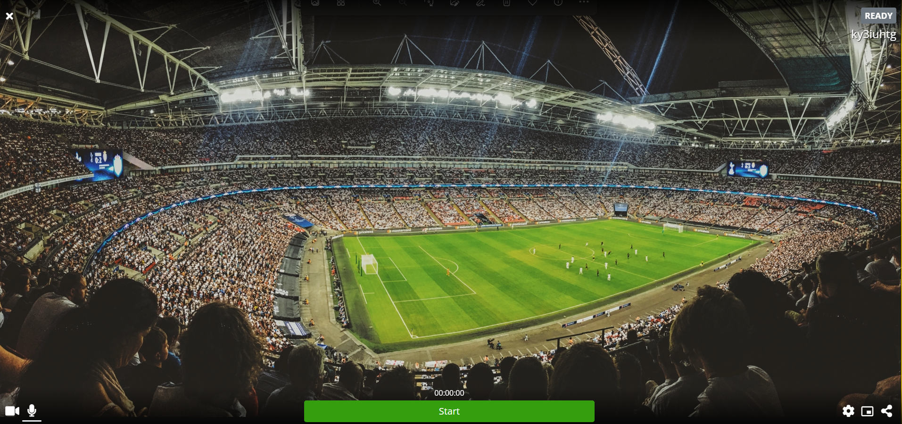

## Subscribe tokens

Subscribe tokens are used to give access to a stream. To ensure only authenticated users view a stream, Subscribe tokens work as _passwords_ for viewers to access a stream. Inside them, a _Token_ and a _Token ID_ are provided. These can also be geolocated, specified to a cluster region, or allowed for specific IP addresses. Visit the guide on how to [manage Subscribe tokens](/millicast/streaming-dashboard/subscribe-tokens.md) for more information.

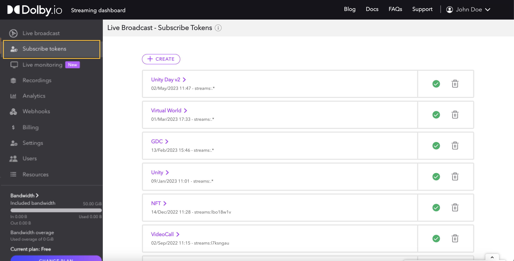

## Live Monitoring

The Live monitoring displays all active ingest streams and streams that have been offline for the last hour. Here you can monitor the status and statistics of your live streams and triage any potential issues.

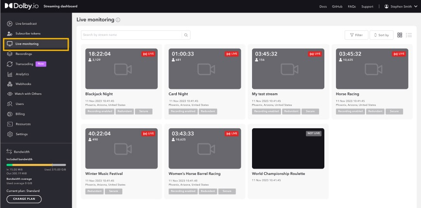

## Recordings

The Recordings section contains your recorded broadcasts, giving you access to preview and download.

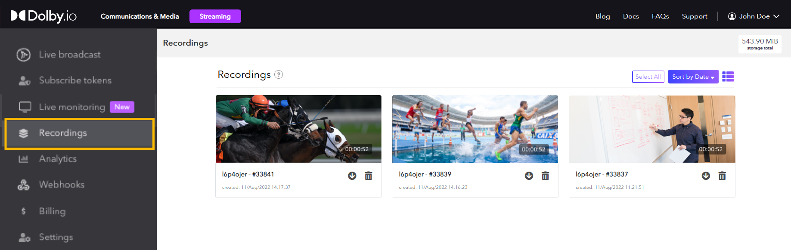

A storage meter above the recording list shows you how much of your storage your files are using. This helps you to better manage the storage space on your account.

Each item in the list allows you to _download_, _delete_ or _preview_ your recorded media. To preview, simply click on the respective item and the preview player will launch. The preview player will display additional information about the media. To learn more, read the [Recordings](/millicast/distribution/stream-recordings/index.mdx) documentation.

## Analytics

The Analytics page gives you a summary of how your bandwidth was consumed. This can give you good insight, not just into how many people are viewing, but also from where they are viewing. The page is viewed in three parts:** Date Controller**,** Chart**, and** Geographical Chart**. 

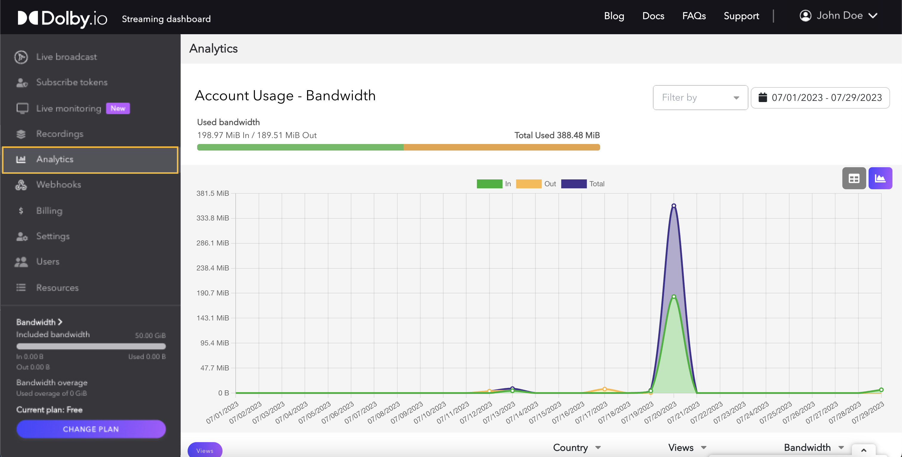

### Date controller

The first part is the _Date Controller_, which is the main controller of the page. Altering the date will update the rest of the results on the page. You can also change the date range from a day to a week to a month to see the total bandwidth used during that period or event.

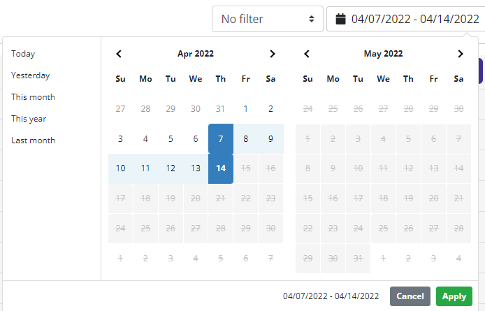

### Chart

The next section is the _Chart_. The chart gives you a visual representation of your bandwidth usage broken down by the ingress data coming into the service and the egress data going out, as well as the sum of both.

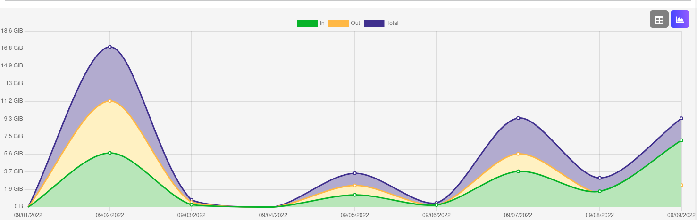

if you prefer to see the data in a nonvisual chart, you can click the _Table_ button to change the view to a data table. This will show the daily or hourly breakdown of the usage. Click the _Chart_ button to return to the chart view.

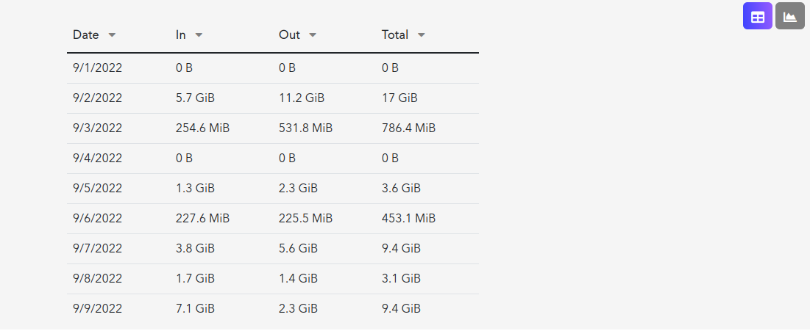

### Geographical chart

The next section is the _Geographical chart_, which displays the data based on your connections' geographical regions. You can see the countries on the left chart display views using a hotspot coloring for ranking, while the table on the right gives you a view of the data.

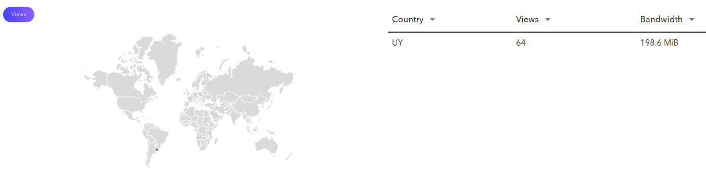

Click on the **"Views"** button to toggle the left chart for a bandwidth view of your data usage. This breaks down each region based on bandwidth usage.

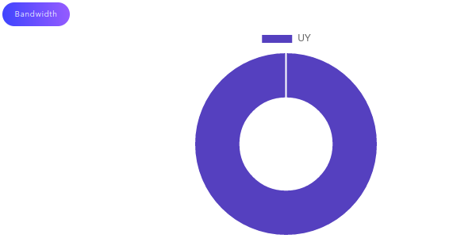

> 📘 Access Window of Analytics
> 
> The analytic information in this area has an access window of 7 days, after that 7 day window you will no longer be able to access this per stream breakdown. You can read more about this limitation in our analytics [Access Restrictions](/millicast/analytics/index.md#access-restrictions) section of the Analytic API doc.

## Webhooks

Webhooks are callbacks triggered by the platform to notify your application when an event occurs. As an alternative to polling solutions built with the [REST API](/millicast/api/webhooks-get.api.mdx), you can build asynchronous services and integrations that react only when real-time notifications are pushed from the Dolby.io platform to your application. For how to create a webhook, [check out its guide](/millicast/webhooks/index.md). 

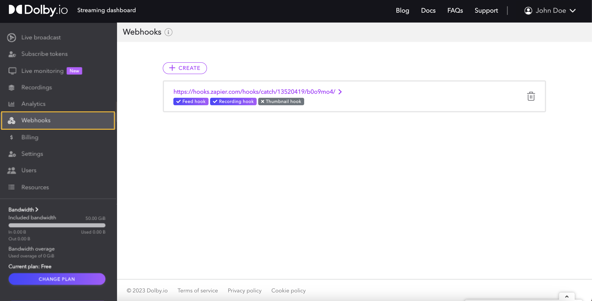

## Billing

The billing section of the dashboard gives you an overview of the current billing period and lets you manage your payment method, invoices, and plans.

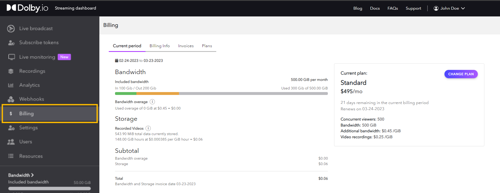

Dolby.io Real-time Streaming plans include a monthly bandwidth allotment and a per GiB fee for bandwidth used over the amount included with your plan. Here you can see how much bandwidth you have used for your current billing cycle.

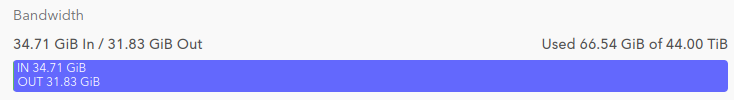

In addition to streaming bandwidth, plans each also includes a storage allotment for recordings. The storage usage under the _Billing Info_ tab shows how many _gigabytes/hour_ of usage have been accrued under the customer's current billing period. 

If you need to scale your account for more storage or to handle more concurrent viewers and bandwidth, simply upgrade by clicking on the **Change Plan** button just below your plan description.

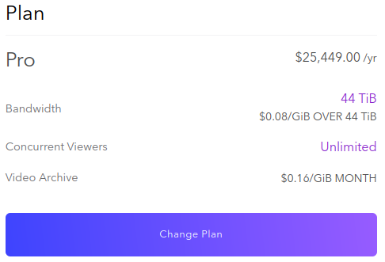

## Profile

Located in the top right corner of the dashboard, under your ID is the_ Profile_ menu. Within the profile menu is:

- The _Personal Information_ tab which allows you to update your email, first name, and last name. 

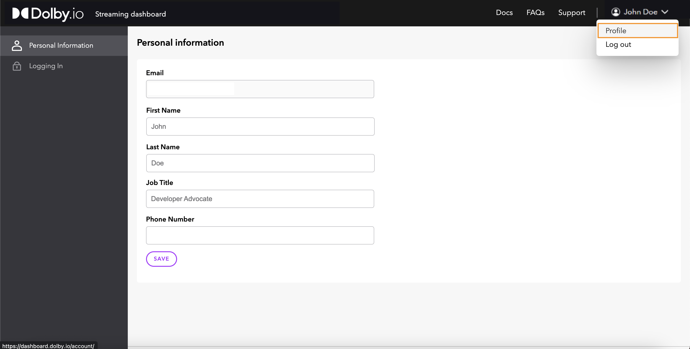

- The_ Logging in_ tab which allows you to update your password and [configure two-factor authentication](/millicast/streaming-dashboard/index.md#two-factor-authentication).

## Settings

Inside _Settings_, the account's _Token defaults_ are managed. Changes here are permanent across any existing and new tokens. Alternatively, you can alter [Geo-blocking](/millicast/distribution/access-control/geo-blocking.md) and [Cluster Regions](/millicast/distribution/multi-region-support/index.md) on a token-by-token basis instead of an account-wide change.

 On the _Security_ tab, users can create one or multiple API secrets to connect to [Dolby.io's Streaming API](/millicast/api/analytics-account-total/). 

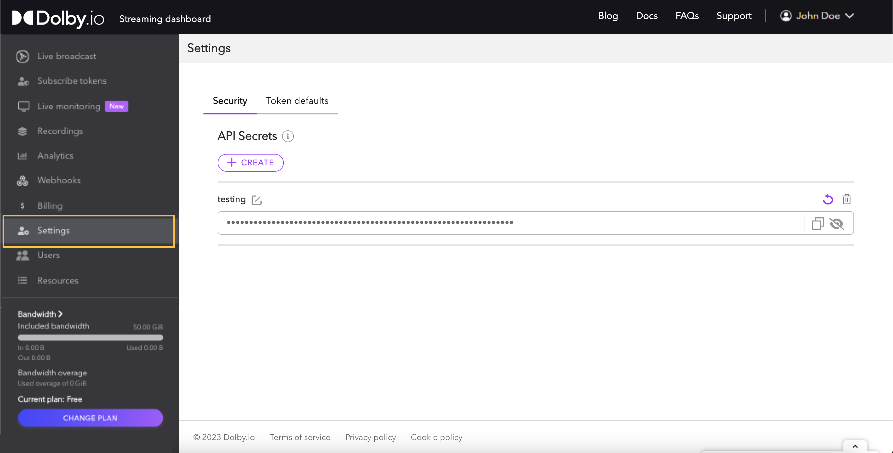

## Users

As a developer platform, we understand that you might not be working alone; therefore, **Users** allows you to add additional developers that might need access to the working streams. These users are managed across all of the Dolby.io platforms, meaning the invited **would also have access to the Communications & Media APIs**. 

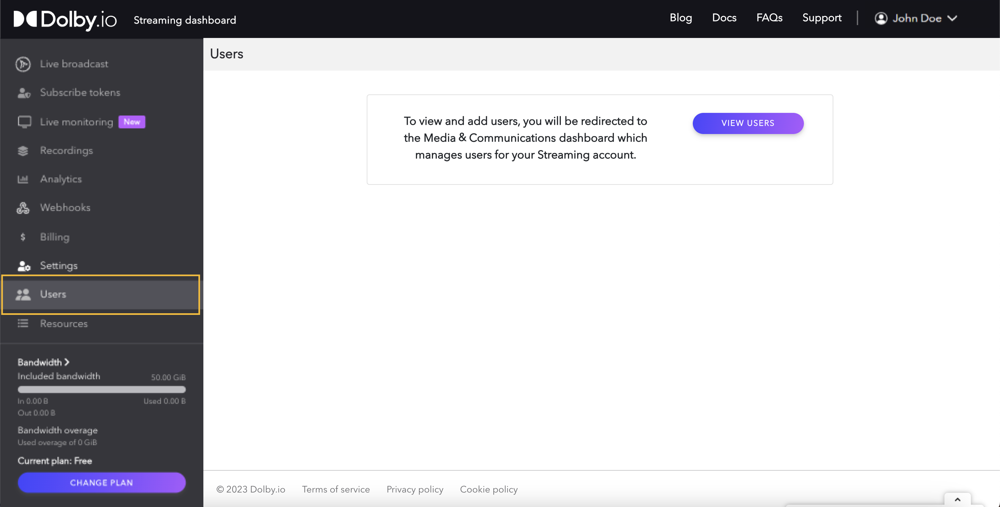

## Resources

The Resources section of the dashboard is reserved as the space for tutorials, documentation, and examples which might serve as useful in exploring all of the integrations and SDKs. Additionally, it links to Dolby.io's WebRTC version of OBS. If you are beginning your journey, start your first stream with our [Getting Started](/millicast/introduction-to-streaming-apis.mdx) guide. 

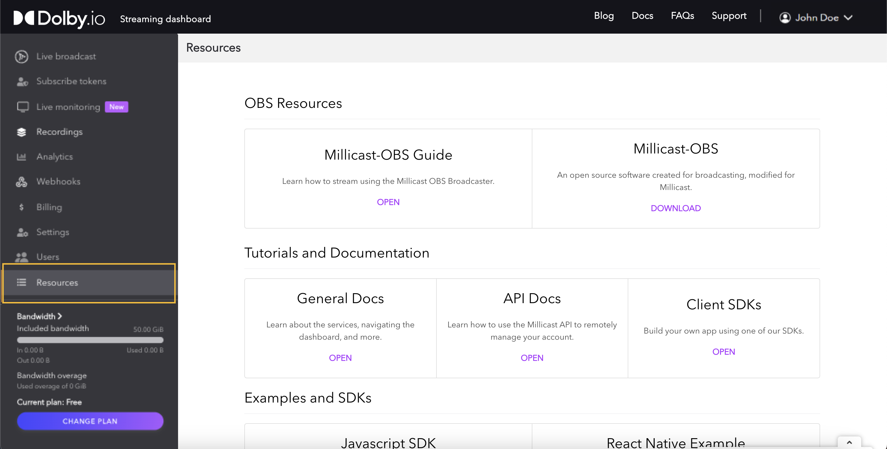

## Two-factor authentication

Two-factor authentication provides an extra layer of security and helps to ensure only an authorized user has access to your account, even if the account password is exposed. The second factor of authentication is provided by a 3rd party authenticator application ([IOS](https://apps.apple.com/us/app/microsoft-authenticator/id983156458), [Android](https://play.google.com/store/apps/details?id=com.azure.authenticator)), which generates a single-use verification code. The two-factor authentication user will need to provide this code in order to log into the Dolby.io dashboard.

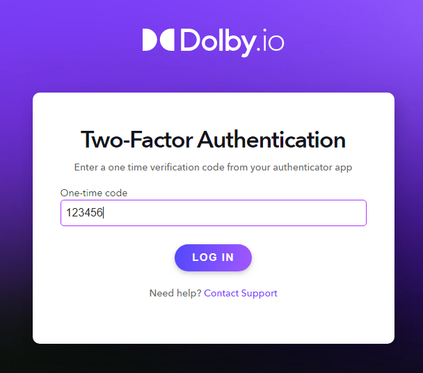

To enable this feature, navigate to the _Logging in_ section of the Dolby.io dashboard by clicking on your name in the top right corner and selecting _Profile_. Click Set Up to activate the two-factor authentication service. This button will take you through the setup process needed to register your authenticator application.

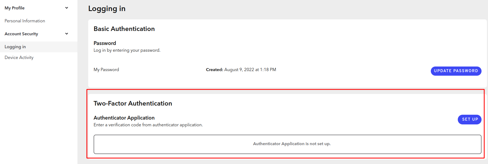

> 🚧 Setting up Two-Factor Authentication
> 
> Once begun, you must complete the setup entirely to avoid any issues or missed information. Please have your authenticator application ([IOS](https://apps.apple.com/us/app/microsoft-authenticator/id983156458), [Android](https://play.google.com/store/apps/details?id=com.azure.authenticator)) ready before starting the process.

Read the QR code on the screen with your authenticator application. Once the QR code is read, it will then generate a code on your device that will be required on the next window. Make sure you see the code on your device and click the _Next_ button.

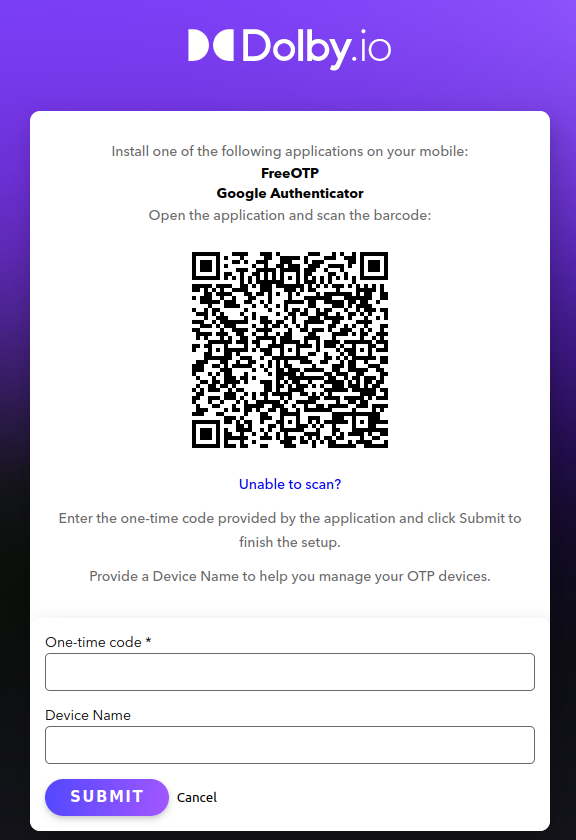

Now that the two-factor authentication system has synced and verified your application, anyone accessing your account will be required to enter a dynamically generated code from the synced authentication application. The generated login codes are valid for only a few seconds from your authentication application.

### Adding multiple two-factor authentication devices

You can sync other devices with an Authentication application if needed to share access or just to have more than one device to access with. To do this, simply go back to the account page and click the two-factor authentication button to open the two-factor authentication management screen.

At the bottom of the two-factor authentication management window, you will see the same QR code you used to initially sync the last device; use the QR to sync another device.

The two-factor authentication management window also lets **you reset your QR code**, which invalidates the last one, as well as other features like **generating new emergency codes** or **turning off two-factor authentication altogether**.

> ❗️ Resync Devices
> 
> You must resync any other devices if you had multiple synced with the last QR code.
