To [broadcast](/millicast/broadcast/index.mdx) a real-time stream the connection must be authenticated with a valid **publish token**. The Dolby.io platform uses token authentication for publishing to prevent unauthorized distribution of streaming content from your Dolby.io account. Without a valid token, publish requests will be rejected by the servers.

This guide outlines the following:

1. [How-to Create a Publish Token in the Streaming Dashboard](/millicast/streaming-dashboard/managing-your-tokens.md)create-a-publish-token)
2. [How-to Manage Publish Tokens](/millicast/streaming-dashboard/managing-your-tokens.md)managing-and-editing-existing-publish-tokens)
3. [Deleting a Publish Token](/millicast/streaming-dashboard/managing-your-tokens.md)deleting-a-token)
4. [Using the Token REST API](/millicast/streaming-dashboard/managing-your-tokens.md)using-the-token-api)

> 📘 Subscribe Tokens
> 
> To restrict who may _view_ a stream, you would use a separate [subscribe token](/millicast/streaming-dashboard/subscribe-tokens.md) after enabling the **Secure Viewer** setting.

## Create a publish token

Log into your [Dolby.io Streaming Account](https://dashboard.dolby.io/signin) and select **Live Broadcast** from the left menu. This is where you can view and manage all of your _Publish tokens_.

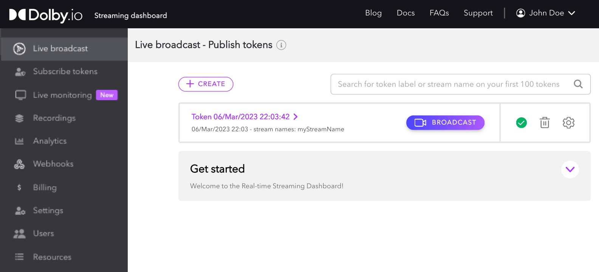

Select the `Create (+)` button. This opens a pop-up window with options for configuring your new _Publish token_. Each option can be changed again later after the token has been created.

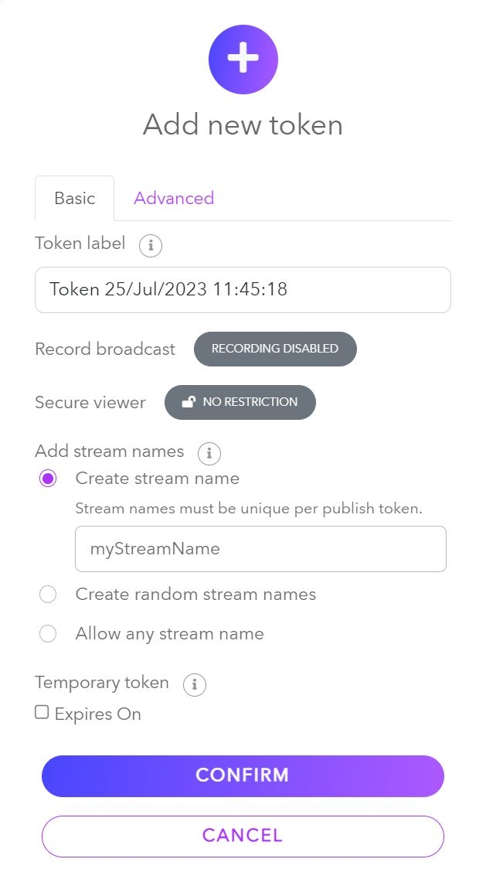

### Basic settings

Let's go over each section in a bit more detail:

- **Token label** gives you a naming system you can use to keep track of your tokens. You can use it to label what the tokens are used for by application, event, user or to differentiate testing from production use.
- **Record broadcast** when enabled will allow you to record broadcasts using this token. After a broadcast is completed, you can find the recordings in the [Recordings](/millicast/distribution/stream-recordings/index.mdx) section of the dashboard. This feature can incur additional charges, see the [pricing](https://dolby.io/pricing) page for additional detail.
- **Secure viewer** has two settings, "_No Restrictions_" (default) which allow anyone with the link to your viewer to watch a live broadcast without requiring authorization. The alternate setting, "_Token Required_", restricts your broadcast to only allow viewing the stream if provided a valid [Subscribe Token](/millicast/streaming-dashboard/subscribe-tokens.md).
- **Add stream names** allows you to indicate how many broadcasts, called "_Token Streams_", you want to be managed by this _Publishing token_. A token can manage an unlimited number of streams as long as each has a unique alphanumeric name.
  - **Create stream name** allows you to specify a specific stream name such as _"MainCameraFeed"_.
  - **Create random stream names** will generate a stream name dynamically to insure uniqueness, such as _"hl7iqst"_.
  - **Allow any stream name** gives your token the ability to use ANY arbitrary stream name in the publishing path. The only rule to note here is that anyone using their own viewer must know what stream name the broadcaster is using in order to view the stream correctly.

> 🚧 Stream names are required to broadcast
> 
> To publish a stream, a _stream name_ is required. Unless the Publish Token is set to **Allow any stream name**, the stream name must be equal to one of the created or generated stream names.

- **Temporary token** allows you to specify an expiration date for the token. Click on the arrows above and below each section respectively, to set the expiration date. Once the date and time have passed, the token will automatically become invalid.
  - If a token expires in the middle of a broadcast, the broadcast will continue until the publisher ends it or if the [Stop an active stream](/millicast/api/stream-stop-stream.api.mdx) API is called for that token. The Temporary token feature prevents expired tokens from being able to _start_ new streams, but doesn't impact already running streams.

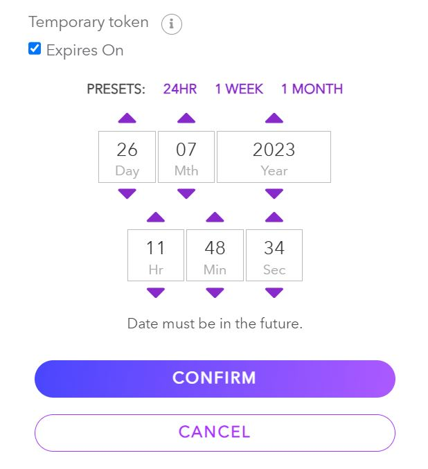

> 👍 Temporary Publish tokens are recommended
> 
> Having an expiration date can prevent old or exposed tokens from becoming a long term vulnerability by limiting the duration they are valid. Tokens can always be deleted manually but if you know you only need the token for a set period of time it is more secure to create a token that is only valid for that duration.

### Advanced settings

You will also see an **Advanced tab** at the top of the token creation interface; in this tab, you can configure more advanced settings.

- [Allowed Origins:](/millicast/distribution/access-control/token-security.md)allowed-origins) If specified, only the domains listed will be allowed in requests to [Director API](/millicast/api/director/director-publish.api.mdx). Wildcard subdomains are also allowed, such as _"\*.demo.com"_. When unspecified (empty), there are no domain restrictions.
- [IP Filter Type:](/millicast/distribution/access-control/token-security.md)ip-filters) 
  - **Allowed IP Addresses:** Allows you to specify multiple IPv4 addresses or CIDR notated network blocks. If specified, the token will only be usable by those addresses.
  - **Bind IPs on usage:** If specified, Bind IPs on usage will bind the token to the first _X_ IP addresses used with a token in requests to [Director API](/millicast/api/publish-token-v-1-read-token.api.mdx), thus restricting the token to those IP addresses without them being known beforehand. Mutually exclusive with the _AllowedIpAddresses_ option. Not currently supported with RTMP.
- [Cluster region:](/millicast/distribution/multi-region-support/index.md) Specifies the cluster used for streaming. This setting is configured to use the default regional cluster set for the account. If `Auto` is selected, the regional cluster will be selected based on the publisher's location. 
- [Geo-Blocking:](/millicast/distribution/access-control/geo-blocking.md) Enables blocking by location at a country level for this specific Token. 
- [Multisource:](/millicast/broadcast/multi-source-broadcasting.md) Enables streaming multiple feeds at once with one Publish token and Stream name combination, allowing for [Multi-view playback](/millicast/playback/multiview.md). 
- [Thumbnail previews:](/millicast/webhooks/thumbnail-webhooks.md) Enables previewing a thumbnail image of your video stream. Thumbnails are delivered via a webhook. 

After you have successfully created your token, it will be displayed in a scrollable list.

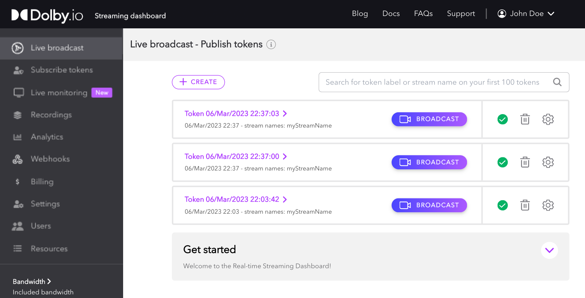

Once created, your Publish token can be used to broadcast in a variety of different ways using different [hardware](../broadcast/hardware-encoders.mdx) and [software](../broadcast/software-encoders.mdx) solutions. To learn more about how to broadcast with your Publish token, explore [the Broadcast guide](/millicast/broadcast/index.mdx).

## Managing and editing existing publish tokens

Once a Pubish token is created, it is displayed on the **Live Broadcast** page. From this page, you can [start a broadcast using the Dashboard Broadcaster](/millicast/getting-started/using-the-dashboard.md)b-start-broadcast), enable or disable, delete, or edit the settings for each Publish token.

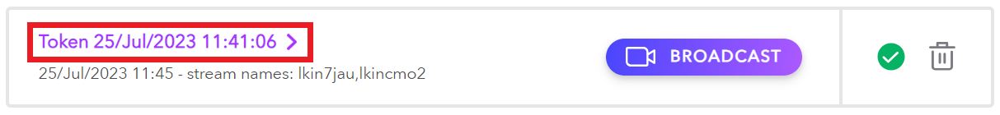

Even though the _quick action menu_ provides you with a certain level of token control, the real control lies within the _manage_ UI for each token. To open the manage view, simply click the **Token Name** on the item’s action menu. 

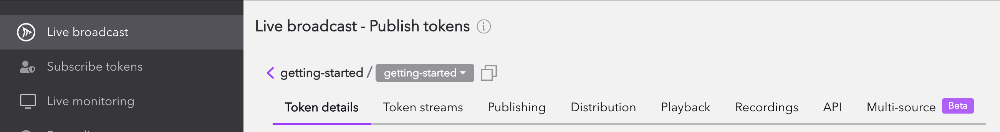

Once opened, you will see multiple tabs to explore.

1. Token details - token identification, security, and overall feature capabilities
2. Token streams - configure stream names that the token can publish
3. Publishing - settings for configuring broadcast encoders such as [RTMP](/millicast/broadcast/using-rtmp-and-rtmps.md), [SRT](/millicast/broadcast/using-srt.md), and [WebRTC](/millicast/broadcast/webrtc-whip.mdx) settings
4. Distribution - configuration for distribution content such as [Geo-cascading](/millicast/distribution/multi-region-support/geo-cascading.md) and [Re-streaming](/millicast/distribution/re-streaming.md)
5. Playback - path and settings available with the hosted [Millicast Player](/millicast/playback/hosted-viewer.md)
6. Recordings - media files that are captured from stream recordings
7. API - publishing token, ids, and endpoints for use with [Client SDKs](/millicast/client-sdks/index.mdx)
8. Multi-source - a convenient tool for setting up [multi-source](/millicast/broadcast/multi-source-broadcasting.md) contribution
### 1\. Token details

The **Token details** tab allows you to view and edit settings specified during token creation. For a full list of these settings and their definitions, see [Creating a Publishing token](/millicast/streaming-dashboard/managing-your-tokens.md)creating-a-publishing-token). The Token details page also includes the **Publish token** string and the **Account ID** string, which can both be copied and used for [starting a broadcast](/millicast/broadcast/index.mdx). 

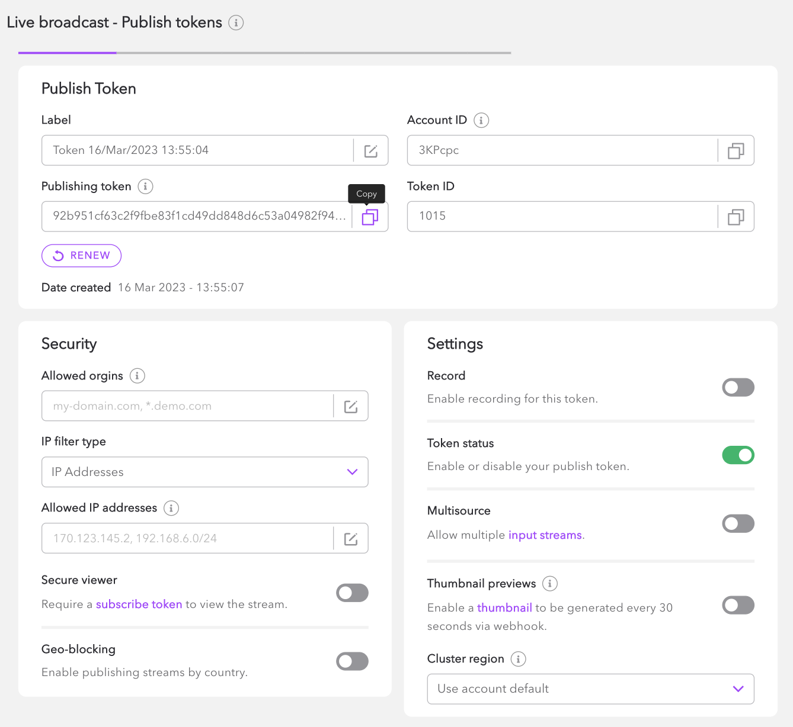

> 👍 Renew your token
> 
> If your token has been compromised you can renew it by clicking the **renew button** under the _"Publishing token"_ string.

### 2\. Token streams

As mentioned in [Creating a Publish token](/millicast/streaming-dashboard/managing-your-tokens.md)creating-a-publishing-token), when a stream name is specified, it will require the user of the token to use a specific stream name in order to broadcast. Within the management view, you are able to add and delete stream names as you see fit.

To add a new name, simply click on the **(+) CREATE** button on the Token Streams tab, which will initiate a popup similar to the add token interface.

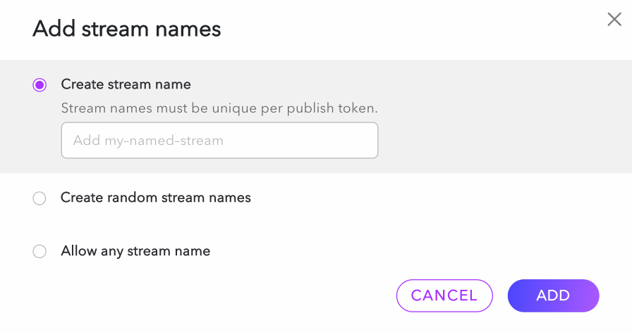

To delete a stream name, simply select it from the list and click the remove button.

### 3\. Publishing

The publishing tab includes all information relating to [broadcasting](/millicast/broadcast/index.mdx) a stream with the Publish token. This tab can be broken down into four sections:

- [WHIP](/millicast/broadcast/webrtc-whip.mdx): The _WHIP endpoint_ and _Bearer token_ can be used to publish a WebRTC stream with WebRTC-compatible software and hardware.
- [RTMP](/millicast/broadcast/using-rtmp-and-rtmps.md): The _RTMP/s publish paths_ and _RTMP publish stream name_ can be used for publishing streams with RTMP-compatible software and hardware.
  - RTMP multi-bitrate can be enabled from this section. When enabled, the dashboard will create three RTMP publish stream names for **low** bitrate, **medium** bitrate, and **high** bitrate.
- [SRT](/millicast/broadcast/using-srt.md): The _SRT publish path_, _SRT stream ID_, and _SRT publish URL_ can be used for publishing with SRT-compatible software and hardware.
  - Passphrase encryption can be enabled from this section. When enabled, the dashboard will generate a passphrase for encrypting the SRT stream.
- Publish token: The _Publishing token_ and _Stream name_ can be used to authenticate and start a broadcast from the [Dolby.io Streaming Client SDKs](/millicast/client-sdks/index.mdx) or compatible [software](../broadcast/software-encoders.mdx) and [hardware encoders](../broadcast/hardware-encoders.mdx).

To learn more about publishing and broadcasting with Dolby.io, check out the [Broadcast](/millicast/broadcast/index.mdx) guide, which provides more in-depth resources and examples on how to use the Publish token once it is created.

### 4\. Distribution

The Distribution tab includes settings that can modify how the CDN distributes the stream to end viewers. This includes a few important configurations such as:

- [Re-streaming](/millicast/distribution/re-streaming.md): fan-out a stream to multiple endpoints that are able to accept incoming connections for syndicated broadcasting and distribution
- [Geo-cascading](/millicast/distribution/multi-region-support/geo-cascading.md): configuration of edge servers that handle the last-mile distribution of a stream for playback

### 5\. Playback

The Playback tab includes all relevant information for playing back a live stream. Dolby.io provides an [out-of-the-box hosted player experience](https://viewer.millicast.com/?streamId=k9Mwad/multiview&multisource=true), which can be viewed at the **Hoster player path** URL or by embedding the **Hosted embedded player** as an `<iframe>` into your webpage.

From this tab, you can customize the player by altering settings such as the inclusion of the "Volume button" or if the stream is "Muted on start". To learn more about the hosted player or how you can build or use your own player, explore the [Playback](/millicast/playback/index.mdx) guide.

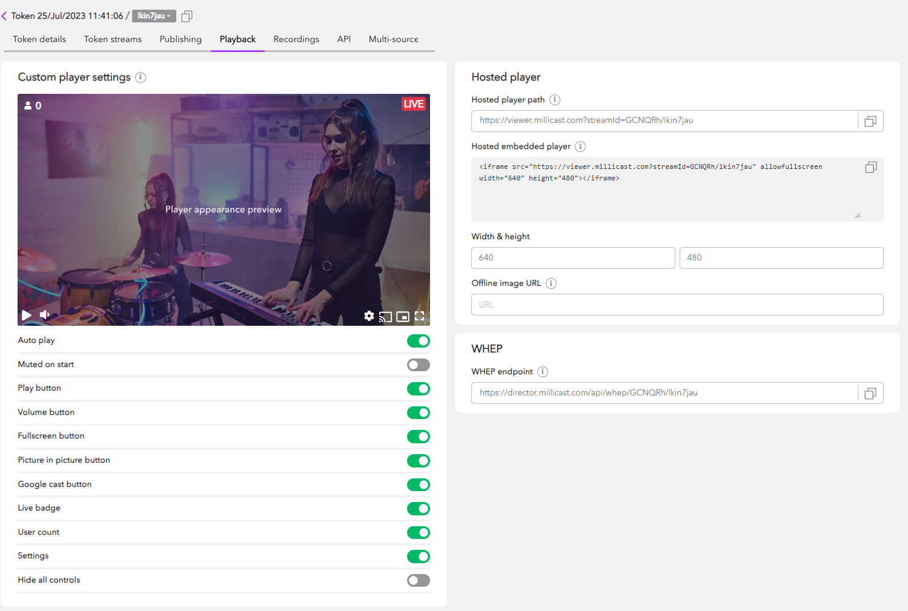

The playback tab also includes a [WHEP](/millicast/api/director/whep-whep-subscribe.api.mdx) endpoint. This can be used for devices that support WebRTC egress. To learn more about WHEP, explore the [Playback](/millicast/playback/index.mdx) section of the documentation.

### 6\. Recordings

The _Recordings_ tab can be used to view and download all recordings associated with this Publish token.

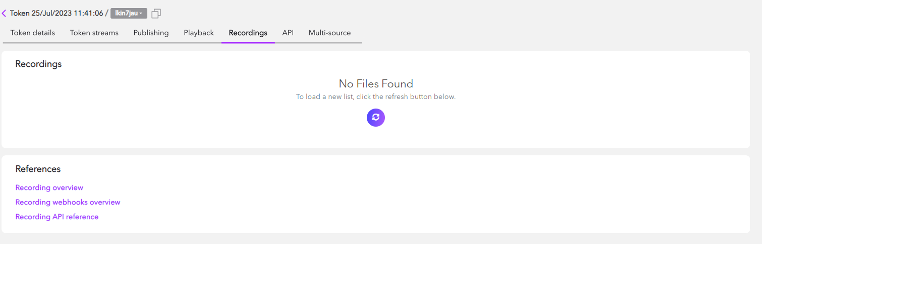

To learn more about recording, visit the [Recordings guide](/millicast/distribution/stream-recordings/index.mdx).

### 7\. API

The API tab includes information needed to publish a stream with the [Client SDKs](/millicast/client-sdks/index.mdx) or from a [third-party software or hardware source](/millicast/broadcast/index.mdx). The tab includes details in a few sections:

- **Publish token**:
  - **Publishing token**: The Publishing token is a unique string that is required for authenticating a request to publish via the Dolbyio servers. This string should be protected and **if exposed, should be cycled immediately** to prevent unwanted broadcasts and charges.
  - **Stream ID**: The Stream ID is a combination of your _Account ID_ and _Stream name_ used for [publishing](/millicast/getting-started/creating-real-time-streaming-web-app.md) or viewing the stream.  If your stream** is not secured** with a [subscribe token](/millicast/streaming-dashboard/subscribe-tokens.md), you'll be able to view it at `https://viewer.millicast.com?streamId=[Account ID]/[Stream name]` when it is live.
  - **Stream name**: Your Stream name is used to manage and distinguish streams using the same token. You can edit the Stream name in the "[Token streams](/millicast/streaming-dashboard/managing-your-tokens.md)2-token-streams)" tab. 
  - **Account ID**: The Account ID is a unique account identifier used for [publishing](/millicast/getting-started/creating-real-time-streaming-web-app.md) and viewing streams. 
  - **Token ID**: The Token ID can be used for [Reading](/millicast/api/publish-token-v-1-read-token.api.mdx), [Deleting](/millicast/api/publish-token-v-1-delete-token.api.mdx), and [Updating](/millicast/api/publish-token-v-1-update-token.api.mdx) Publish tokens via the [REST APIs](/millicast/api/publish-token-v-1-read-token.api.mdx).
- **Sample API calls**: The Sample API calls section includes some basic examples of [Publishing](../streaming-dashboard/token-api.md#creating-publishing-tokens) and [Subscribing](../streaming-dashboard/token-api.md#creating-subscribe-tokens) calls that can be made with the credentials provided in the Publish token section. To learn more about API calls, explore the [Token API](../streaming-dashboard/token-api.md) guide.
- **API endpoints**: The API endpoints section provides a [Publish API URL](../streaming-dashboard/token-api.md#creating-publishing-tokens) and a [Subscribe API URL](../streaming-dashboard/token-api.md#creating-subscribe-tokens), which can be used with the Publish token credentials and [Subscribe token credentials](../streaming-dashboard/subscribe-tokens.md), respectively.

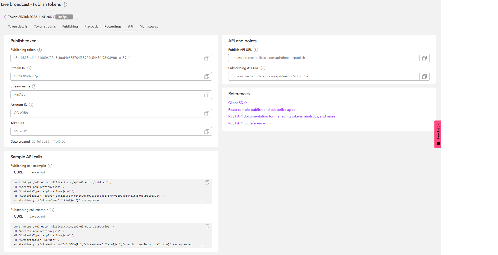

### 8\. Multi-source

The multi-source builder is a tool to help you construct and configure publishing endpoint arguments to power a multi-view experience. You can add multiple SRT, RTMP, or WebRTC sources and can configure Multi-Bitrate publishing. The Multi-source tab also includes a URL to launch the hosted player in the multi-viewer configuration, customizable `<iframe>` code to add the hosted embedded player into your webpage, and the ability to export your multi-source file.

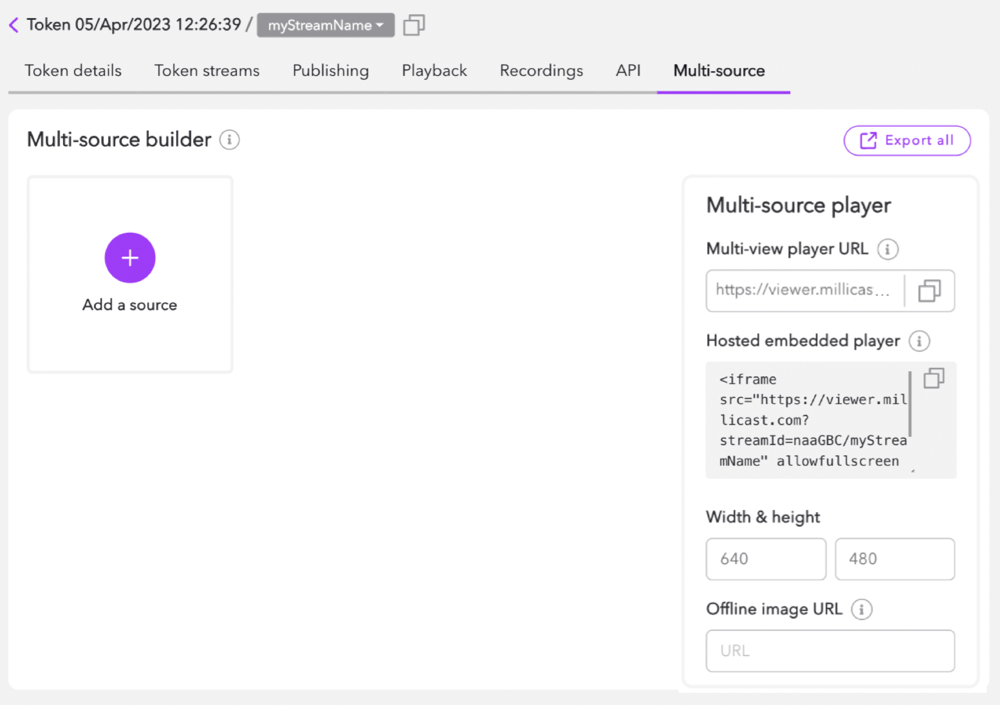

## Deleting a token

Once you've finished using a Publish token, it is **recommended that you retire the token** by deleting it to prevent accidental vulnerabilities. Deleting the token can be done from the _quick action menu_ found at the top-level Live Broadcast page by clicking on the trash can icon.

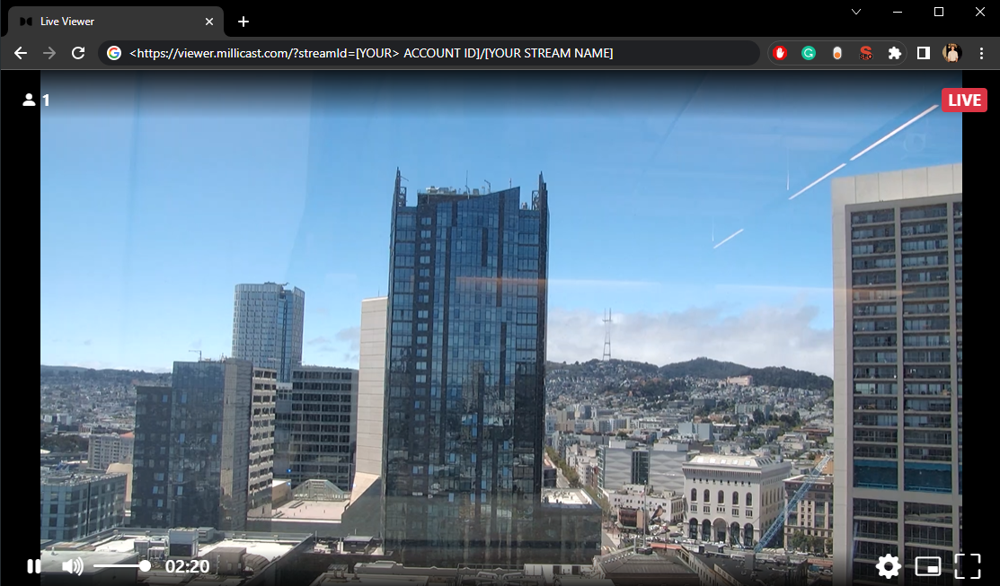

## Using the Token API

This guide provides a high-level understanding of managing your tokens via the Dolby.io dashboard. Whilst the dashboard is a great choice for managing Publish and [Subscribe](/millicast/streaming-dashboard/subscribe-tokens.md) tokens, **all aspects of token creation and management can be programmatically controlled via the Dolby.io Streaming Token REST APIs**. By utilizing the Token APIs to automate workflows, you can create scalable streaming solutions for your application or platform.

To learn more about using the REST APIs for token creation and management, check out:

- [The Platform Guide for Token APIs](/millicast/streaming-dashboard/token-api.md)
- [The REST API reference](/millicast/api/publish-token-v-1-read-token.api.mdx)
