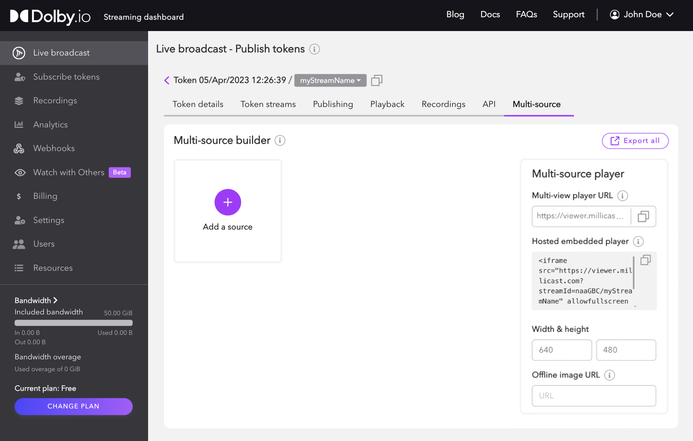
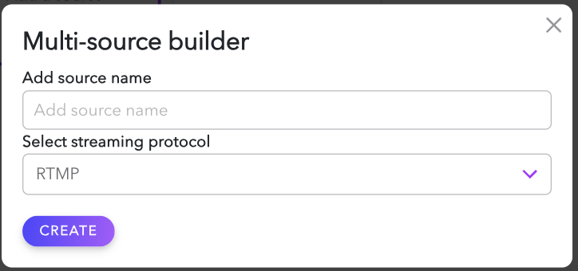
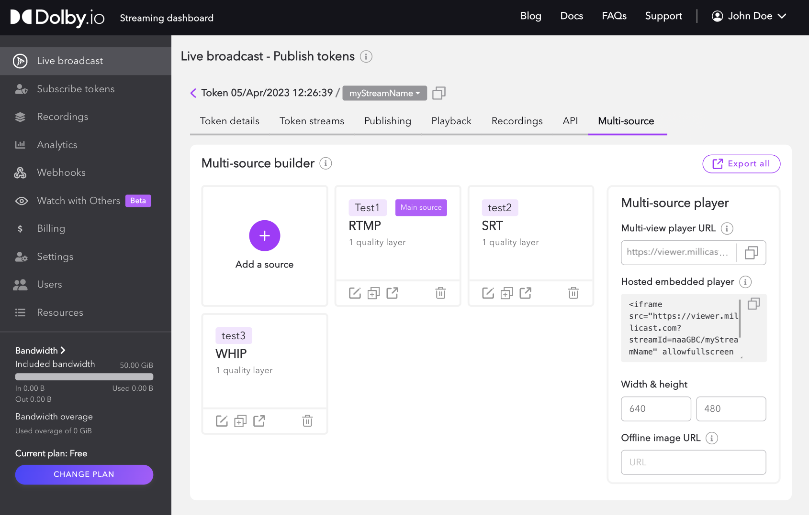
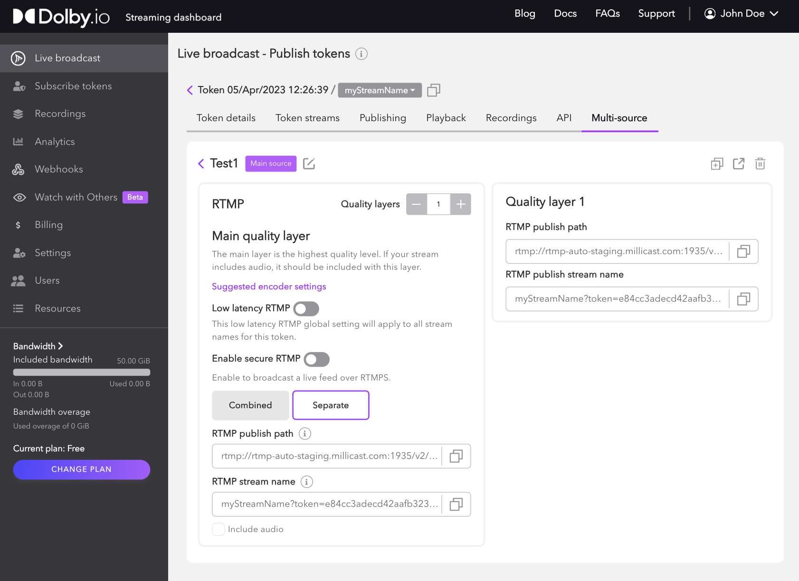
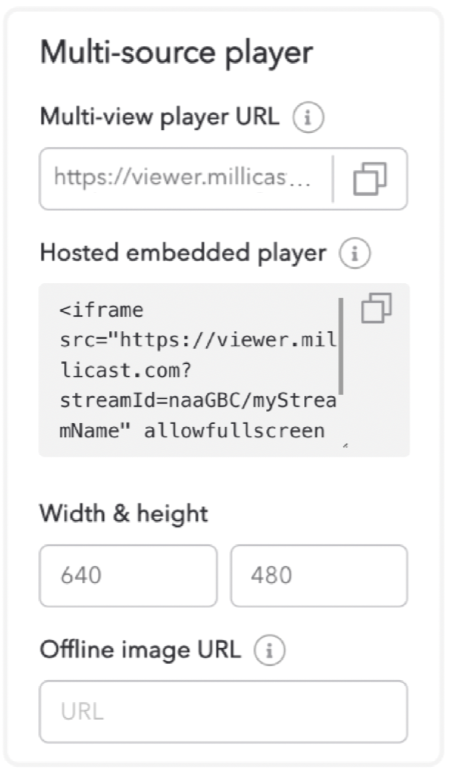

The **Multi-source** tab of the Streaming Dashboard is a tool to help you build and configure multiple publishing sources to enable simulcast or power a multi-view experience. You can add multiple [SRT](/millicast/broadcast/using-srt.mdx), [RTMP](/millicast/broadcast/using-rtmp-and-rtmps.mdx) or [WebRTC](/millicast/broadcast/webrtc-whip.mdx) sources and use the user-interface to configure multi-bitrate publishing. The Multi-source tab also includes a URL to launch the hosted player with the multi-viewer configuration, customizable `<iframe>` code to embed the hosted player into your webpage, and the ability to export your multi-source configuration as a file.

This guide covers the following: 

- [Adding a Source](#adding-a-source)
- [Using the Multi-source Player](#multi-source-player)
- [Exporting a Multi-source File](#exporting-a-multi-source-file)

## Adding a source

Click the `Add a source` button to begin setting up multiple stream sources.

The **source name** should be a short and descriptive text label. This name will appear within the hosted player multi-view as audio and video sources that can be selected. 

The **streaming protocol** helps identify the configuration needed for the broadcast. The multi-source builder supports [RTMP](/millicast/broadcast/using-rtmp-and-rtmps.mdx), [SRT](/millicast/broadcast/using-srt.mdx), and [WHIP](/millicast/broadcast/webrtc-whip.mdx) broadcast protocols.

By default, the first source you add will be labeled as the _Main_ source. Dolby.io Real-time Streaming limits the aggregate bitrate of all sources to 12 Mbps. The main source is prioritized and allowed to exceed the 12 Mbps limit, and the other sources share any remaining available bandwidth. See the [Multi-view](/millicast/playback/multiview.md#limitations-of-multi-view) guide for examples of bandwidth allocation.

## Source details

By selecting a source, the configuration details and available settings will be displayed. This varies depending on the capabilities of the protocol.

- [RTMP](/millicast/broadcast/using-rtmp-and-rtmps.mdx): The _RTMP/s publish paths_ and _RTMP publish stream name_ can be used for publishing streams with RTMP-compatible software and hardware.
  - RTMP multi-bitrate can be enabled from this section. When enabled, the dashboard will create three RTMP publish stream names for **low** bitrate, **medium** bitrate, and **high** bitrate.
- [SRT](/millicast/broadcast/using-srt.mdx): The _SRT publish path_, _SRT stream ID_, and _SRT publish URL_ can be used for publishing with SRT-compatible software and hardware.
  - Passphrase encryption can be enabled from this section. When enabled, the dashboard will generate a passphrase for encrypting the SRT stream.
- [WHIP](/millicast/broadcast/webrtc-whip.mdx): The _WHIP endpoint_ and _Bearer token_ can be used to publish a WebRTC stream with WebRTC-compatible software and hardware.

### Quality layers

For RTMP and SRT sources, you can specify one or more quality layers. Quality layers allows for quality selection when multi-bitrate (simulcast) is used for playback. **Multi-bitrate delivery** allows for adaptive quality RTMP and SRT streams. These streams are selected based on the viewer's available bandwidth and provide a more stable streaming experience. For more information see, [Simulcast](/millicast/distribution/using-webrtc-simulcast.md).

To learn more about publishing and broadcasting with Dolby.io, check out the [Broadcast](/millicast/broadcast/index.mdx) guide, which provides more in-depth resources and examples on how to use the Publish token once it is created.

## Multi-source player

You can use the multi-source hosted player, which is a streaming video player, as a standalone web application or embed it into your website with an `<iframe>`. The player is similar to the [Live Broadcast](/millicast/streaming-dashboard/how-to-broadcast-in-dashboard.md) application in the dashboard but is for the audience to use to view the published multi-source stream. For more information, see the [Hosted Player](/millicast/playback/hosted-viewer.md) guide.

You can use the[Hosted Player](/millicast/playback/hosted-viewer.md) with multi-view enabled to verify your multi-source setup. This streaming video player can be used as a standalone web application or embedded into your website. By copying the **Multi-view player URL** or **Hosted embedded player** code it will already be properly configured for this type of multi-source playback.

The embedded player is compatible whether using a CMS like Drupal or Wordpress or more complex custom JavaScript web applications built with frameworks like React, VueJS, or Angular. For more information, see [How to embed the hosted player in a website](/millicast/playback/hosted-viewer.md#how-to-embed-the-hosted-player-in-a-web-site).

## Exporting a multi-source file

You can download your multi-source file, which includes the multi-source hosted player path URL, and publishing URLs for each source and associated quality layer. The exported file can be used to transfer the configuration to multiple devices. For example, an administrator can create the stream, and hand off the configuration file to an operator to set up the encoder. 

To export the multi-source file, click the `Export all` button and click the copy icon or `Download` to save your multi-source configuration.
