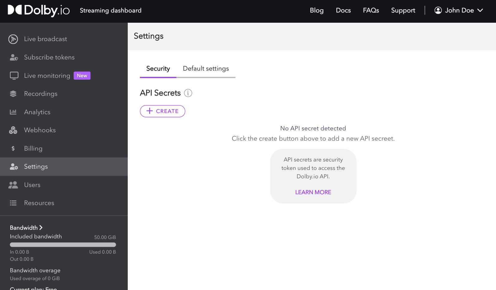
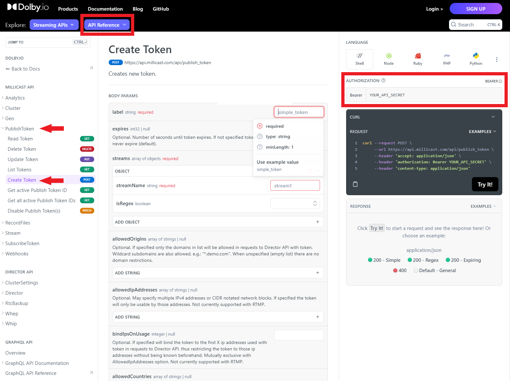
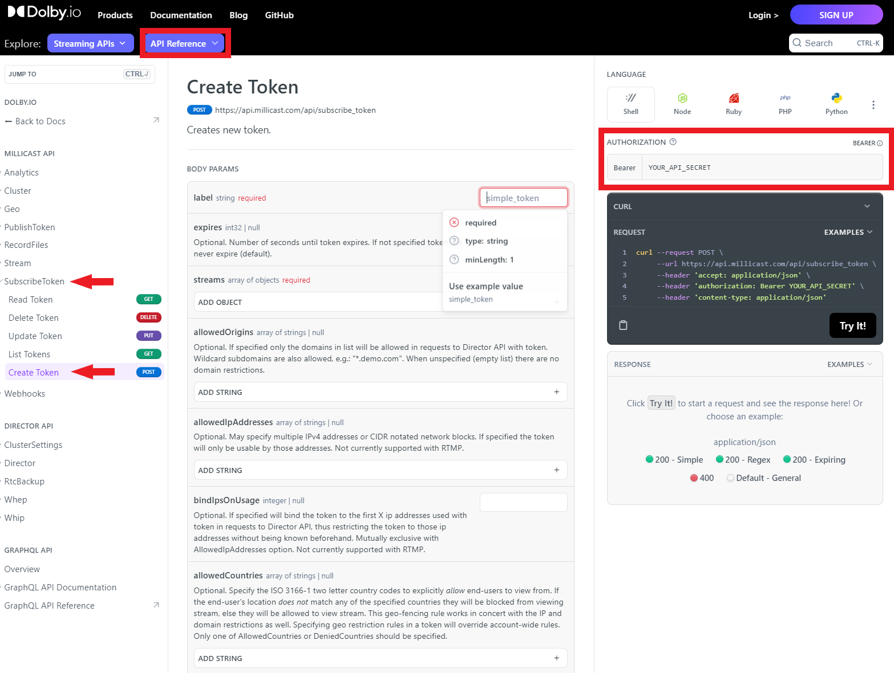

The **Token API** is a REST endpoint that allows you to automate the creation and management of tokens for your applications. You can create, read, update, and delete **publish tokens** and **subscribe tokens** that are used for authorizations with a broadcast stream. 

***

<div class="dolbyio-cards-container-4">
    
  <a class="dolbyio-card" href="./managing-your-tokens">
    <div class="dolbyio-card-image">
      
    </div>
    <div class="dolbyio-card-header">Publish tokens</div>
    <div class="dolbyio-card-description">
			Used to publish and manage starting a broadcast.
    </div>
  </a>

  
  <a class="dolbyio-card" href="./subscribe-tokens">
    <div class="dolbyio-card-image">
      
    </div>
    <div class="dolbyio-card-header">Subscribe tokens<br/>(optional)</div>
    <div class="dolbyio-card-description">
      Used to subscribe and manage the playback viewing of a stream. 
    </div>
  </a> 
  
</div>


***

This guide covers the following: 

- [Getting Your API Secret](/millicast/streaming-dashboard/token-api.md)acquiring-your-api-secret)
- [Create and Manage Publish Tokens](/millicast/streaming-dashboard/token-api.md)creating-publishing-tokens)
- [Create and Manage a Subscribe Tokens](/millicast/streaming-dashboard/token-api.md)creating-subscribe-tokens)

> 👍 Using the REST APIs
> 
> Review the [REST API](/millicast/getting-started/basic-api-tutorial.md) platform guide for more details on generating an API secret for authentication. You will need an _API Secret_ from the dashboard in order to make requests.

## Acquiring your API secret

To use the REST APIs, you must provide an API Secret to authenticate your application. Without a valid secret, API calls will be rejected with an Unauthorized error.

To acquire an API Secret, log into the Dolby.io dashboard, and click on "_Settings_" in the left-side menu.

Navigate to the Security tab and click the `+ Create` button to add an API Secret.





Once you have created your initial API Secret, you can use the same edit button to refresh the API Secret, and any further access using old tokens will then be rejected. You can also delete the token and **disallow ALL API access to your account** as it was by default when you first signed up.

From here, you can start using any of the APIs in the [API reference](ref:publishtokenv1_readtoken) or continue through the guide below to learn more about managing publish and subscribe tokens.

## Creating publishing tokens

Publish tokens are required to start a stream and can be used to control who, where, and what kind of stream can be started. The easiest way to begin learning about programmatically creating a publish token is by going to the [PublishToken Create Token interface of the API reference](ref:publishtokenv1_createtoken).

Inside the reference, you'll see a section on the right where you can select your preferred programing language, add your [API Secret key](/millicast/streaming-dashboard/token-api.md)acquiring-your-api-secret), and see the sample call based on the parameters you've added so far. In the middle, you'll see where you can add and adjust the required and optional parameters, along with the respective parameter definitions.





There are a lot of parameters to adjust when creating a token. For a full list of definitions, refer to the [Creating a Publish Token](/millicast/streaming-dashboard/managing-your-tokens.md)creating-a-publishing-token) guide, which goes into more detail.

As an example, we can use the API reference UI to create a basic publish token via a cURL request:

```curl cURL
curl --request POST \
     --url https://api.millicast.com/api/publish_token \
     --header 'accept: application/json' \
     --header 'authorization: Bearer YOUR_API_SECRET' \
     --header 'content-type: application/json' \
     --data '
{
  "streams": [
    {
      "streamName": "MainCam",
      "isRegex": false
    },
    {
      "streamName": "BackupCam",
      "isRegex": false
    },
    {
      "streamName": "StageCam",
      "isRegex": false
    }
  ],
  "label": "DevTestToken",
  "expires": 2592000
}
'
```

The above request would use my API secret to create a publish token valid for 30 days that supports three streams: "_MainCam_", "_BackupCam_", and "_StageCam_". 

You can also use Regex for Stream names, giving your token the ability to **use ANY arbitrary stream name** in the publishing path. The only rule to note here is that anyone using their own viewer must know what stream name the broadcaster is using in order to view the stream correctly.

```curl cURL
curl --request POST \
     --url https://api.millicast.com/api/publish_token \
     --header 'accept: application/json' \
     --header 'authorization: Bearer YOUR_API_SECRET' \
     --header 'content-type: application/json' \
     --data '
{
  "streams": [
    {
      "streamName": ".*",
      "isRegex": true
    }
  ],
  "allowedCountries": [
    "PL",
    "ZA"
  ],
  "label": "DevTestToken",
  "expires": 2628000
}
'
```

In the above example, I also used the `allowedCountries` parameter to limit the token to only broadcasting from _Poland (PL)_ and _South Africa (ZA)_.

### Managing publish tokens

Once you've created a publish token, you can use the REST APIs to manage the token. The REST APIs support [Reading](ref:publishtokenv1_readtoken), [Deleting](ref:publishtokenv1_deletetoken), [Listing](ref:publishtokenv1_listtokens), [Updating](ref:publishtokenv1_updatetoken), [Disabling](ref:publishtokenv1_disabletokens), and [Getting Token IDs](ref:publishtokenv1_getallactivetokensbyaccount).

For example, If I wanted to list the most recent 30 tokens created on my account, I could run the following command:

```curl
curl --request GET \
     --url 'https://api.millicast.com/api/publish_token/list?sortBy=AddedOn&page=1&itemsOnPage=30&isDescending=true' \
     --header 'accept: application/json' \
     --header 'authorization: Bearer YOUR_API_SECRET'
```

Once listed, I could pick a token by its `tokenID` and delete it:

```curl
curl --request DELETE \
     --url https://api.millicast.com/api/publish_token/Your_Token_ID \
     --header 'accept: application/json' \
     --header 'authorization: Bearer YOUR_API_SECRET'
```

## Creating subscribe tokens

Unlike the publisher, the viewer, by default, does not need a subscribe token to view a broadcast. However, if you want to [secure your feed](/millicast/streaming-dashboard/managing-your-tokens.md)creating-a-publishing-token) from being viewed by unauthorized users, using a subscribe token is recommended. The subscribe token also has its own set of rules you can use to protect your feed. You can create a token with a time limit, set the token to work from single or multiple specified domains, or you can even set it to use a specific IP or IPs as well. 

The easiest way to begin learning about creating a subscribe token is by going to [the _SubscribeToken Create Token_ interface of the API reference](ref:subscribetoken_createtoken).

Inside the reference, you'll see a section on the right where you can select your preferred programing language, add your [API Secret key](/millicast/streaming-dashboard/token-api.md)acquiring-your-api-secret), and see the sample call based on the parameters you've added so far. In the middle, you'll see where you can add and adjust the required and optional parameters, along with the respective parameter definitions.





There are a lot of parameters to adjust when creating a token. For a full list of definitions, refer to the [Creating a Subscribe Token guide](/millicast/streaming-dashboard/subscribe-tokens.md), which goes into more detail.

As an example, we can use the API reference UI to create a basic subscribe token via a cURL request:

```curl
curl --request POST \
     --url https://api.millicast.com/api/subscribe_token \
     --header 'accept: application/json' \
     --header 'authorization: Bearer YOUR_API_SECRET' \
     --header 'content-type: application/json' \
     --data '
{
  "streams": [
    {
      "streamName": "StageCamera"
    }
  ],
  "label": "DevTestToken",
  "expires": 2628000
}
'
```

The above request would use my API secret to create a subscribe token valid for 30 days that supports the stream "_StageCam_".

You can also use Regex for Stream names, giving your token the ability to **use ANY arbitrary stream name** in the publishing path. The only rule to note here is that since the subscribe token supports any arbitrary stream name, it can hence be used to access any stream on the account.

```curl
curl --request POST \
     --url https://api.millicast.com/api/subscribe_token \
     --header 'accept: application/json' \
     --header 'authorization: Bearer YOUR_API_SECRET' \
     --header 'content-type: application/json' \
     --data '
{
  "streams": [
    {
      "streamName": ".*",
      "isRegex": true
    }
  ],
  "label": "DevTestToken",
  "bindIpsOnUsage": 1,
  "expires": 2628000
}
'
```

The above example also uses the `bindIpsOnUsage` parameter to bind the token to the first IP address that connects to it.

Another feature that can be useful is _"Tracking"_. Tracking allows you to add a `trackingId` to your token that you can [use to list the total bandwidth consumed](/millicast/analytics_gettrackingtotalforstreams) by a `trackingId` associated with a subscribe token. The example below showcases creating a token with a `trackingId` "_Tracking_ID_1_:

```curl
curl --request POST \
     --url https://api.millicast.com/api/subscribe_token \
     --header 'accept: application/json' \
     --header 'authorization: Bearer YOUR_API_SECRET' \
     --header 'content-type: application/json' \
     --data '
{
  "streams": [
    {
      "streamName": "StageCam"
    }
  ],
  "tracking": {
    "trackingId": "Tracking_ID_1"
  },
  "label": "DevTestToken"
}
'
```

You can use the Analytics APIs to get the [bandwidth consumed by this token](/millicast/analytics_gettotalbandwidthfortrackingid), a useful feature for checking if a subscribe token has been shared:

```curl
curl --request GET \
     --url 'https://api.millicast.com/api/analytics/tracking/total?trackingIds=Tracking_ID_1&startDate=2023-02-02&stopDate=2023-07-27' \
     --header 'accept: application/json' \
     --header 'authorization: Bearer YOUR_API_SECRET'
```

### Self-sign subscribe tokens

Depending on how secure you want your stream to be, you may need to create many subscribe tokens. Dolby.io Real-Time Streaming supports the ability to self-sign subscribe tokens without having to make an API call to the Dolby.io server. Self-signing subscribe tokens locally allows you to generate your subscribe token more efficiently. The self-signed token is a user-generated JSON Web Token (JWT) that is generated from an existing subscribe token.

To learn more about self-signing subscribe tokens, [check out this guide](/millicast/streaming-dashboard/subscribe-tokens.md#self-signing-subscribe-tokens).

### Managing subscribe tokens

Once you've created a subscribe token, you can use the REST APIs to manage the token. The REST APIs support [Reading](ref:subscribetokenv1_readtoken), [Deleting](ref:subscribetokenv1_deletetoken), [Listing](ref:subscribetokenv1_listtokens), and [Updating](ref:subscribetokenv1_updatetoken).

For example, if I wanted to list the 30 most recent subscribe tokens, I could run the following request:

```curl
curl --request GET \
     --url 'https://api.millicast.com/api/subscribe_token/list?sortBy=AddedOn&page=1&itemsOnPage=30&isDescending=true' \
     --header 'accept: application/json' \
     --header 'authorization: Bearer YOUR_API_SECRET'
```

Then if I wanted to delete one of the tokens listed, I could run the following request:

```curl
curl --request DELETE \
     --url https://api.millicast.com/api/subscribe_token/Your_Token_ID \
     --header 'accept: application/json' \
     --header 'authorization: Bearer YOUR_API_SECRET'
```
