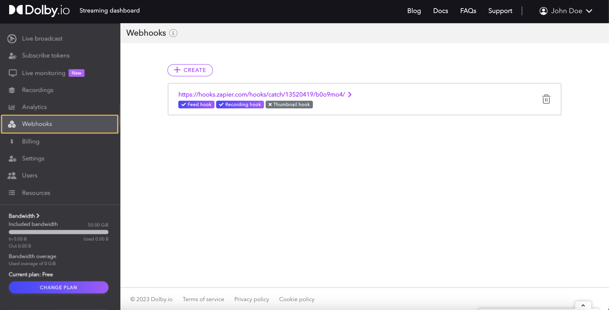

**Webhooks** are callbacks triggered by the platform to notify your application when an event occurs. As an alternative to polling solutions built with the [REST API](../api/webhooks-get.api.mdx), you can build asynchronous services and integrations that react only when real-time notifications are pushed from the Dolby.io platform to your application. 

This guide covers:

- [Creating and Managing](/millicast/webhooks/index.md#creating-webhooks) webhooks for your account.
- [Receiving Webhooks](/millicast/webhooks/index.md#receiving-webhooks) sent to your application.

# Creating webhooks

Defining a webhook requires a **Webhook URL**. This should be any publicly reachable _https\://_ endpoint address that is running a service capable of receiving `POST` requests. You can create a webhook using either the [Streaming Dashboard](/millicast/streaming-dashboard/index.md) or the [Webhooks API](../api/webhooks-get.api.mdx).

You choose from several _types_ of events that can be sent to your service.

- [Feed Hooks](/millicast/webhooks/feeds-webhooks.md) send a notification for an activity feed of when a stream has started or stopped publishing.
- [Media Hooks](/millicast/webhooks/media-webhooks.md) send a notification for the start, completion, and deletion of server-side recordings.
- [Thumbnail Hooks](/millicast/webhooks/thumbnail-webhooks.md) send a notification when static thumbnail images are captured during a live video stream.
- [Transcoder Hooks](/millicast/webhooks/transcoder-webhooks.md) send a notification when a transcoder changes status such as starts or stops.
- [ViewerConnection Hooks](/millicast/webhooks/viewerconnection-webhooks.md) send a notification when a viewer attempts to connect to an inactive stream or when a stream doesn't have any active viewers remaining.  This hook is helpful for automating an encoder to start only when a viewer connects.

Webhooks are not correlated with a specific publishing token. You can have one webhook that responds to all platform events for your account or separate endpoints that each receive only specific types.

Each webhook generates a **Webhook Secret**. This secret can be used for signature verification that an incoming request to your endpoint originated from the Dolby.io Streaming service.

## How-to add a webhook with the streaming dashboard

From the [Streaming Dashboard](/millicast/streaming-dashboard/index.md), navigate to the Webhooks tab and click the `CREATE` button.





This will open a popup window on your screen to input the **Webhook url**. You also choose which specific event **types** this endpoint should receive.


Once created, the URL and event types will be listed. 

## How-to update webhook settings with the streaming dashboard

Select a webhook from the webhooks listed in the dashboard to modify its settings.


Change the URL that will be called by the webhook by pressing the pen icon at the end of the row:


Update the URL and **confirm** your decision by clicking the green checkmark. To **cancel**, select the grey button.


To choose the types of event hooks to receive, click the **Enabled** button next to each hook type to toggle it to be enabled or **Disabled**. Click the _trash can_ icon to delete the webhook entirely.

## How-to reset or rotate the webhook secret

If you believe your webhook secret has become compromised or want to rotate it regularly for security purposes, click the **Renew** button.


> ❗️ Warning
> 
> Once you click to renew the secret this cannot be undone. Please be certain you want to reset this value before proceeding because you may need to redeploy your service that receives the callback.

## How-to add a webhook with the REST API

> 👍 Using the REST APIs
> 
> Review the [REST API](/millicast/getting-started/basic-api-tutorial.md) platform guide for more details on generating an API secret for authentication. You will need an _API Secret_ from the dashboard in order to make requests.

The [/api/webhooks](../api/webhooks-add-webhook.api.mdx) endpoint can be used to add new webhooks by making a `POST` request. You must specify the webhook URL and a boolean value for each event type that you want to enable or disable.

```shell
curl --request POST \
     --url https://api.millicast.com/api/webhooks \
     --header 'accept: application/json' \
     --header 'authorization: Bearer {YOUR_API_SECRET}' \
     --header 'content-type: application/json' \
     --data '
{
  "isThumbnailHooks": true,
  "isRecordingHooks": false,
  "isFeedHooks": false,
  "url": "{YOUR_FUNCTION_URL}"
}
'
```

# Receiving webhooks

To receive the webhooks, you will need to deploy a service endpoint. This can be accomplished with many different cloud providers or common function-as-a-service implementations.

The platform will send a `POST` request to the _Webhook url_ specified when the webhook was created. 

- The request will not attempt a _retry_ if the service is unavailable or returns an error code.
- The events are sent asynchronously, so the order of events is not guaranteed. Use the _timestamp_ if the order must be maintained.

## How-to verify the webhook

A signature verification header,  `X-Millicast-Signature`, is included in the callback request. This SHA1 signature uses the _Webhook secret_ so that you may verify the origin and data integrity.

Here is a code sample for how to use the signature to check the data.

```Text Node.js
const webhookSecretBuffer = Buffer.from(webhookSecret, 'base64');
    const calculatedSignature = 'sha1=' + Crypto.createHmac('sha1', webhookSecretBuffer)
    	.update(body)
    	.digest('hex');
    const headerSignature = request.get('X-Millicast-Signature');

    if (calculatedSignature !== headerSignature) {
      console.warn('Invalid signature sent to us, unsafe data');
      res.status(400).send('BAD SIGNATURE');
      return;
    }
```

## Webhook schema

A JSON payload will be included in the body of the request so that you can process the event accordingly.

Most webhooks will share the same base JSON structure:

```json Common JSON format for Dolby.io Real-time Streaming Webhooks
{ 
  "type": "...",              // Webhook type: "feeds", "recording", "thumbnail", "transcdoder" or "viewerConnection"
  "event": "...",             // Event name: "started", "ended", etc.
  "timestamp": 1638463486489, // Timestamp (epoch) when the request was sent
  "data": {                   // Event data depending on the type
    ...
  }
}
```

See the [Feed Hooks](/millicast/webhooks/feeds-webhooks.md) and [Media Hooks](/millicast/webhooks/media-webhooks.md) guides for additional details on what **data** to expect and how to interpret the **event**.

The [Thumbnail](/millicast/webhooks/thumbnail-webhooks.md) hook does not use this schema and instead only sends the captured image.

The [ViewerConnection](/millicast/webhooks/viewerconnection-webhooks.md) hook guide explains how to use viewer connection events to automate your workflow. 

# Learn more

Learn more or find examples by exploring the [developer blog](https://dolby.io/blog/tag/webhooks) and [code samples](https://github.com/orgs/dolbyio-samples/repositories?q=webhooks).


