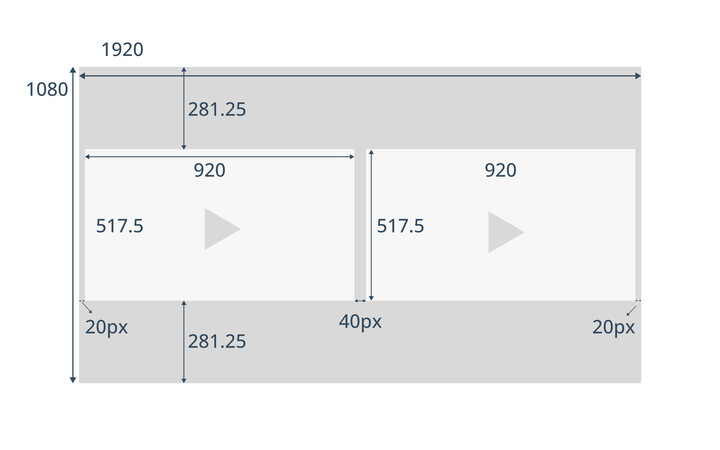
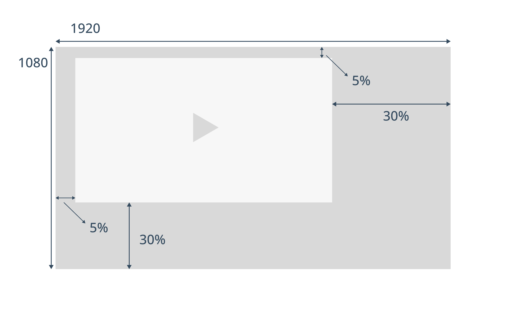

# Create backdrop images
Backdrop is an image that is shown along with the player during an ad.
This image is intended to provide some additional information about an advertisement.

## Backdrop Layout Options

There are two primary backdrop layout options, each serving a specific purpose in presenting ads effectively:

### 1. Double Box Layout

The **Double Box** layout places the video content and advertisement side by side, allowing viewers to see both elements simultaneously.

- **Screen Ratio:** 16:9 for optimal viewing on widescreen displays.
- **Border:** A fixed 20px border is applied around video elements, ensuring a clean, defined separation between the content and the ad.

#### Example Template

Below is a template for the Double Box layout tailored for 1080p resolution:

### 2. L-Shape Layout

The **L-Shape** layout positions the video player in the top-left corner of the screen, scaling it down to create space for the backdrop image. 
This configuration allows viewers to see the content or ad and backdrop image simultaneously.

- **Screen Ratio:** 16:9, ensuring compatibility with most screens.
- **Positioning:** The player is moved to the top-left corner, with the backdrop image filling the remaining space.

#### Example Template

Below is a template for the L-Shape layout designed for 1080p resolution:

## Considerations and Limitations

While both layouts serve distinct purposes, certain limitations should be considered:

- **Device Compatibility:** Some smart TVs may not support the Double Box layout due to the lack of capability to show multiple video streams at the same time. For these devices, the L-Shape layout is a better option, as it displays only one active video stream along with the backdrop image.
- **Resolution Adaptability:** Templates are made for 1080p resolution, but scaling considerations should be taken into account for lower or higher resolutions to maintain the quality and layout proportions.
- **File Size and Load Times:** To ensure smooth playback and quick loading times, backdrop images should be optimized, especially for mobile and lower-capability devices.
