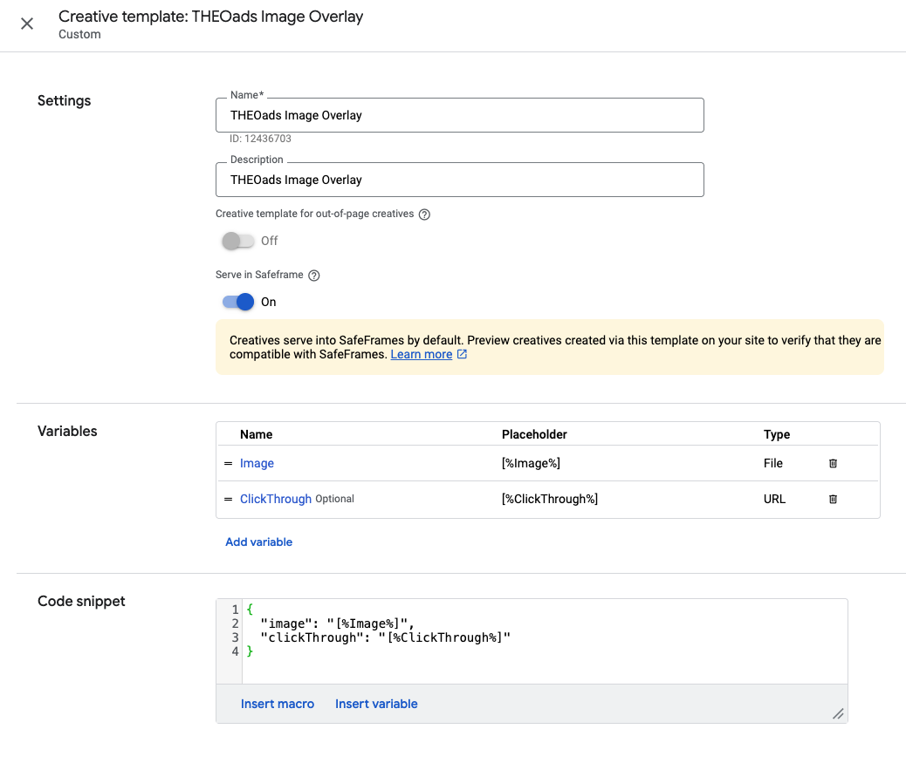

# Scheduling overlays

OptiView Ads can insert overlays into your content, but it requires placement information to do so. This page will outline the various options for scheduling overlays.

## Using the OptiView Ads service REST API

The recommended way to schedule overlays is through the OptiView Ads service API.

This can be done by a POST request to `{path}/overlay` where path is the usual url to interact with the OptiView Ads service for a specific monetized stream: `{optiview-ads-host}/ads-client/api/v1/monetized-streams/:monetizedStreamId`. Please see [CreateMonetizedStreamOverlay](/theoads/api/signaling/create-monetized-stream-overlay/).

The body of the post request can have the following properties:

```ts
{
  id: string;
  name: string | undefined;
  startDate: string;
  duration: string;
  type: string;
  position: {
    left: number | undefined;
    right: number | undefined;
    top: number | undefined;
    bottom: number | undefined;
  };
  size: {
    width: number;
    height: number;
  };
  opacity: number | undefined;
  gamProperties: {
    iu: string;
    sz: {
      default: string;
      phone: string | undefined;
      tv: string | undefined;
    }
  } | undefined;
  resourceURI: {
    type: string;
    default: string;
    phone: string | undefined;
    tv: string | undefined;
  }[] | undefined;
  clickThroughURI: string | undefined;
}
```

- The `id` uniquely identifies the overlay inside the monetized stream.
- `name` is used to optionally identify the overlay presentation with a human-friendly name.
- `startDate` denotes when the overlay presentation should start. It should be in a Program Date Time format such as `YYYY-MM-DDThh:mm:ss.SSSZ`.
- `duration` is the total duration of the overlay presentation (in seconds).
- `type` can only be 'image' for now. In the future we might extend this.
- `position` is required to know where the overlay needs to be presented on top of the video content. It requires a combination of either one of `left` or `right` and `top` or `bottom`. All values are percentage based and non-zero. The values denote the location from the specified side. For example: `left: 10` denotes `10% from the left edge of the video`.
- `size` is required to know what the overlay presentation's width and height need to be relative to the video content display size. All values are percentage based and non-zero. For example: `width: 20` denotes 20% of the current video display width.
- `opacity` can optionally be used to make the overlay less opaque. This value is percentage based and non-zero. The default is `100`.
- `gamProperties` can optionally be used to specify the values required for requesting a pre-configured custom creative from GAM (See below). It follows the [specifications](https://support.google.com/admanager/answer/2623168#zippy=%2Crequired-parameters) for a tagless request to load a creative. If `gamProperties` is not defined, you need to specify at least one `resourceURI`.
  - `iu` specifies the Google Ad Manager ad unit code, including your Google Ad Manager network code.
  - `sz` specifies the creative size configured in GAM. Aside from the required `default` value, you can optionally specify alternative values for either `phone` or `tv` devices.
- `resourceURI` can optionally be used to specify one or more types required for requesting a custom overlay via a URI. If `resourceURI` is not defined, you need to specify `gamProperties`.
  - `type` is used to specify the resource type. Currently, only `png` and `svg` are supported. Based on the underlying platform, the suitable format will be chosen.
  - `default`, `phone` and `tv` can be used to specify the corresponding resource URI to load when presenting the overlay. While `default` is required, `phone` and `tv` are optional.
- `clickThroughURI` is an optional field used to enable the clickthrough function on the overlay for both the `gamProperties` and `resourceURI` options.

An example of a schedule overlay request body for a GAM based image overlay can be found below:

```json
{
  "id": "1",
  "name": "Test overlay 1",
  "startDate": "2024-12-09T07:30:11.274Z",
  "duration": "30",
  "type": "image",
  "position": {
    "left": 5,
    "top": 5
  },
  "size": {
    "width": 10,
    "height": 10
  },
  "opacity": 50,
  "gamProperties": {
    "iu": "/12345678/overlay_1",
    "sz": {
      "default": "400x225",
      "phone": "400x225",
      "tv": "400x225"
    }
  },
  "clickThroughURI": "https://optiview.dolby.com"
}
```

An example of a schedule overlay request body for a custom image overlay can be found below:

```json
{
  "id": "2",
  "name": "Test overlay 2",
  "startDate": "2024-12-09T07:30:11.274Z",
  "duration": "30",
  "type": "image",
  "position": {
    "left": 5,
    "top": 5
  },
  "size": {
    "width": 10,
    "height": 10
  },
  "opacity": 50,
  "resourceURI": [
    {
      "type": "svg",
      "default": "https://<PATH_TO_IMAGE>/image.svg",
      "phone": "https://<PATH_TO_IMAGE>/image_phone.svg",
      "tv": "https://<PATH_TO_IMAGE>/image_tv.svg"
    },
    {
      "type": "png",
      "default": "https://<PATH_TO_IMAGE>/image.png",
      "phone": "https://<PATH_TO_IMAGE>/image_phone.png",
      "tv": "https://<PATH_TO_IMAGE>/image_tv.png"
    }
  ],
  "clickThroughURI": "https://optiview.dolby.com"
}
```

## Custom Creatives via Google Ad Manager

When using GAM for delivering dynamic image overlays through the `gamProperties` property of the overlay object, you need to first configure corresponding Creatives in the GAM console.

First off, you need to define a custom creative template specifically for OptiView Ads image overlays as documented [here](https://support.google.com/admanager/answer/1138308#custom-templates).

You can either import this [pre-defined template](../assets/json/OptiView_Ads_Image_Overlay_gam_template.json), or follow the steps below.

Apart from assigning a `Name` and optional `Description`, you need to perform the following changes:

- Configure a File type variable `Image`, optionally limiting the allowed file types:


- Optionally configure a URL type variable `ClickThrough`:


- Configure the `Code snippet` as follows:

```json
{
  "image": "[%Image%]",
  "clickThrough": "[%ClickThrough%]",
  "impression": "%%VIEW_URL_ESC%%"
}
```

Note the `impression` field which is needed for the player to properly handle impression tracking. The special macro `%%VIEW_URL_ESC%%` is supplied by GAM and will contain a GAM specfic impression URL which is called when the overlay is shown on the client.

In the end it should look like this:



Now that the template is set up, you can start adding creatives as you would otherwise when using standard image creative, except you need to select this Custom creative template when adding the new creatives:


When editing the creative itself, make sure to select an appropriate `Target ad unit size` as you would with a standard image creative also. This size corresponds to the `sz` property values inside the `gamProperties`.

Besides that, you need to at least also upload or select a suitable image for display.


Now that the creatives are defined, make sure to add them to a line item that is at least in status 'Ready' so delivery can commence (Ref GAM [documentation](https://support.google.com/admanager/answer/82991?hl=en&ref_topic=7506394&sjid=17311913585360515246-EU)).

That's it! You should now be able to add image overlays which should show up inside the player at the appropriate time and location.
