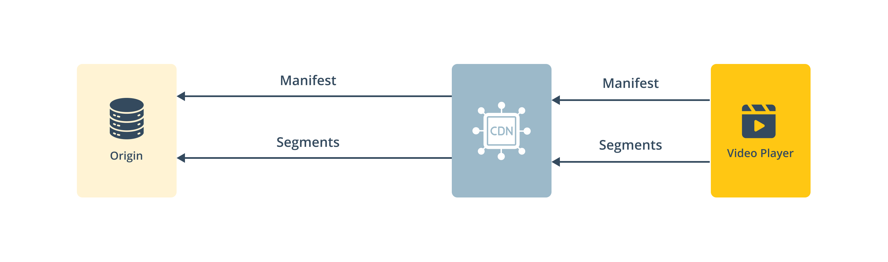
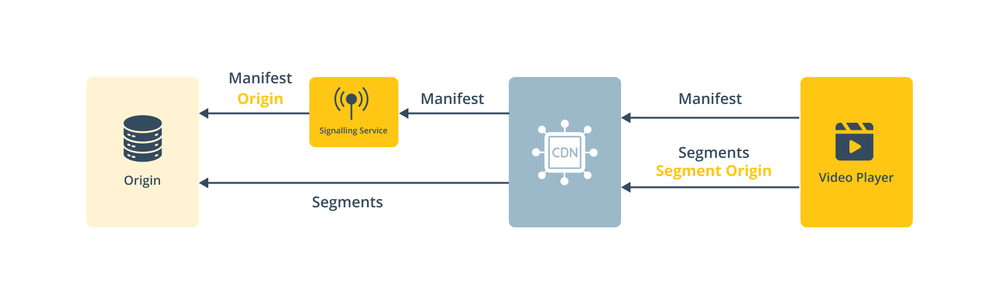

# Workflow integration

For implementing THEOads, the Signaling Service must be integrated within your existing video workflow. This service acts as an intermediary between the media origin and the CDN, enabling ad insertion and metadata enrichment.

## Existing Video Workflow

In a typical video delivery workflow, the CDN fetches the manifest directly from the media origin, and all subsequent requests for video segments are also routed from the CDN to the origin.

.

## Integrating the Signaling Service

By introducing the Signaling Service, the manifest requests from the CDN are intercepted before reaching the origin. The Signaling Service augments the manifest with ad break signals and any necessary metadata. Notably, video segment requests bypass the Signaling Service and continue to be fetched directly from the CDN to the origin, ensuring minimal impact on content delivery performance.

.

## Configuring the Signaling Service

To integrate the Signaling Service with your workflow, the properties origin and segmentOrigin are crucial when setting up a new monetized stream:

- `origin`: This property specifies where the original manifest should be fetched from. It points to the media origin that provides the main content.
- `segmentOrigin`: This property ensures that the segment URLs within the augmented manifest are absolute. It defines the path from which the segments should be requested, typically directly from the origin or CDN.
  By configuring these properties, the Signaling Service seamlessly inserts ad breaks without affecting the video segment delivery flow.

## More information

- [Getting Started](/theoads/getting-started/getting-started-signaling-service/)
- [API reference](/theoads/api/signaling/)
