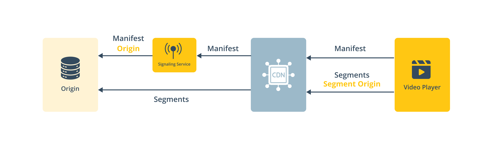

# Worklow integration

For integrating THEOads, the Signaling Service must be incorporated into the existing video workflow, positioned between the media origin and the CDN.

.

The integration allows the Signaling Service to intercept the manifest request from the CDN to the origin, inserting break signals and metadata. Segment requests, however, are not proxied through the Signaling Service and should be fetched directly from the CDN to the origin.

.

When creating a new monetized stream, the properties `origin` and `segmentOrigin` are used to configure the Signaling Service. The `origin` property defines where the original manifest is fetched from, while `segmentOrigin` ensures that the segment URLs in the augmented manifest are absolute.

## More information

- [Getting Started](/theoads/getting-started/getting-started-signaling-service/)
- [API reference](/theoads/api/signaling/)
