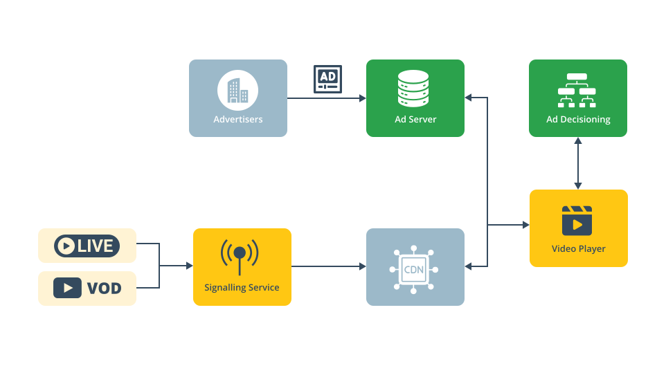

# THEOads Introduction

import SidebarDocCardList from '@site/src/components/SidebarDocCardList';

THEOads is an ad-insertion service for both VOD and LIVE content, created by THEO Technologies, utilizing Server-Guided Ad-Insertion (SGAI). On these pages, you'll learn how to get started with THEOads, how to use the configure the player, and integrate the signaling service API's.

By logically redistributing responsibilities in the advertisement workflow, THEOads:

- Creates a seamless viewer experience across platforms.
- Simplifies the workflow by reducing complexity, which results in easier implementation and lower operational risk.
- Introduces innovative ad formats, creating more diverse and less intrusive ad opportunities.
- Maximizes workflow efficiency by reducing prefetching and over-allocation of inventory.
- Enables more relevant ads through a high degree of personalization.

THEOads is an advanced ad-insertion service consisting of two key components:

1. **Signaling Service**: This back-end component enriches the manifest from your existing origin with advanced ad break signaling. It integrates seamlessly with THEOplayer, the second component, to create a smooth and cohesive workflow.

2. **THEOplayer**: THEOplayer fetches and splices ads into the content, working closely with the Signaling Service to optimize the viewer experience across platforms.

The Signaling Service is provided as a service and can be integrated into any existing content management workflow through its APIs, allowing for seamless adoption without significant changes to your current setup.

To ensure high availability, we recommend maintaining the original origin stream on a CDN as a backup, while the Signaling Service provides redundancy and failover capabilities to further enhance reliability.

THEOads is tightly integrated with [Google Ad Manager](https://developers.google.com/ad-manager/dynamic-ad-insertion 'Google DAI') for ad decisioning, transcoding, and serving, ensuring a streamlined process for ad delivery and management.

THEOads enables innovative ad formats through THEOplayer, providing new ways to monetize content in a less intrusive manner. The out-of-the-box formats include, but are not limited to:

- **Default Full Screen Ad Insertion**: Replaces the content with an advertisement.
- **Double Box**: Allows content to continue playing side-by-side with an advertisement and its companion background.
- **L-Shape**: Displays advertisements in a scaled window alongside a companion background.

**Note**: Every THEOplayer comes with the functionality to enable THEOads by default. However, a THEOads-enabled THEOplayer license is required to activate this functionality.

<SidebarDocCardList />
