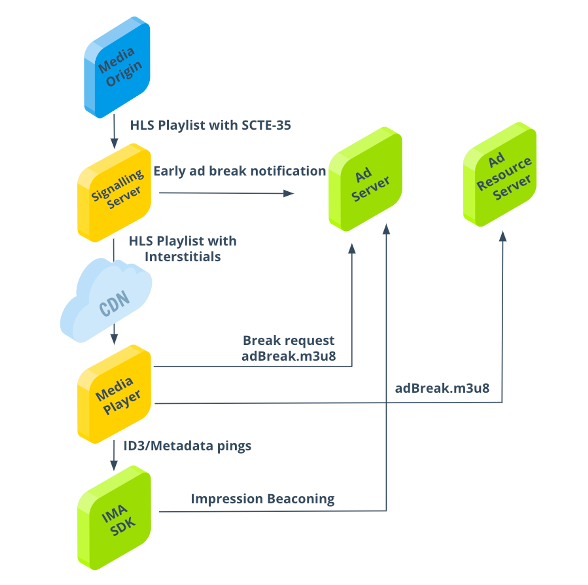

# Architecture

The THEOads solution is a combination of several components working together:

### Media origin

This component produces the HLS feed with SCTE-35 markers indicating the start and duration of ad breaks.

### Signaling Server

THEO develops and provides this component. It will be integrated between your CDN and media origin.
Its purpose is to enhance the HLS manifest provided by the media origin with ad break signals and metadata.
On top of this it integrates with the Google Ad Server for Early Ad Break Notifications to ensure scalability.

### CDN

The CDN provides scalability by shielding requests from the media player.

### Media Player (THEOplayer)

The media player fetches the media stream and corresponding ad requests.
It switches seamlessly between main content and ads based on manifest signals provided by the Signaling Server.
Ad requests are obtained by integrating with the Google IMA SDK.

### IMA SDK

An SDK provided by Google which works with the player to display ad content and relay in-stream ad triggers. It transmits signals back to the ad server.

### Ad Server

Responds to player ad requests with a ready-to-play stream for the ad break using Google DAI POD serving.
It handles VAST wrapper unwrapping and ad transcoding to ensure media file availability.

### Ad Resource Server

Serves the ad stream for the full ad break with in-stream metadata for tracking ad insights.

