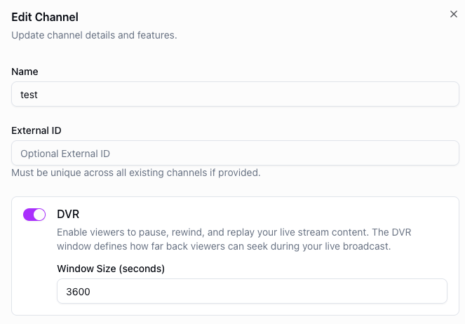

# DVR window

---

DVR (Digital Video Recording) enables viewers to pause, rewind, and replay your live stream content. The DVR window defines how far back viewers can seek during your live broadcast.

## Configuration

To enable DVR, set a **window size** in seconds on your channel. This determines the length of the rewindable buffer available to viewers. For example, a window size of 3600 seconds allows viewers to seek up to one hour back in the live stream.

<figure style={{ textAlign: 'center' }}>

</figure>

When DVR is enabled, viewers can scrub back through the live stream within the configured window. Once the window is exceeded, older content is no longer available for playback.
