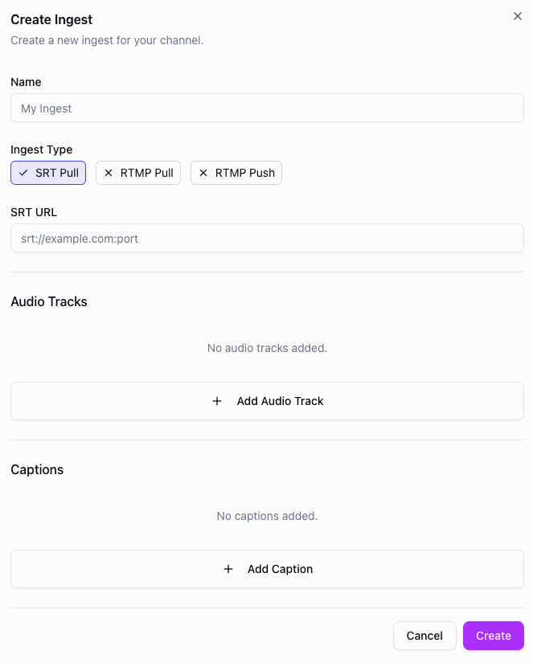

# Multi-audio


The Dolby OptiView Live platform supports multi-audio ingest and delivery. This functionality is perfect for
use cases such as live events where multiple languages or commentary may be required.

:::caution
This functionality is **only** supported through the SRT ingest protocol.
:::

## Configuring multi-audio ingest and playback

To deliver multi audio SRT the following steps must be taken:

1. Within the dashboard configure your SRT listener endpoint.
2. Configure your expected incoming "Audio tracks" by specifying a language, label, and the expected PID.

<div style={{ textAlign: 'center' }}></div>

3. Start the Channel and begin ingesting video and audio into the engine.
4. Check the preview in the dashboard to validate the audio tracks are being received correctly.

## API example

You can also configure multi-audio tracks via the API when [creating](../api/create-channel-ingest.api.mdx) or [updating](../api/update-ingest.api.mdx) an ingest. Include the `tracks.audio` array in your request body, where each track requires a `language` and the `pid` matching your SRT stream.

`POST https://api.theo.live/v2/channels/{channelId}/ingests`

```json
{
  "name": "my-ingest",
  "type": "srt-pull",
  "url": "srt://your-srt-source:1234",
  "region": "europe-west",
  "tracks": {
    "audio": [
      { "pid": 256, "language": "en", "label": "English" },
      { "pid": 257, "language": "es", "label": "Spanish" }
    ]
  }
}
```

## Feature Compatibility and Limitations

- Audio must be encoded as AAC.
- Only stereo audio is supported.
- There is a limit of 12 audio tracks per channel.

#### Ingest

| RTMP Push | RTMP Pull | SRT Pull |
| :-------: | :-------: | :------: |
|    No     |    No     |   Yes    |
