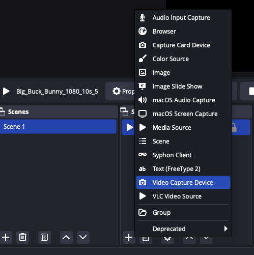
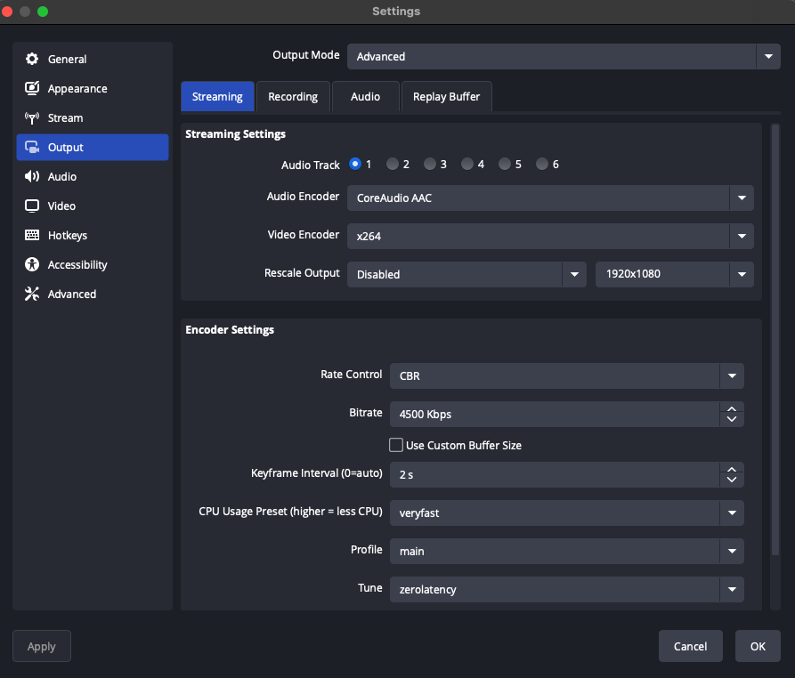
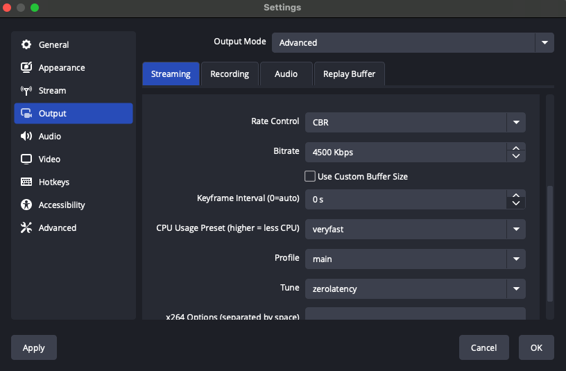
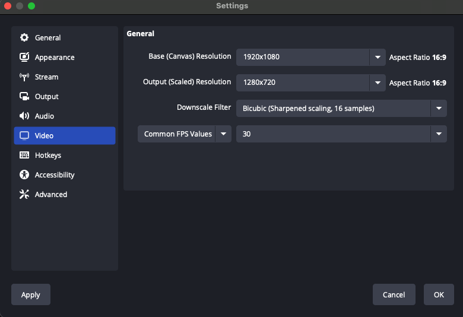
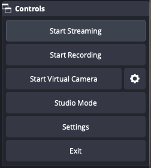

# Using OBS with OptiView Live

**Open Broadcaster Software (OBS)** is a free open-source software created for broadcasting and recording on your desktop. You can take advantage of this tool to stream high-quality video to your viewers using OptiView Live.

:::tip
See the official [obsproject.com](https://obsproject.com) documentation for installation instructions and additional support.
:::

## Setting up a broadcast

### 1. Add a source

In the _Source_ section at the bottom of the OBS application, hit the + sign to add a new source. For example, selecting "Media Source" allows you to select an existing media file stored on your machine. Selecting "Display Capture" will record your screen. Selecting "Video capture device" will allow you to select a video input device like a webcam.

### 2. Configure stream settings

Select _Settings_ in the _Controls_ section at the bottom right of the OBS application. Click on the _Stream_ tab on the left menu bar and configure the following:

- Select "Custom..." as the _Service_
- Copy your `rtmpPushUrl` from the channel details page in the dashboard URL as _Server_
- Copy your `streamKey` from the channel details page in the dashboard as _Stream Key_

Next, go to the _Output_ tab in the _Settings_ menu, and configure the following settings in order to achieve the lowest possible latency using OptiView Live.

- Output Mode: `Advanced`
- Bitrate: match the max bitrate of the profile used in your channel (e.g.: 4500Kbps for "sport"). [More details](../../media-engine/abr.mdx).
- Keyframe interval: `2s`
- CPU Usage Preset (higher = less CPU): `veryfast`
- Profile: `main`
- Tune: `zerolatency`

Lastly, go to the _Video_ tab and set the frame rate to the same value you have set in your channel. See [Stream configuration](../../media-engine/abr.mdx) for more details.

:::info 🚧 Upload bandwidth
Make sure that your encoder has a stable connection and enough upload bandwidth. This will ensure all data is correctly sent to the channel.
:::

### 3. Start streaming

Hit apply on settings, close the window, and click on _Start Streaming_ in the _Controls_ panel in the bottom right corner of the OBS application.

### 4. Start your channel

Your channel must be started in order to receive video ingest from OBS. You can choose to start up your channel before or after you start streaming via OBS.

## Feature compatibility and limitations

- Ingest protocol must be RTMP push
