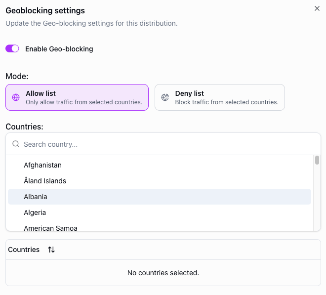
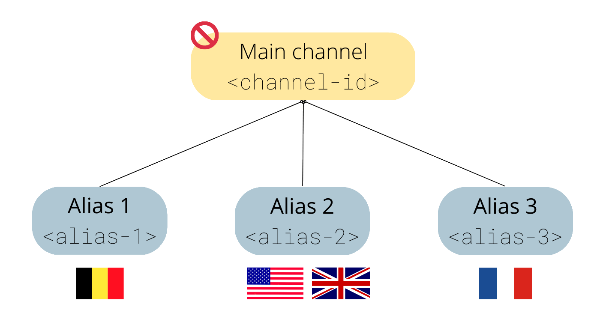

# Geo-blocking

---

Geo-blocking restricts or allows access to your stream based on the geographical location of the viewer. This is commonly used to comply with licensing agreements, enforce regional distribution rights, or protect content from unauthorized access.

## Configuration

To configure geo-blocking, navigate to your distribution's security settings and enable geo-blocking. You can then choose between two modes:

- **Allow list** — only viewers in the listed countries can access the stream. All other countries are blocked.
- **Deny list** — viewers in the listed countries are blocked. All other countries can access the stream.

Add countries to the list to define which regions are affected.

<figure style={{ textAlign: 'center' }}>

</figure>

## Example: regional distribution

Suppose you are distributing a live event with the following regional rights:

- Customer 1 can only show the stream to Belgian viewers
- Customer 2 can only show the stream to UK and USA viewers
- Customer 3 can only show the stream to French viewers

Create a separate distribution for each customer and configure geo-blocking with an allow list containing only the permitted countries.

## Notes

- Geo-blocking can be enabled or disabled while a stream is live — no restart is needed.
- Geo-blocking is applied per distribution, so different distributions on the same engine can have different rules.
