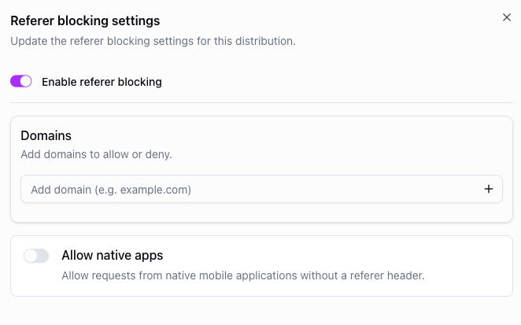

# Referrer blocking

---

Referrer blocking restricts access to your stream based on the HTTP `Referer` header sent by the viewer's browser. This allows you to control which websites are allowed to embed and play your content.

When enabled, the platform checks the `Referer` header of each playback request against a list of allowed or blocked domains. Requests originating from unauthorized websites are rejected, preventing third parties from embedding your stream on their pages without permission.

## Use cases

- **Embed protection** — ensure your stream can only be played on your own website or approved partner sites.
- **Content piracy prevention** — block unauthorized websites from hotlinking your stream.
- **Partner control** — allow specific resellers or affiliates to embed the stream while blocking everyone else.

Referrer blocking can be configured via the API or the console on a per-distribution basis.

<figure style={{ textAlign: 'center' }}>

</figure>
