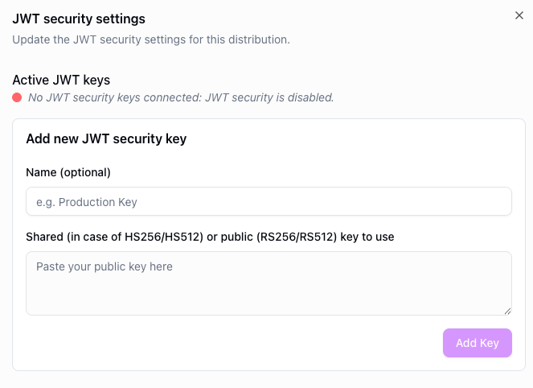

# Token-based security

---

Token-based security restricts access to your stream by requiring a valid JWT (JSON Web Token) on every playback request. This ensures that only authenticated viewers — those who have received a token from your backend — can access the stream.

## How it works

When token security is enabled on a distribution, the CDN validates an `Authorization` header containing a Bearer token on each request. The token is signed with a shared secret (HS256/HS512) or a public/private key pair (RS256/RS512) that you provide when enabling the feature.

The token payload must include:

- **`exp`** — expiration time in epoch format. The token is rejected after this time.
- **`nbf`** *(optional)* — "not before" time in epoch format. The token is rejected before this time.

Requests without a valid token are rejected. If the distribution does not have token security enabled, the `Authorization` header is ignored.

## Configuration

To enable token-based security, navigate to your distribution's security settings and enable the token security toggle. Provide the shared secret or public key used to verify tokens.

<figure style={{ textAlign: 'center' }}>

</figure>

## Player configuration

The player needs to be configured to pass the `Authorization` header with each request. Refer to the platform-specific guides:

- [Web](/theoplayer/how-to-guides/web/theolive/token-based-security/)
- [Android](../../playback/android/token-based-security.mdx)
- [React Native](../../playback/react-native/token-based-security.mdx)
- [Roku](../../playback/roku/01-token-based-security.mdx)
