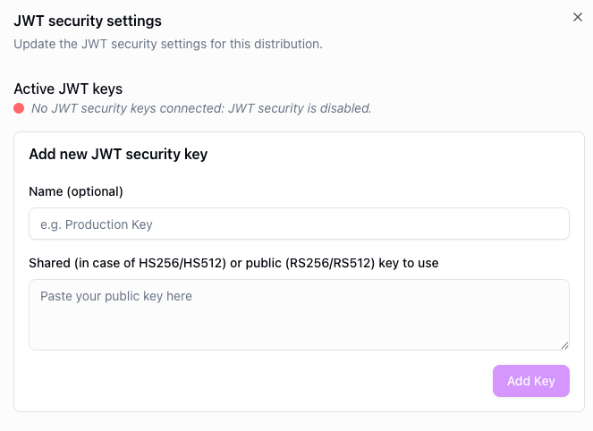

# Token-based security

Token-based security restricts access to your stream by requiring a valid JWT (JSON Web Token) on every playback request. This ensures that only authenticated viewers — those who have received a token from your backend — can access the stream.

## How it works

When token security is enabled on a distribution, the CDN validates the JWT on each request. The token is signed with a shared secret (HS256/HS512) or a public/private key pair (RS256/RS512) that you provide when enabling the feature.

The token can be provided in one of two ways:

- As an `Authorization` header with a Bearer token:

  ```http
  Authorization: Bearer <JWT>
  ```

- As a `token` query parameter:

  ```
  ?token=<JWT>
  ```

The token payload must include:

- **`exp`** — expiration time in epoch format. The token is rejected after this time.
- **`nbf`** _(optional)_ — "not before" time in epoch format. The token is rejected before this time.

Additionally, the following standard optional claims are supported:

| Claim | Type   | Description                                                                       |
| ----- | ------ | --------------------------------------------------------------------------------- |
| `sub` | string | Subject. If present, a SHA-256 hash of this value is used as the viewer identity. |
| `iss` | string | Issuer. Identifies the system that created the token.                             |

Requests without a valid token are rejected with an HTTP `403` response.

::::caution[Tokens are validated even when token security is disabled]
Disabling token security makes the token optional, but it does not make the CDN ignore it. Any JWT still included in a request — via the `Authorization` header or the `token` query parameter — is validated for well-formedness and expiry. In particular, an **expired** token is rejected with an HTTP `403`, even though the same request without a token would have been allowed. After disabling token security, make sure your players stop attaching (potentially stale) tokens.
::::

## Custom claims

### The `optiview` claim

The JWT token supports a custom `optiview` claim that enables fine-grained access control. When present, the claim restricts token usage based on channel, geography, or device type.

| Property | Type       | Description                                                                                                                                                                                                                   |
| -------- | ---------- | ----------------------------------------------------------------------------------------------------------------------------------------------------------------------------------------------------------------------------- |
| `ch`     | `string[]` | Channel ID(s). If present, the token can exclusively be used for a channel in this list.                                                                                                                                      |
| `geo`    | `object`   | Geographic restrictions (country, region, DMA), combined into a single allow-list. See [Geo restrictions](#geo-restrictions).                                                                                                 |
| `hw`     | `string[]` | Device type(s). If present, the token can exclusively be used by a device type in this list. Possible values: `"desktop"`, `"mobile"`, `"tv"`. If the viewer's device type cannot be determined, this restriction is skipped. |
| `tid`    | string     | Tracking ID. A group identifier string used to correlate viewers.                                                                                                                                                             |
| `cvd`    | string     | Custom viewer data. Arbitrary string attached to the session, e.g. an individual identifier to uniquely identify a viewer.                                                                                                    |
| `cc`     | `string[]` | **Deprecated** — use `geo.cc` instead. Country code(s), evaluated as part of the [geo restrictions](#geo-restrictions).                                                                                                       |
| `rgn`    | `string[]` | **Deprecated** — use `geo.rgn` instead. Region code(s), evaluated as part of the [geo restrictions](#geo-restrictions).                                                                                                       |
| `dma`    | `number[]` | **Deprecated** — use `geo.dma` instead. DMA code(s), evaluated as part of the [geo restrictions](#geo-restrictions).                                                                                                          |

All properties are optional. When a property is omitted, no restriction is applied for that dimension. Every property that is present must be satisfied: a token restricted to a channel _and_ a device type only works for that channel on that device type.

#### Geo restrictions

The `geo` object groups the geographic restrictions:

| Property | Type       | Description                                                                                                                                                                                |
| -------- | ---------- | ------------------------------------------------------------------------------------------------------------------------------------------------------------------------------------------ |
| `cc`     | `string[]` | Country code(s) in [ISO 3166-1 alpha-2](https://en.wikipedia.org/wiki/ISO_3166-1) format (e.g. `"US"`, `"BE"`).                                                                            |
| `rgn`    | `string[]` | Region code(s) using the subdivision codes defined in [ISO 3166-2](https://en.wikipedia.org/wiki/ISO_3166-2), only supported for the United States and Canada (e.g. `"US-CA"`, `"US-NY"`). |
| `dma`    | `number[]` | DMA (Designated Market Area) code(s), only supported for the United States and Canada (e.g. `501`, `803`).                                                                                 |

Together, the properties of `geo` form a single allow-list with OR semantics: the request is allowed when the viewer's country, region, **or** DMA code matches any of the listed values, and denied only when none of them do. An omitted property simply contributes no matches. For example:

```json
"geo": {
  "cc": ["CA", "GB"],
  "rgn": ["US-AK", "US-AL"]
}
```

allows viewers in Canada, in Great Britain, and in the US states of Alaska and Alabama; viewers anywhere else — including all other US states — are denied. To restrict playback to specific US states, list those states in `rgn` and do not list `"US"` in `cc`.

If the viewer's region or DMA code cannot be determined, those values simply don't match; the request is denied unless another `geo` property matches.

::::caution[Deprecated top-level geo claims]
The top-level `cc`, `rgn` and `dma` properties are deprecated in favor of the `geo` object. They keep working, but are now evaluated with the same OR semantics as the properties of a `geo` object — previously each was an independent restriction that all had to be satisfied. When a `geo` object is present, the top-level `cc`/`rgn`/`dma` properties are ignored entirely, so do not combine both. New integrations should use `geo`.
::::

#### Device type mapping

The `hw` device types are derived from the viewer's `User-Agent` header:

| Detected device         | Mapped type |
| ----------------------- | ----------- |
| Desktop / Media player  | `desktop`   |
| Smart Phone / Tablet    | `mobile`    |
| Smart TV / Game console | `tv`        |

**Example payload:**

```json
{
  "sub": "user-12345",
  "iat": 1516239022,
  "exp": 1672531200,
  "optiview": {
    "ch": ["channel_1", "channel_2"],
    "geo": {
      "cc": ["CA", "GB"],
      "rgn": ["US-AK", "US-AL"]
    },
    "hw": ["mobile", "tv"],
    "tid": "group-abc",
    "cvd": "viewer-98765"
  }
}
```

## Troubleshooting rejected viewers

A viewer can be rejected because the geo or device restrictions in their token do not match what the CDN detected for them, which is hard to diagnose from an HTTP `403` alone: you know the token you issued, but not the country, region, DMA code or device type the CDN resolved for that viewer.

For those two restrictions, the `403` response carries an `x-optiview-reject-reason` header describing what the CDN detected. The value is a comma-separated list of `<claim property>=<detected value>` pairs, keyed by the path of the restriction that rejected the request:

| Rejected by                                                        | Header value                                                    | Example                               |
| ------------------------------------------------------------------ | --------------------------------------------------------------- | ------------------------------------- |
| [Geo restrictions](#geo-restrictions) (`geo`, or `cc`/`rgn`/`dma`) | `geo.cc=<country>`, `geo.rgn=<region>` and `geo.dma=<DMA code>` | `geo.cc=US,geo.rgn=US-CA,geo.dma=803` |
| [Device type](#device-type-mapping) (`hw`)                         | `hw=<device type>`                                              | `hw=mobile`                           |

For example, a token restricted with `"geo": { "cc": ["BE"] }` presented by a viewer in California is rejected with:

```http
HTTP/2 403
x-optiview-reject-reason: geo.cc=US,geo.rgn=US-CA,geo.dma=803
```

Comparing that against the token shows why playback failed: the viewer is in `US`, the token only allows `BE`.

Keep in mind when reading the header:

- The values describe the **viewer**, not the token. They are what the CDN resolved from the request, so they are exactly the values the restrictions were evaluated against.
- Only attributes the CDN could determine are listed. A viewer in a country without region subdivisions, or outside the United States and Canada (where regions and DMA codes are supported), yields `geo.cc` only.
- Only the restriction that rejected the request is reported. Restrictions are evaluated in order (channel, distribution, geo, device) and evaluation stops at the first one that fails, so a viewer failing both the geo and the device restriction sees the geo detail only.
- The header is exposed through `Access-Control-Expose-Headers`, so a browser-based player can read it on the `403`.

Every other rejection returns a plain `403` without this header, including an expired, malformed or incorrectly signed token, a channel restriction (`ch`) that does not match, and the distribution's own [geo-blocking](./geo-blocking.md), [IP blocking](./ip-blocking.md) and [referrer blocking](./referrer-blocking.mdx) rules.

## Configuration

To enable token-based security, navigate to your distribution's security settings and enable the token security toggle. Provide the shared secret or public key used to verify tokens.

<figure style={{ textAlign: 'center' }}>



</figure>

## Supported signing algorithms

| Algorithm family | Key type         | Description                            |
| ---------------- | ---------------- | -------------------------------------- |
| HS256 / HS512    | HMAC (symmetric) | Signed with a shared secret.           |
| RS256 / RS512    | RSA (asymmetric) | Signed with a public/private key pair. |

## Player configuration

The player needs to be configured to pass the token with each request. Refer to the platform-specific guides:

- [Web](/theoplayer/how-to-guides/web/theolive/token-based-security/)
- [Android](/theoplayer/how-to-guides/android/theolive/token-based-security/)
- [React Native](/theoplayer/how-to-guides/react-native/theolive/token-based-security/)
- [Roku](/theoplayer/how-to-guides/roku/theolive/token-based-security/)
