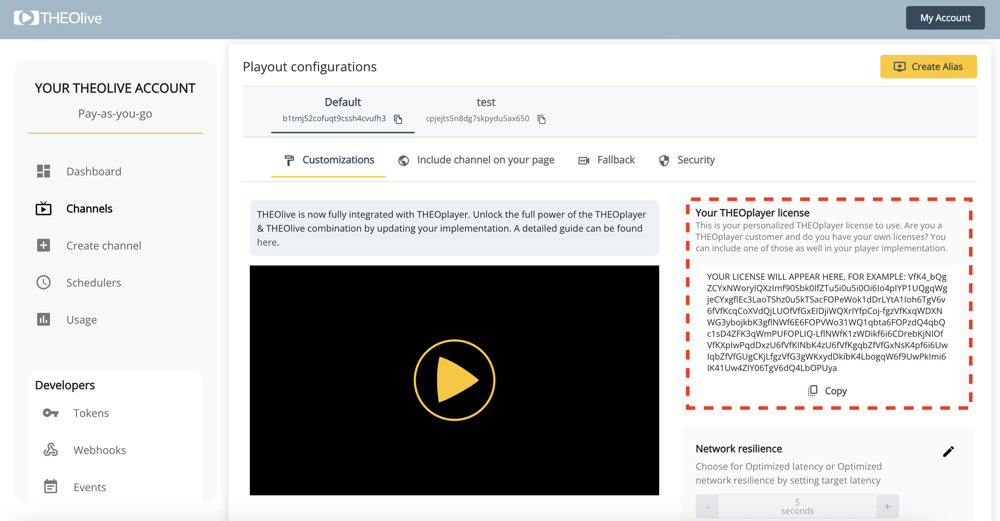

# Backend

THEOlive provides a REST api to manage channels, configure them and start / stop them. Each possible call can be found at our [API Reference](https://developers.theo.live/reference/create-channel).

However, to make things easier for non-developers, we built a management console on top of these API calls which makes it straightforward to perform the basic actions. To be able to create and use a THEOlive channel, you should register for an account and get a token to perform [authenticated requests](./platform/authorization.mdx) to our API.

## 1. Create an account in the management console

To start your journey, you'll have to create a THEOlive account in the [management console](https://console.theo.live/) .

Once you've entered your username and password, you can already create your first channel and start streaming.


:::info 📘 API reference

This guide describes how to get started with the THEOlive management console. Please consult the [API reference](https://developers.theo.live/reference/create-channel) and [Authorization](./platform/authorization.mdx) if you would like to work with API calls.
:::

## 2. Create your first channel

Time to start streaming! In the management console, please click "create channel", which will return the following screen: here you can enter a name for your channel, choose the ingest location, and define your [Stream configuration](./contribution/stream-configuration.mdx). It is important to choose a location as close as possible to you to reduce latency.


When hitting 'Create', you will be navigated towards the Details page of your newly created channel.


A channel can also be created through an API call to the `channels` endpoint, passing an ingest location and a name. It will return an `id` that you can use to start, stop, update or delete the channel later on. Also, a `streamKey` and `rtmpPushUrl` will be returned to stream your content to. More information about the Create channel endpoint and how to pass advanced properties can be found [here](https://developers.theo.live/reference/create-channel).

```curl
curl --location --request POST 'https://api.theo.live/channels'
--header 'Authorization: Basic dG9rZW46c2VjcmV0' \
--header 'Content-Type: application/json' \
--data-raw '{
    "ingestLocation": "europe-west",
    "metadata": {
        "name": "a-name"
    }
}'
```

Note that for this API call you'll need a token that you can generate in the management console. More information can be found at the [Authorization](./platform/authorization.mdx) guide.

## 3. Start streaming

Using the RTMP push URL and the stream key you have received when creating a channel, you can start streaming content to that RTMP endpoint.

:::info 🚧 RTMP pull

If you would like to do pull-based streaming instead of push-based streaming, you can also use your own RTMP pull endpoint and specify this when starting the channel in the next step.
:::

One option to start streaming content is making use of [OBS](https://obsproject.com/). It's an easy, free and quick way to get you started. More information on how to get started with OBS can be found in our guide [Using OBS with THEOlive](./contribution/Encoder Guides/obs.md). If you would be using [Wirecast](https://www.telestream.net/wirecast) for your live streaming, then more information on how to get started can be found in the guide [Using Wirecast with THEOlive](./contribution/Encoder Guides/wirecast.md). There are also guides for [vMix](./contribution/Encoder Guides/vmix.md) and [Videon Edgecaster](./contribution/Encoder Guides/videon.mdx).

:::info ❗️ RTMPS vs RTMP

The RTMP push URL generated by THEOlive shows as RTMPS. If you would like to do RTMP streaming then you will have to change "rtmps" to "rtmp". As an example, `rtmps://rtmp.europe-west.theo.live/live` will have to be changed to `rtmp://rtmp.europe-west.theo.live/live` for RTMP-based streaming.
:::

## 4. Player embed script

Now we have to make sure that our viewers have access to the stream! Including a THEOlive channel on your page is very simple: all you need is our embed script and the channel ID. The [Player](./playback/web/00-getting-started.mdx) guide gives more information on how to do this, including a code snippet example.

### Obtaining a Player License for THEOLive

THEOlive customers have access to THEOplayer Licenses with support for the following platforms:

- `html5`
- `android`
- `androidtv`
- `firetv`
- `ios`
- `tizen`
- `tvos`
- `webos`

These licenses can be found in the "Playout Configurations" section for each of your created Channels on your [THEOLive dashboard](https://console.theo.live/login) as pictured below:



Licenses will be automatically generated for each new channel you create. Aliases on the same channel will share the same license.

## 5. Start the channel

When you're all set, you can start your THEOlive channel. Starting your channel also means your [transcoding time](https://www.theoplayer.com/pricing/theolive) will start counting for billing purposes.

You can easily start your channel on the channel details page, by clicking on the green "start" button.


In the background this will make a `POST` request to the `channels/start` endpoint. You can also start a channel via the Start channel API call, for which you can find more information [here](https://developers.theo.live/reference/start-channel). As mentioned in the last section, you can optionally pass the `rtmpPullUrl` property in the body of the request for pull-based streaming. Don't forget to stop streaming when you are done!

```curl
curl --location --request POST 'https://api.theo.live/channels/{channel-id}/start' \
--header 'Authorization: Basic dG9rZW46c2VjcmV0' \
--header 'Content-Type: application/json' \
--data-raw '{
    "rtmpPullUrl": "your-optional-rtmp-pull-url"
}'
```

## 6. Stop the channel

Have you finished your real-time streaming? Make sure to stop your channel by making a request to the `channels/stop` endpoint, either through a [Stop channel](https://developers.theo.live/reference/stop-channel) API call or by pressing the red "stop" button in the management console.

```curl
curl --location --request POST 'https://api.theo.live/channels/{channel-id}/stop' \
--header 'Authorization: Basic dG9rZW46c2VjcmV0' \
--header 'Content-Type: application/json'
```
