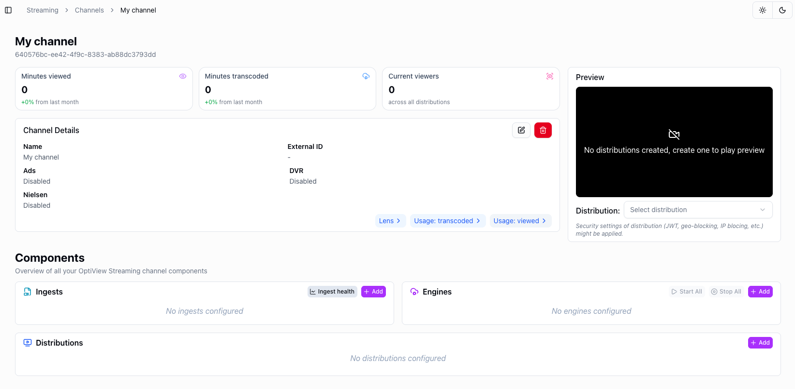
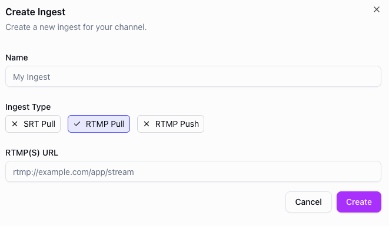
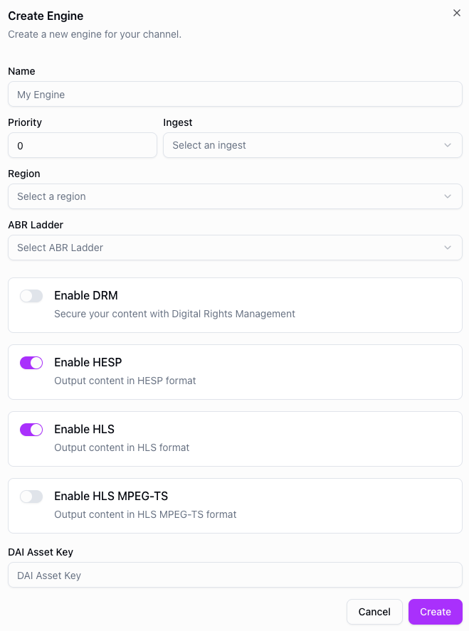
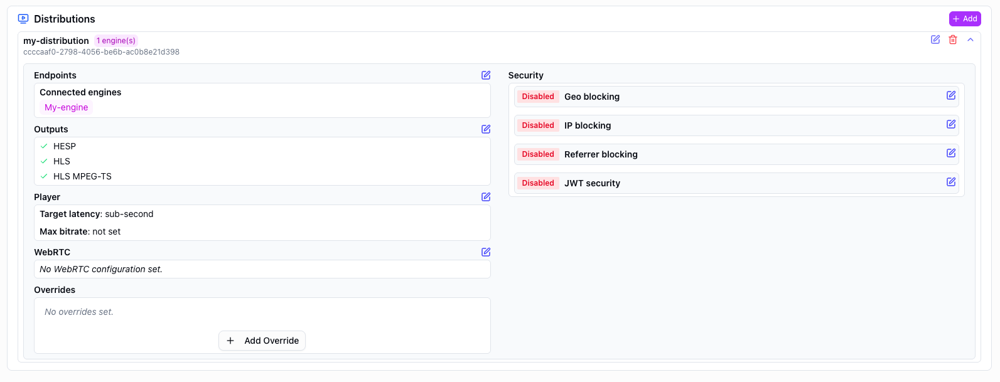
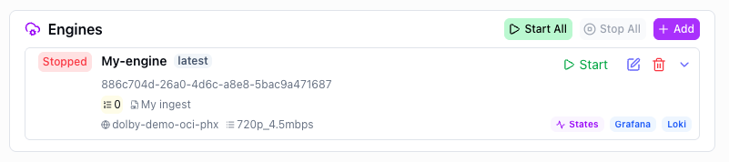
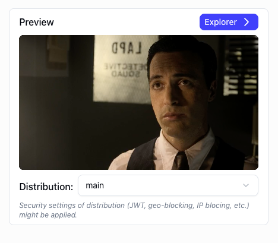

# Getting started

This guide walks you through creating your first stream, from setting up an account to embedding the player on your page.

OptiView live streaming provides a REST API to manage channels, configure them and start / stop them. Each possible call can be found in the [API Reference](./api/index.mdx). On top there also is a [management dashboard](https://dashboard.optiview.dolby.com/) on top of these API calls, making it straightforward to perform the basic actions without writing code.

### Prerequisites

- An OptiView account
- An RTMP/SRT-capable encoder — see our [software encoder](./contribution/software-encoders/index.mdx) and [hardware encoder](./contribution/hardware-encoders/index.mdx) guides
- A web page or app to embed the player

## 1. Create your first channel

Time to start streaming! In the dashboard, click "create channel" and fill in a name. You will end up on the overview page for your channel, where you can configure the different components.

There are other options during channel creation that are more advanced and are explained in their respective guides, you can ignore them for now:

- [DVR](./channel/dvr.mdx)
- [Nielsen](./channel/nielsen.mdx)

## 2. Configure your channel

This section focuses on getting a simple example up and running. For a full breakdown of the platform architecture, see the [Architecture](./architecture.mdx) page.

A channel consists of three main components that need to be configured:

- **Ingest** — where the media is retrieved from. This is the entry point for your content and multiple protocols are supported like RTMP and SRT.
- **Engine** — processes the incoming media, handling transcoding and packaging.
- **Distributions** — different output versions of an engine. Each distribution lets you enable or disable protocols, choose CDNs, and more.

<figure className="center-container">

<figcaption>Example diagram of a channel setup with redundant ingests</figcaption>

</figure>

### 2.1 Ingest

Create a new ingest, give it a name, and select the protocol you want to use (RTMP or SRT) and which mode (pull or push).

:::tip
You only need a single ingest to start streaming but are free to create multiple ones for redundancy purposes for example.
:::

### 2.2 Engine

The engine is responsible for transcoding and packaging the incoming media. Create a new engine and configure the following properties:

- **Name** — a descriptive name for your engine.
- **Priority** — determines which engine takes precedence when multiple engines are configured. A lower number means higher priority.
- **Ingest** — select which ingest this engine should use as its source.
- **Region** — the region where the transcoding takes place. Choose one close to your ingest location.
- **ABR Ladder** — the adaptive bitrate ladder used for transcoding, defining the resolution and bitrate combinations.
- **Enable DRM** — secure your content with Digital Rights Management.
- **Enable HESP** — output content in HESP format for low latency delivery.
- **Enable HLS** — output content in HLS format for broad platform compatibility.
- **Enable HLS MPEG-TS** — output content in HLS MPEG-TS format. Only recommended for very specific platforms that don't support HLS with CMAF segments.
- **DAI Asset Key** — asset key for Dynamic Ad Insertion.

### 2.3 Distributions

A distribution represents an output version of an engine. Create a new distribution, give it a name and a connected engine. The default properties are fine to get started, but a lot of properties can be configured:

- **Endpoints** — the connected engines that feed into this distribution.
- **Outputs** — enable or disable streaming protocols (HESP, HLS, HLS MPEG-TS).
- **Player** — configure player settings such as target latency and max bitrate.
- **WebRTC** — optional WebRTC configuration for real-time delivery.
- **Overrides** — add custom overrides for specific settings.
- **Security** — configure access restrictions including geo blocking, IP blocking, referrer blocking and JWT security.

## 3. Start the channel

When you're all set, you can start your channel from the channel details page by clicking the `Start all` button. This will start all engines at once. Starting your channel means your transcoding time will start counting for billing purposes.

For advanced use cases such as production updates, you can start and stop individual engines separately. However, for most use cases all engines will be started and stopped at the same time.

## 4. Verify playback

Now we have to make sure that our viewers have access to the stream. In the dashboard you can already see the preview of the stream.

For production use cases, you should connect [OptiView Player](./playback/optiview-player.mdx).

## 5. Stop the channel

When you are done streaming, make sure to stop your channel to avoid unnecessary transcoding costs.
