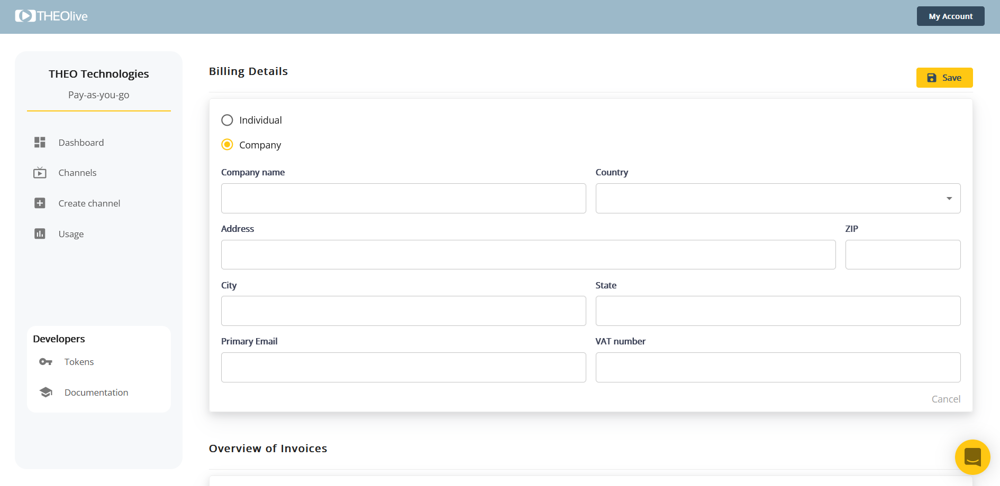
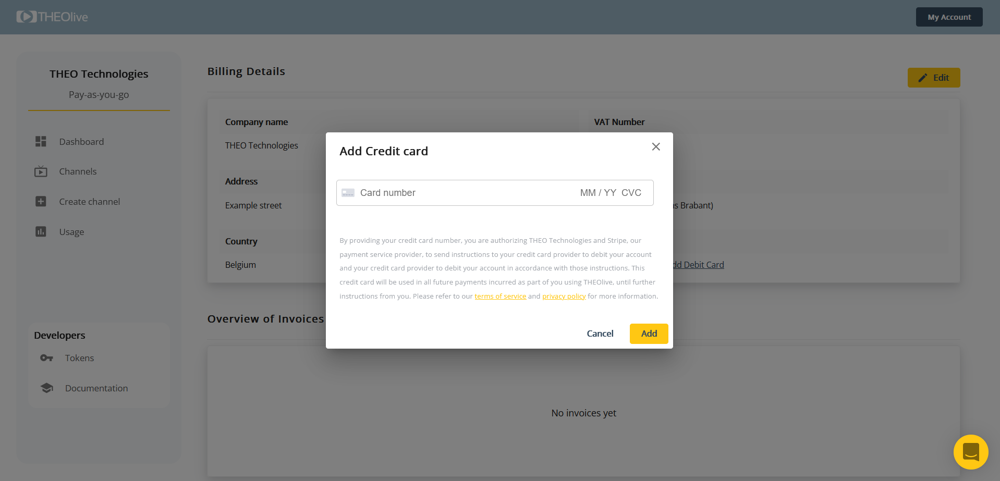

Discover our payment methods and billing cycles

---

This guide describes which payment methods are available, how to activate these, and when you will be billed.

## 1. Know this first

- You can test for free in demo mode. This limits your streaming time to 5 minutes and puts a watermark on your video. All other functionalities are equivalent to those available in production.
- When adding your payment method, you get $20 in production for free.
- We work with billing cycles and payment thresholds, in combination.

## 2. Add you billing details

Your billing details can be added via _My Account_ > _Billing Details_.

You subsequently have to click _Add Billing Details_, and complete the form.

This will allow you in turn to add a payment method. We provide for 2 methods: credit card payment and direct debit. The picture below illustrates the credit card view.

You are all set, and can start using your production channels!

## 2. Invoicing

### 2.1 Model

THEOlive is pay-as-you-go. There are no minimum fees; you pay per minute of transcoding and per minute of streaming per viewer.

> 📘 Estimate your streaming costs
>
> To get an estimate of the streaming cost for an event, you can check the [pricing page](https://www.theoplayer.com/pricing/theolive) on the website. Note that the prices listed do not include VAT yet; this will be added on your invoice. Discounts are possible for high volumes and commitments: [contact us](https://www.theoplayer.com/contact-us) to know more.

You will be invoiced based on billing cycles or payment thresholds, whichever takes place first.

### 2.2 Payment thresholds

There are four payment thresholds, or tiers, respectively $100 (Tier 1), $250 (Tier 2), $500 (Tier 3) and $1000 (Tier 4). As a new user, you start in Tier 1. When you've accrued $100 in costs, an invoice is generated and you are promoted to Tier 2. The same applies to the following tiers: if you accumulate an additional $250, a new invoice is generated and you are promoted to Tier 3. Tier 4 is the highest: reaching the threshold will not move your account to a new tier and the same threshold remains applicable.

### 2.3 Billing cycles

If at the end of the calendar month your threshold has not been reached, you will be billed for the open amount. For example, a THEOlive user in Tier 2 has an open amount of $200 at the end of the month. As the Tier 2 threshold of $250 has not been reached, an invoice will be generated for $200.
