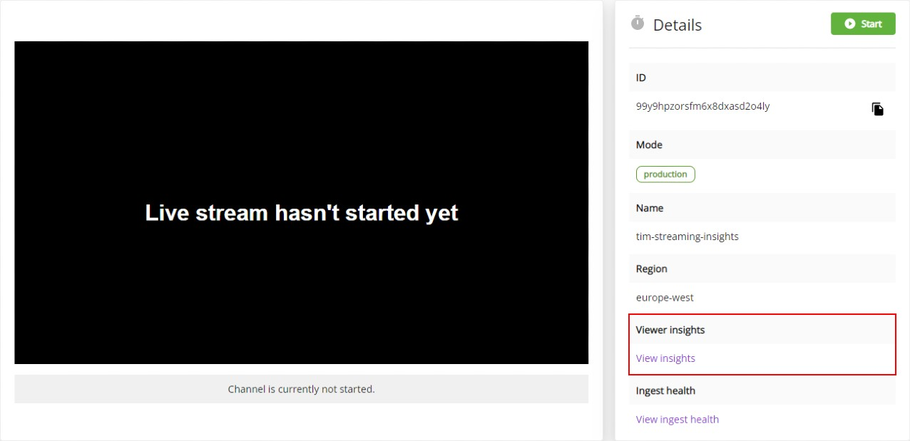
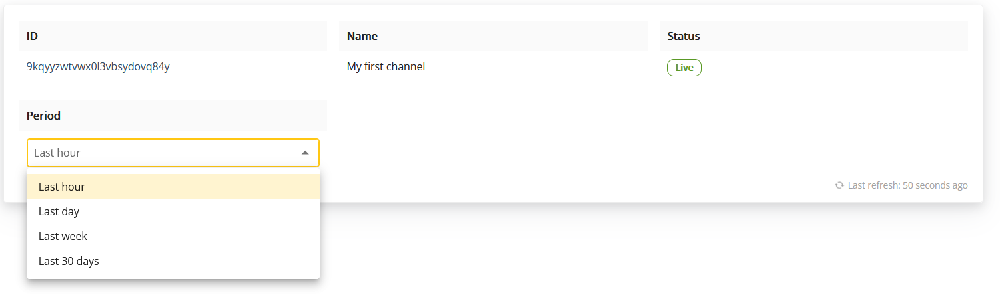

Easily monitor and analyze viewer behavior of your live stream
---

Interested to know how many viewers are watching your live stream at any moment in time, and where they are located? Do you know when additional viewers have joined the live stream and when they have left? These are just a few of the viewer insights which will be interesting to analyze, to see how you can optimize your next live stream. 

Viewer insights are made available for every THEOlive user. This guide describes which viewer insights are available for your THEOlive channel, and where to find them.

## How to access viewer insights

Viewer insights are available for each channel, and can be accessed on your channel page under _Details_ by clicking _Viewer Insights_. The below picture illustrates where to find this. Each channel has its dedicated viewer insights page, so when running multiple channels simultaneously (including failover channels, if any), you'll have to repeat this step for every channel. 

## Analyzing viewer insights

The viewer insights page of your channel includes:

### Main channel information

The first section contains information such as the **channel ID** and **name **as well as its **status**. This way, you can make sure that you're consulting the right viewer insights at any moment in time and whether or not your channel is live.

The last field in this section allows you to select the **period ** for the viewer insights graphs. You can select different periods, from _Last hour_ to the _Last 30 days_. What you see in the following sections is determined by the value you select here.

### Viewer sessions

This graph shows how many concurrent viewer sessions are active within the selected period. In addition, it also shows the active session right now, so that you know at any moment in time how many viewers are watching your live stream. 

### Viewer latency

When interactivity is key, you want to make sure that you're live streaming at ultra-low latency. The next graph shows the latency your viewers are experiencing for the selected period. This is defined as the percentage of viewers who experienced a specific (median) latency. The graph below shows for example a typical latency between 550ms and 950ms and the overall median latency was 834ms.  

### Viewer locations

Curious to see where your viewers are located? The next table shows where viewers were connecting from, and how many connections were established for each reported city/place. You can sort the data in this chart by increasing or decreasing value for each column, and select how many rows per page are shown.

### Top browser and operating systems

Are your viewers using mobile phones, or do they typically use a desktop, or other platform? And which operating system are they using? These are just a few of things you can find in the last table on your _viewer insights_ page. In this section, the viewer count is reported by browser, browser version, OS and OS version. You can sort the data in this chart by increasing or decreasing value for Browser, OS and Amount of sessions as well as select how many rows per page are shown.

