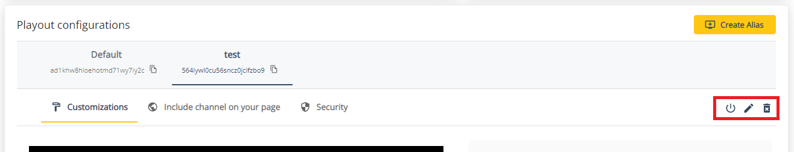

# Multi-channel: aliases for channels

This guide describes the multi-channel approach of THEOlive: ingest only once, and create multiple channel aliases to configure unique playouts. Next to a different configuration for each alias, THEOlive offers the possibility to apply some security settings (like Geoblocking and token based security) on each alias.

All of this is possible via the [THEOlive management console](https://console.theo.live), as well via the [THEOlive API](https://developers.theo.live/reference/create-channel-alias).

## Multi-channel: player aliases

Do you want to make your live stream available to multiple customers concurrently? And do you require for each customer a different player look & feel, restrictions on countries the content is made available, and usage stats to be tracked separately? You can easily do this with the THEOlive multi-channel capability.

When accessing your "_Channel Details_" page, you can create aliases for your channel under the section "_Playout configurations_". For each alias that you create it’s possible to subsequently change the playout configuration: colors, poster image, announcement message, logo etc.

The big advantage here is that you only have to configure your ingest once, and can then share your content on multiple web pages as each alias has a different channel ID. Including an alias is very simple: you just have to copy the ID and paste it as the value of the `data-theo-live-id` attribute. Click on the "_Include channel on your page_" tab to see the full explanation on how the include a specific playout configuration (alias) on your page.

### Managing your alias

At any time, you can [update](https://developers.theo.live/reference/update-channel-alias), [enable](https://developers.theo.live/reference/enable-channel-alias), [disable](https://developers.theo.live/reference/disable-channel-alias) or [delete](https://developers.theo.live/reference/delete-channel-alias) a channel alias. The default alias can't be deleted, you'll have to delete your whole channel in case you want to do so.

### Analytics per channel alias

It's possible to visualize data per channel alias. In the console you can see your viewing insights (concurrent viewers, latency, locations of your viewers, browsers and operating systems used) and channel usage (viewing minutes) per alias by clicking on one of the links in the analytics section of the Channel Details page.

THEOlive also offers an API endpoint where you can query the minutes viewed on an hourly basis per channel alias. You can read more about it [here](https://developers.theo.live/reference/get-channel-alias-analytics).

