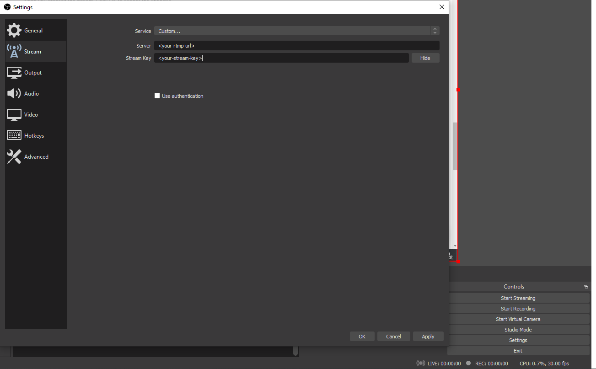
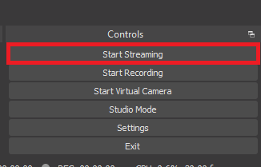

# Using OBS with THEOlive

This guide will shortly describe how to set up [OBS Studio](https://obsproject.com) correctly so it can be used to stream content to THEOlive.

## 1. Add a source

In the _Source_ section at the bottom of the application, hit the + sign. You can choose any source you want. As an example, we can select "Display Capture", which will record your screen.

## 2. Define the settings

Select _Settings_ in the _Controls_ section at the right bottom of the application. Click on the _Stream_ tab and enter your credentials:

- Select "Custom..." as the _Service_
- Pass the `rtmpPushUrl` URL as _Server_
- Make sure to enter the `streamKey` as _Stream Key_

As a next step, go to the _Output_ tab in the _Settings_ menu, and configure the following settings in order to achieve the lowest possible latency with THEOlive.

- Output Mode: `Advanced`
- Bitrate: match the max bitrate of the profile used in your channel (e.g.: 4500Kbps for "sport"). [More details](stream-configuration.mdx).
- CPU Usage Preset (higher = less CPU): `veryfast`
- Profile: `main`
- Tune: `zerolatency`

Go to the _Video_ tab and set the frame rate to the same value you are using in your channel. See [Stream configuration](stream-configuration.mdx) for more details.

:::info 🚧 Upload bandwidth
Make sure that your encoder has a stable connection and enough upload bandwidth. This will ensure all data is correctly sent to the THEOlive channel.
:::

## 3. Start streaming

Close the window and click on _Start Streaming_ in the same _Controls_ section

## 4. Start your THEOlive channel

This can be done either [through the API](https://developers.theo.live/reference/start-channel) or via [the management console](https://console.theo.live/).
