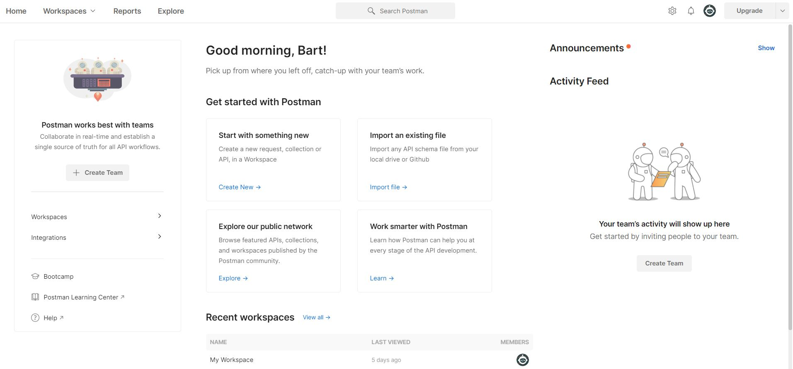
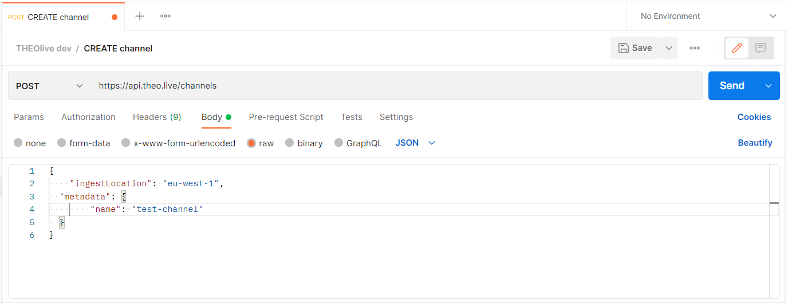

# Using Postman with THEOlive

Postman is a great tool to play around and test your API tools. In this guide, we will explain to you how to install it, and how to use it to make some calls towards the THEOlive API.

## 1. Sign up for a Postman Account and download

You can log in or sign up for a Postman account by clicking on [this link](https://www.postman.com/product/api-client/).

Once you are signed in, you can download the [Postman client](https://www.postman.com/downloads/).

## 2. Configure your first request

Under the section "Start with something new", click on “Create New” and subsequently click "Create a Request" under the "Get Started" section.



Perform the following basic steps to set up your request:

**a. Select the right method** (`DELETE`, `GET`, `PATCH`, `POST`) based on the [API reference documentation](https://developers.theo.live/reference/create-channel)

**b. Pass the URL.** For [Create channel](https://developers.theo.live/reference/create-channel), for example, this is `https://api.theo.live/channels`

**c. Set the right Authorization** (see screenshot below)

- Select the Authorization tab
- Select “Basic Auth” as type
- Pass your credentials, i.e. username and password. These correspond to respectively the token (=user name) and secret (=password) as generated in the management console. More information on authorization can be found in the [Authorization](../getting-started/authorization.mdx) guide.


In case of a `POST` method, pass the right body as per the [API reference documentation](https://developers.theo.live/reference/create-channel). Also, see the example below for 'Create Channel' where the channel 'test-channel' is created.

```json Body Create Channel
{
  "ingestLocation": "europe-west",
  "metadata": {
    "name": "test-channel"
  }
}
```

Make sure to select the “raw” radio button, and select “JSON” in the dropdown (which is located after “GraphQL” radio button and standardly is set to “Text”.)



## 3. Send the request

Hit “Send” to trigger the request. Results will be shown in the "Response" section at the bottom of the page. For the Create Channel example, it will return an `id` that you can use to start, stop or delete the channel later on. Also, a `stream_key` and `rtmp_push_url` will be returned to stream your content.
