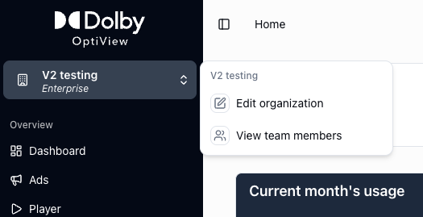
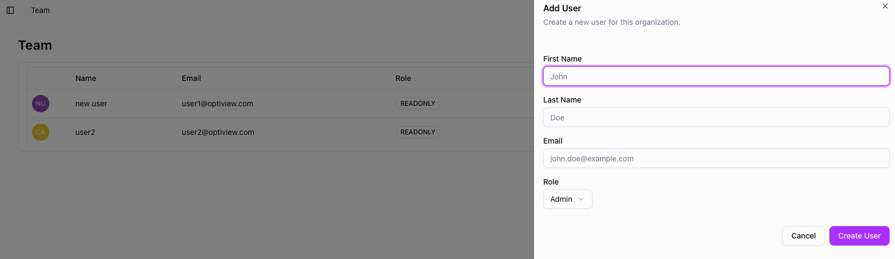

# Manage organization

Your organization is the top-level account that contains all your channels, distributions, and team members. From the organization settings you can manage who has access and what they can do.

## Managing your organization

Navigate to the organization settings to view and edit your organization name and details.

<figure style={{ textAlign: 'center' }}>

</figure>

## Adding team members

To invite a colleague, navigate to the team section and click **Add member**. Enter their first name, last name, email address, and select their role, then confirm.

The invited user will receive an email with instructions to access the dashboard. Once they accept, they appear as part of your organization.

<figure style={{ textAlign: 'center' }}>

</figure>

## Roles

There are two roles: **admin** and **user**.

- **Admin** — full access, including team management, billing, and token revocation.
- **User** — access to day-to-day operations like managing channels and distributions, but no access to team management or billing.

Only admins can invite or remove team members and change roles.
