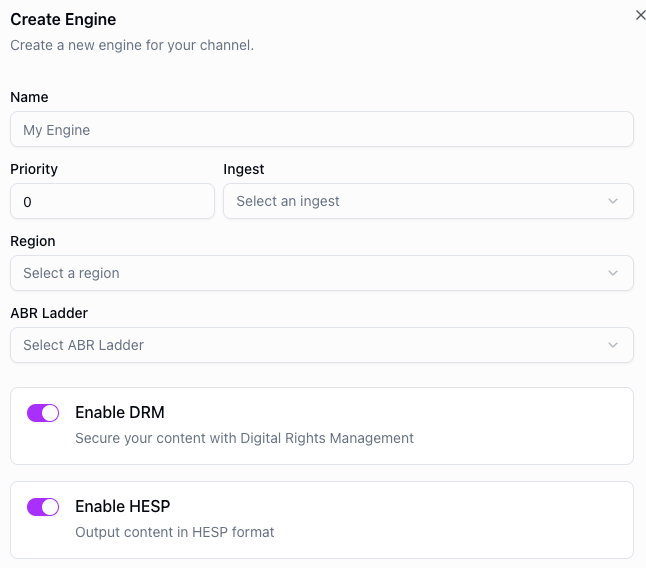

# DRM


Digital Rights Management (DRM) protects live video content by encrypting the stream so that only authorized viewers can watch it. Without DRM, streams can be intercepted, redistributed, or recorded without permission.

DRM is essential for content that requires legal or contractual protection, such as premium sports broadcasts, pay-per-view events, or licensed entertainment. It ensures that content owners retain control over who can access their streams and under what conditions.

## Enabling DRM

DRM is configured per engine, allowing fine-grained control over which streams are protected. To enable DRM, simply enable the DRM option on an engine.



## API example

You can also enable DRM via the API by setting `drm` to `true` when [creating](../api/create-channel-engine.api.mdx) or [updating](../api/update-engine.api.mdx) an engine.

`POST https://api.theo.live/v2/channels/{channelId}/engines`

```json
{
  "name": "my-engine",
  "region": "europe-west",
  "quality": {
    "abrLadderId": "your-abr-ladder-id"
  },
  "drm": true
}
```
