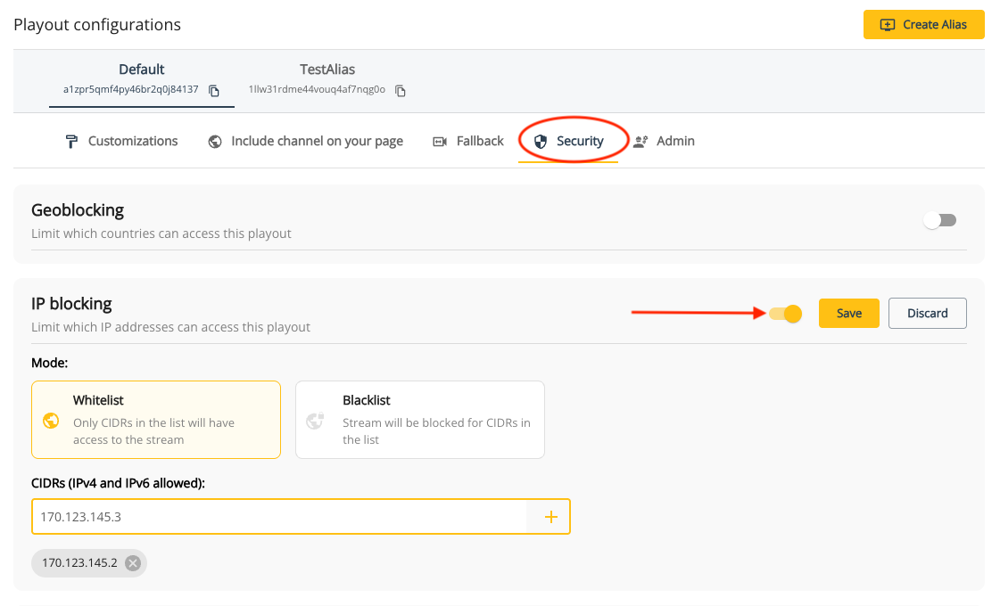

# IP-blocking

IP-blocking (or IP-banning) refers to a security measure that restricts access to content for specific IP addresses. Filtering can be allowed or denied by IP addresses or by [countries](/theolive/platform/Security/geo-blocking) as well. Only IPv4 and IPv6 CIDRs (Classless Inter-Domain Routing) are allowed.

IP-blocking can be configured via the API or the console.

## IP-blocking via the API

### Main channel

You can enable IP-blocking on a channel by [updating](/theolive/api/channels/update-channel) the `ipBlocking` object within `publicationConfig`. The `mode` of geo-blocking can also be configured:

- `whitelist`: Used by default when no `mode` is passed. This will make the content only available for the CIDRs that have been specified in the `cidrs` property. CIDRs not listed in the `cidrs` property will not recieve the stream.
- `blacklist`: Blocks the content for the CIDRs that have been specified in the `cidrs` property. All CIDRs not specified in the `cidrs` property will be able to view the content.

For example: If you want to restrict certain CIDRs from viewing your content, you can pass the following request:

```json Enable ip-blocking on a channel
{
  "publicationConfig": {
    "ipBlocking": {
      "enabled": true,
      "mode": "whitelist",
      "cidrs": ["170.123.145.2", "170.123.145.3"]
    }
  }
}
```

### Channel Alias

IP-blocking can also be done on a [channel alias](/theolive/platform/multi-channel) using the specified channel alias [endpoint](/theolive/api/channels/update-channel-alias) or via the console.

## IP-blocking via the console

Updating IP-blocking settings can also be done via the console. Navigate to your channel's details page and scroll down to the playout configurations panel. Select the your default channel or alias and click on the security tabs. If you don't have an alias, click the _Create Alias_ button on the top right of the panel.

Clicking the toggle button can enable and disable IP-blocking on the specified channel. When enabled, a mode can be selected and CIDRs can be added to the list.

Don't forget to hit "Save" to apply your changes.



## Feature compatibility and limitations

- IP-blocking can be enabled or disabled during the middle of a stream without needing to restart the channel or restart ingests
- IP-blocking for a specified CIDR will not work if geo-blocking is enabled for the country or region where the CIDR originates from
- IP-blocking only allows IPv4 and IPv6 CIDRs
