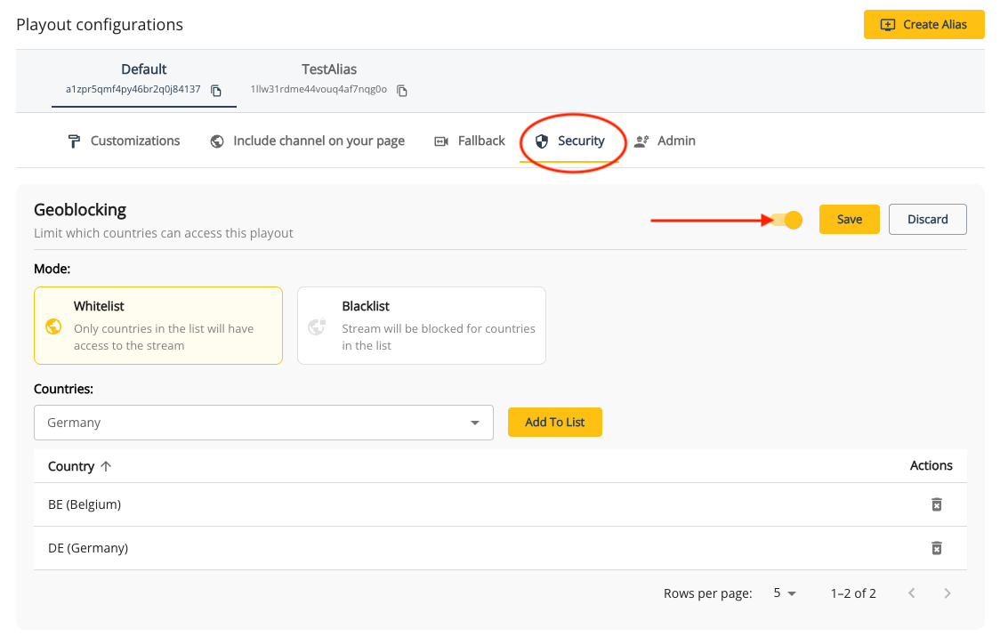

# Geo-blocking

Geo-blocking refers to the action of restricting ("blacklisting") or allowing ("whitelisting") access to certain content based on the geographical location of the user. Filtering can be allowed or denied by countries as well as [IP addresses](/theolive/platform/security/ip-blocking). Geo-blocking enables content providers to adhere to specific licensing agreements and distribution rights, protect copyrighted material, or service another layer of privacy when working on private content.

Geo-blocking can be configured via the API or the console.

## Geo-blocking via the API

### Main channel

You can enable geo-blocking on a channel by [updating](/theolive/api/channels/update-channel) the `geoBlocking` object within `publicationConfig`. The `mode` of geo-blocking can also be configured:

- `whitelist`: Used by default when no `mode` is passed. This will make the content only available in the countries that have been specified in the `countries` property. Countries not listed in the `countries` property will not recieve the stream.
- `blacklist`: Blocks the content in the countries that have been specified in the `countries` property. All other countries not specified in the `countries` property will be able to view the content.

:::tip
Countries should be passed in [ISO 3166-1 alpha-2 codes](https://en.wikipedia.org/wiki/ISO_3166-1_alpha-2)
:::

For example: If you want to restrict the viewers of your content to only Belgium and Germany, you can pass the following request:

```json Enable geo-blocking on a channel
{
  "publicationConfig": {
    "geoBlocking": {
      "enabled": true,
      "countries": ["BE", "DE"],
      "mode": "whitelist"
    }
  }
}
```

If you would like to disable geo-blocking on this channel, you can pass the same request as above, but with:

- `"enabled": false`
- `countries` can be omitted as it will be ignored

```json Enable geo-blocking on a channel
{
  "publicationConfig": {
    "geoBlocking": {
      "enabled": false,
      "mode": "whitelist"
    }
  }
}
```

If you would like to make your content available anywhere **except** Belgium, you can pass the following request:

```json Use blacklist geo-block
{
  "publicationConfig": {
    "geoBlocking": {
      "enabled": true,
      "countries": ["BE"],
      "mode": "blacklist"
    }
  }
}
```

### Channel alias

Geo-blocking can also be done on a [channel alias](/theolive/platform/multi-channel) using the specified channel alias [endpoint](/theolive/api/channels/update-channel-alias) or via the console.

## Geo-blocking on main channel and alias

Combining geo-blocking rules on both the main channel and aliases can allow you to create custom rules on where your content can be viewed in the world.

For example, a stream you have created must adhere to the following rules:

- Customer 1 can only show the stream to Belgian viewers
- Customer 2 can only show the stream to UK and USA viewers
- Customer 3 can only show the stream to French viewers

In this scenario, you can create 3 aliases of your main channel, one for each customer. This allows you to set custom geo-blocking rules for each customer as well as [track customer specific analytics](../multi-channel.md).

The main channel's `channel-id` won't be used, we so can geo-block it completely. This means someone using this channel ID will not be able to see it anywhere in the world.

We will configure the 3 aliases with the following configurations:

- Customer 1 will use channel ID `alias-1` where we `enable` geo-blocking and restrict the access to `BE` using `whitelist` in the the `mode` property.
- Customer 2 will use channel ID `alias-2` where we `enable` geo-blocking and restrict the access to `UK` and `US` using `whitelist` in the the `mode` property.
- Customer 3 will use channel ID `alias-3` where we `enable` geo-blocking and restrict the access to `FR` using `whitelist` in the the `mode` property.


## Geo-blocking via the console

Updating geo-blocking settings can also be done via the console. Navigate to your channel's details page and scroll down to the playout configurations panel. Select the your default channel or alias and click on the security tabs. If you don't have an alias, click the _Create Alias_ button on the top right of the panel.

Clicking the toggle button can enable and disable geo-blocking on the specified channel. When enabled, a mode can be selected and countries can be added to the list.

Don't forget to hit "Save" to apply your changes.



## Feature compatibility and limitations

- Geo-blocking can be enabled or disabled during the middle of a stream without needing to restart the channel or restart ingests
- IP-blocking for a specified CIDR will not work if geo-blocking is enabled for the country or region where the CIDR originates from
