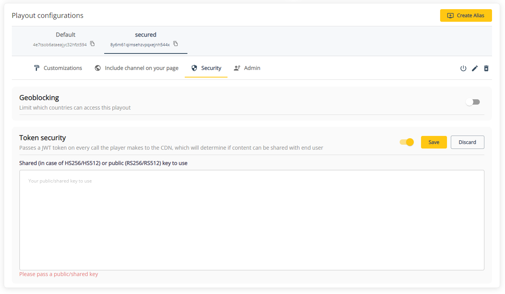

# Token based security

THEOlive offers the option to enable JWT token security on channel alias level. This can be interesting if you only want valid users to access your stream.

In this document, we will

- explain how it works
- how to enable/disable it via the console and API
- how to configure your THEOplayer to pass the mandatory headers

## How it works

When enabling token security on a channel alias, we expect you to share the shared (private) key in case of HS256/HS512 or the public key in case of RS256/RS512 encryption. This will be used on CDN level to determine if a request (with a Bearer token passed in the `Authorization` header) is valid or not. It's up to you to configure this header correctly through our [npm player](https://www.npmjs.com/package/theoplayer). Later in this document we will explain how.

In the bearer token that gets sent to us, we expect the following properties to be available:

- `exp`: date in epoch format until which the JWT token is valid
- `nbf`: optional date in epoch format. Stands for "not before" and acts as a "start date" of the JWT to be valid.

When not passing a bearer token for a secured channel, the request will be rejected.


## Enable or disable token security for an alias

Please refer to the [Enable token security for alias](/theolive/api/channels/enable-token-security-for-alias) and [Disable token security for alias](/theolive/api/channels/disable-token-security-for-alias) API endpoints to manage the token security settings for an alias.

When enabling for the first time, you have to pass the `key` property in the body. If you disable token security later on, and make it active again, you can omit this property if it should stay the same.

If you're using the [THEOlive management console](https://console.theo.live), you can navigate to the player details page and select the alias you want to enable/disable token security for. When enabling, please pass the correct shared or public key to use. **Don't forget to confirm your changes by hitting the save button!**



## Configuring THEOplayer to pass the necessary headers

### 1. Create a network interceptor

First thing to do is to create a header provider function. In this function you add the `Authorization` header which contains a bearer token generated by you. This token should at least contain a `exp` property, and an optional `nbf` property. You can add as many other properties to it as you want, but THEOlive doesn't do anything with them.

```typescript Creating header provider
const interceptor = (request) => {
  const headers = {
    ...request.headers,
    Authorization: 'Bearer <token-generated-by-you>',
  };
  request.redirect({
    headers,
  });
};
```

### 2. Set the request interceptor

The above defined interceptors can be added to the player as follows:

```js
player.network.addRequestInterceptor(interceptor);
```

The player will now include the header in every request that gets made to the CDN to grab content.

Similarly, interceptors can be removed, as follows:

```js
player.network.removeRequestInterceptor(interceptor);
```

:::warning
An unauthorized error will occur if no token or an invalid token is passed, preventing users from being able to watch the stream.
:::

### Limitations on iOS devices

Apple devices running an iOS version lower than 17.1 do not support MSE, therefore there are limitations with what is possible when playing a THEOlive stream. One such limitation is that the above network interceptor approach does not work on those devices. Instead, a service worker needs to be registered to support playback of JWT enabled streams.

The service worker needs to intercept the `fetch` requests originating from the app, compute a JWT and attach it as a `Authorization` header to the request and dispatch it. As mentioned above, the only key in the JWT that we need is the `exp`, all others are optional and will be ignored by the backend.

A code snippet for the service worker code is shared below.

:::note
Service worker registration and the usage of the crypto object (used for signing the JWT) are only posssible in a secure environment (`https://`) or on `localhost`.
:::

```javascript Service Worker for iOS Safari
// If you are using a symmetric key, then this is the same key as configured in your console.
const YOUR_JWT_SIGNING_KEY = 'YOUR-SIGNING-KEY-GOES-HERE';

// Service worker events
self.addEventListener('install', () => {
  console.log('Service worker installed!');
  self.skipWaiting();
});

// Activation event
self.addEventListener('activate', (event) => {
  console.log('Service Worker activated');
  // Claim clients so the service worker is in effect immediately
  event.waitUntil(self.clients.claim());
});
// Service worker events end

// Intercept the fetch event and add in your JWT
self.addEventListener('fetch', (event) => {
  event.respondWith(
    (async function () {
      try {
        const url = new URL(event.request.url);
        // Only intercept requests made by the player and not other requests
        if (url.origin.endsWith('theo.live')) {
          // Replace `sign` with your own JWT signing implementation
          const jwt = await sign(
            {
              exp: Math.floor(Date.now() / 1000) + 300, // 5 minutes
            },
            YOUR_JWT_SIGNING_KEY
          );

          // Clone the request and add the JWT header
          const modifiedRequest = new Request(event.request, {
            headers: {
              ...Object.fromEntries(event.request.headers.entries()),
              Authorization: `Bearer ${jwt}`,
            },
          });

          return fetch(modifiedRequest);
        }

        // For other requests, just pass through
        return fetch(event.request);
      } catch (error) {
        console.error('Error in fetch handler:', error);
        return new Response('Service Worker Error', { status: 500 });
      }
    })()
  );
});
```

And then, to register this service worker in to your code, you can attach it this way.

```javascript add service worker
const registerServiceWorker = () => {
  if ('serviceWorker' in navigator) {
    // Replace with your own path to the service worker location.
    navigator.serviceWorker
      .register('./path/to/your/service-worker.js')
      .then((reg) => {
        if (reg.active) console.log('Service worker registered!');
      })
      .catch((err) => {
        console.error('Could not register service worker!', err);
      });
  } else {
    console.error('Service worker not supported!');
  }
};
// Initialise the service worker some time early in the processs.
if (!(window.MediaSource || window.ManagedMediaSource)) {
  registerServiceWorker();
}
```

The snippet above assumes the existence of a function `sign(payload, secret)` that generates a JSON Web Token (JWT) and signs it using the default HMAC SHA-256 algorithm. [(Refer to docs on jwt.io)](https://jwt.io/introduction). In pseudo-code :

```javascript
const sign = async (payload, secret) => {
  let header = { alg: 'HS256', typ: 'JWT' };
  let message = base64UrlEncode(header) + '.' + base64UrlEncode(payload);
  let signature = HMACSHA256(message, secret);
  return message + '.' + base64UrlEncode(signature);
};
```

You can use an existing library like [Jose](https://github.com/panva/jose), or you can use our example implementation:

<details>
<summary> JWT `sign` function </summary>

```js
const base64UrlEncode = (str) => {
  return btoa(str).replace(/\+/g, '-').replace(/\//g, '_').replace(/=/g, '');
};

const utf8ToUint8Array = (str) => {
  return new TextEncoder().encode(str);
};

const sign = async (payload, secret) => {
  const header = { alg: 'HS256', typ: 'JWT' };

  const encodedHeader = base64UrlEncode(JSON.stringify(header));
  const encodedPayload = base64UrlEncode(JSON.stringify(payload));

  const data = `${encodedHeader}.${encodedPayload}`;
  const secretBytes = utf8ToUint8Array(secret);

  const key = await crypto.subtle.importKey('raw', secretBytes, { name: 'HMAC', hash: { name: 'SHA-256' } }, false, ['sign']);

  const signature = await crypto.subtle.sign({ name: 'HMAC' }, key, utf8ToUint8Array(data));

  const signatureStr = String.fromCharCode(...new Uint8Array(signature));

  return `${data}.${base64UrlEncode(signatureStr)}`;
};
```

:::info
You can validate the token generated by inspecting it using the JWT decoder on [JWT.io](https://jwt.io/). The header and payload will be decoded immediately. If you provide your HMAC key, you can validate that the signature is also valid.
:::

</details>

:::note
If you are using a bundler such as Vite or Rollup etc, you will need to ensure that your service worker also gets copied to our output directory and is `registered` from the correct path.
:::
