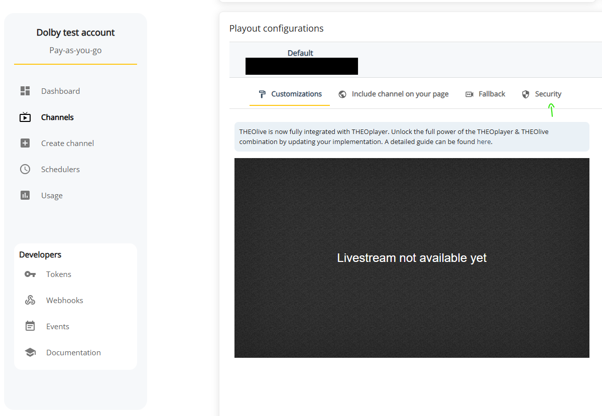
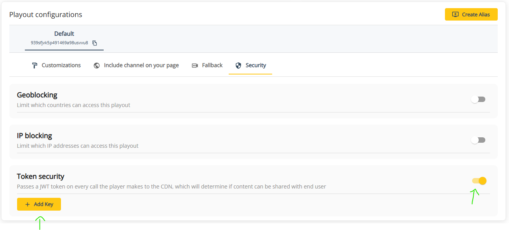
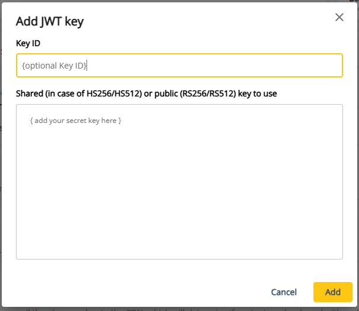

# Token Based Security

Currently you can enable JWT token security on a channel and set a custom header to authorize playback when using the THEOplayer Flutter SDK for iOS and Android applications only. If you need
JWT token security when using the THEOPlayer Flutter SDK for Web, track the official [`changelog`](https://pub.dev/packages/theoplayer/changelog) to learn when this feature becomes available.

The addition of custom header functionality for Android (PlaybackPipeline.MEDIA3) and iOS is stated in the changelog for [`version 9.2.0`](https://pub.dev/packages/theoplayer/changelog#920)

## Enable Token Security for Channel

The first step to enabling JWT token security is generating a JWT token using a secret key which will be used in the THEOlive dashboard. Generating both a secret key and a JWT token can be done online
or through the use of a backend server, using secret key generating scripts and token generating packages like [`'jsonwebtoken'`](https://www.npmjs.com/package/jsonwebtoken). Ensure that
you keep your secret key and JWT values secure.

Once you have your secret key and JWT token created, go to the THEOlive dashboard and select the channel that you would like to enable security for. Once you've identified the channel and have selected it, do
the following steps to enable token-based security for your channel:

First scroll down to the `'player configurations'` panel and select the `'security'` option:



Next, toggle token security on and click the `Add key` button:



Finally, add your secret key to the second input field with a title of `Shared (in case of HS256/HS512) or public (RS256/RS512) key to use`:



Click `Add` to complete token security setup and your channel's streams will now require the JWT token to be present in the request headers to be viewed. To do this you will need
to set up a custom header containing reference to your JWT token. See the [`set custom header`](#set-custom-header) section to learn how to set a `Authorization` header, which allows
the viewing of your secured THEOlive stream.

## Set custom header

You can set custom headers for Android (PlaybackPipeline.MEDIA3) and iOS devices using [`TypedSource.headers`](https://pub.dev/packages/theoplayer/changelog#920), making it possible
to pass your JWT token to the `Authorization` request header property for token secured streams. Your custom headers will be applied to master playlist, media playlist, and segment requests.

Using the THEOplayer Flutter SDK for IOS or Android, you can set an `Authorization` header when setting your source:

```dart
  Map<String, String> headerInput = {};
  headerInput["Authorization"] = "Bearer <jwt-token-generated-by-you>";

  player.source = SourceDescription(sources: [
    TypedSource(src: "<your-theolive-channel-id>", headers: headerInput),
  ]);
```

The code above will allow your JWT token to be added in the request headers `Authorization` property to allow secure viewing.

## More information

- [THEOplayer Flutter SDK](/theoplayer/flutter/)
