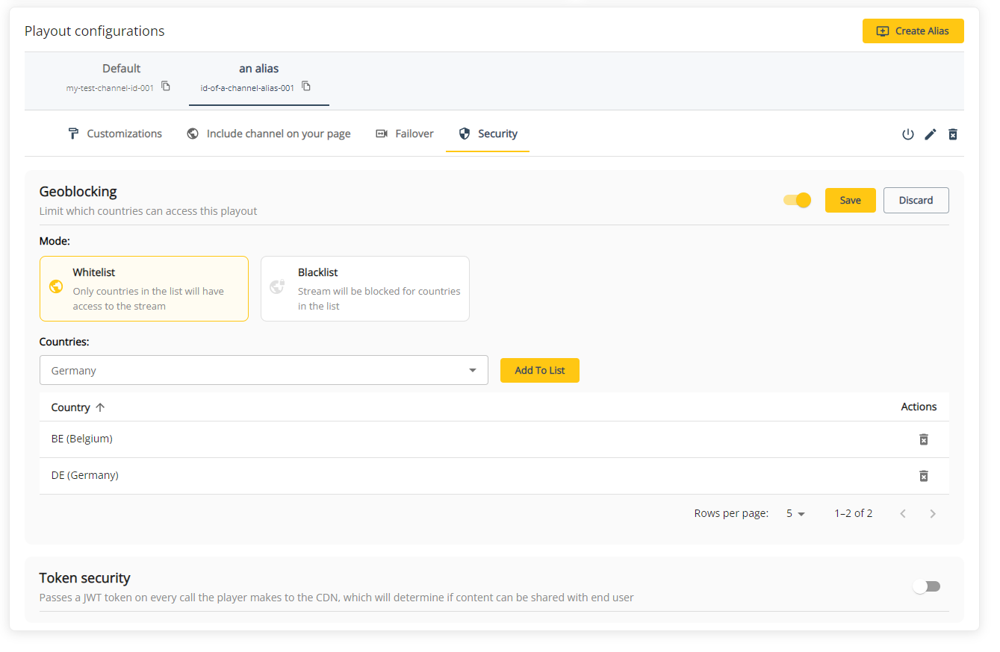

# Geo-blocking

Geo-blocking allows you to block content in certain countries ("blacklisting"), or only allow a set of countries to have access to it ("whitelisting"). You can easily enable/disable it through the management console or via the API. We'll discuss both approaches in this guide.

## How it works

You can enable geo-blocking on the main channel by [updating](https://developers.theo.live/reference/update-channel) the `publicationConfig` object of a channel. There are two` mode`s available:

- `"whitelist"`: used by default when no `mode` is passed. This will only make the content (your stream) available in the countries that have been passed in the `countries` property. Other countries won't have access to your stream.
- `"blacklist"`: will bock the content in the countries that have been passed, and allow it in all other countries.

For example: if you want to enable geo-blocking and restrict the viewers to only Belgium and Germany, you have to pass the following request. **Note that countries should be passed in [ISO 3166-1 alpha-2 codes](https://en.wikipedia.org/wiki/ISO_3166-1_alpha-2).**

```json Enable geo-blocking on a channel
{
  "publicationConfig": {
    "geoBlocking": {
      "enabled": true,
      "countries": ["BE", "DE"],
      "mode": "whitelist"
    }
  }
}
```

When you want to disable geo-blocking, you can pass the same request as above, but with:

- `"enabled": false`
- `countries` can be omitted as it will be ignored

The same can be done for channel alias. You just have to use [the right endpoint](https://developers.theo.live/reference/update-channel-alias) for it.

Other example: we want to make our stream available anywhere, but not in Belgium:

```json Use blacklist geo-block
{
  "publicationConfig": {
    "geoBlocking": {
      "enabled": true,
      "countries": ["BE"],
      "mode": "blacklist"
    }
  }
}
```

## Example: combination of channel and alias geo-blocking

Suppose you provide a stream that you'll distribute to end customers:

- One customer has the rights to share the stream with Belgian viewers
- The other one can show the stream in the UK and USA
- A third one only in France

In such a case, you can create 3 aliases, one for each customer, so you can easily[ track customer specific analytics](../multi-channel.md) as well later on.

As the main channel id `channel-id` won't be used, we can geo-block it completely: someone using this channel ID won't be able to see it anywhere in the world.

For our first customer, we share the channel ID `alias-1`, we can enable geo-blocking and restrict the access to Belgium.  
Our second customer gets channel ID `alias-2`, we do the same, but restrict to the US and UK.  
Lastly, our third customer will receive `alias-3` from us. This stream will be geo-blocked everywhere, but not in France.


## Managing geo-blocking in the console

You can change your geo-blocking settings per channel and channel alias. Just navigate to a channel details page and scroll down to the different playout configurations. Clicking on the security tab will give you a few options.  
Enabling and disabling geo-blocking can easily be done by the switch. When enabled, a mode can be selected and countries can be added to the list.  
Don't forget to hit "Save" to confirm your changes!

