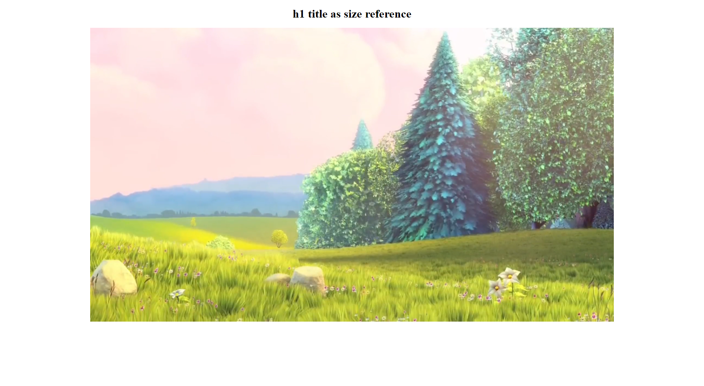

# How to auto-size my player

Let your player grow dynamically with the size of your page

---

A fixed player width and height might not always serve your needs. Sometimes you want your player to grow dynamically with the size of your page. An example of how this can be done can be found below.

```html
<html>
  <head>
    <title>Test page</title>
  </head>
  <body>
    <div style="width: 75%">
      <div style="width: 100%; padding-bottom: 56.25%; position: relative">
        <div data-theo-live-id="<your-channel-id>" style="position: absolute; left: 0; right: 0; top: 0; bottom: 0"></div>
        <script type="text/javascript" src="https://cdn.theo.live/player/embed.js" async></script>
      </div>
    </div>
  </body>
</html>
```

Explanation of the sample piece of code above:

- In our example we have a parent div that will always take 75% of the screen. You can change this to your needs using CSS rules (think about setting a maximum height, using media queries for different device widths, etc.).
- The child div will take up all the space of the parent div (`width: 100%`). The `padding-bottom: 56.25%` allows us to keep the video dimensions: `56.25%` is the value to be used if your video has a 16:9 dimension (9/16 = 0.5625 = 56.25%). You can perform the same calculation if your video has different dimensions.
- The div with the `data-theo-live` attributes has an `absolute` positioning, with `left`, `right`, `top`, `bottom` all being set to 0. This means that it will span the entire size of the relative-positioned parent.

In the screenshots below you can see the video always taking up 75% of the screen and thus applying the auto-sizing rules based on the screen width.




