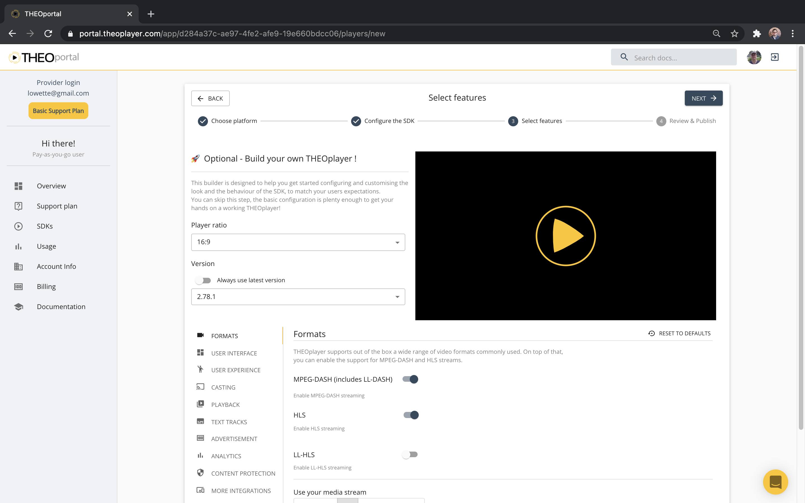
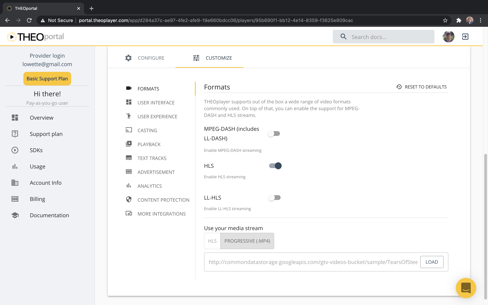

# THEOplayer Features & Modules

The THEOplayer SDK consists of modular features.

When building an SDK (i.e. license), you can specify which features are enabled.
Only a subset of features are enabled by default, such as "HLS", "MPEG-DASH", "UI", "Chromecast", "Airplay", "Ads", and "Text Track Rendering".

This modular approach allows you to optimize the file size of your THEOplayer SDK.

## How do I enable or disable certain features?

You can do this through our [Portal](https://portal.theoplayer.com/).



- If you're creating a new SDK, you can enable (and disable) features.
- If you want to toggle certain features for an existing SDK, you need to navigate to your SDK, update it, and re-publish it.

## My feature isn't working?

Many features sit behind this modular structure. For example, the VR API or Up Next API won't work unless you've enabled the feature when creating your SDK.

## How do I know which features are enabled?

You can log in to [portal.theoplayer.com](https://portal.theoplayer.com/) and navigate to your account.
Once you're there, you further navigate to your desired SDK and check how you've customized your features.



If you're a developer (and you're only interested in this answer for the THEOplayer Web SDK),
then you can also figure this out at runtime through JavaScript.
You can call [`THEOplayer.features`](pathname:///theoplayer/v6/api-reference/web/variables/features.html) to identify which features are enabled.

```js
THEOplayer.features;
// (29) ["dash", "hls", "chromecast", "ads", "airplay", "yospace", "spotx", "vr", "conviva", "cache", "visibility", "webaudio", "youbora", "mediamelon", "moat", "google-dai", "streamone", "v-nova", "freewheel", "agama", "ui", "relatedcontent", "social", "upnext", "contextmenu", "texttrackstyle-ui", "activequalitylabel", "upcomingadnotification"]
```

## How do I quantify my optimizations?

After optimizing your SDK, by enabling and disabling certain features, you might want to quantify those actions.

- You could compare the file size of your THEOplayer.js files. For example, when building THEOplayer 2.78.1, with only the "HLS" and "UI" feature enabled, the library size is 315 kB.
  THEOplayer 2.78.1, with almost all features enabled, is almost 77% larger at 558 kB.
- You could [measure the loading time of your THEOplayer library](https://codesandbox.io/s/github/THEOplayer/samples-web?file=/reference-apps/utility/measure-loading-time/index.html).

Note that optimizing a video player goes way beyond reducing your file size.
As a developer, you could consider [async library loading](https://demo.theoplayer.com/async-library-loading), you could change your [ABR strategy](pathname:///theoplayer/v6/api-reference/web/types/ABRStrategyType.html) (as [demonstrated](https://demo.theoplayer.com/increase-viewer-experience-optimizing-video-abr)),
you want to optimize your [time-to-first-frame](../how-to-guides/09-player/02-how-to-measure-time-to-first-frame.md), and much more!
