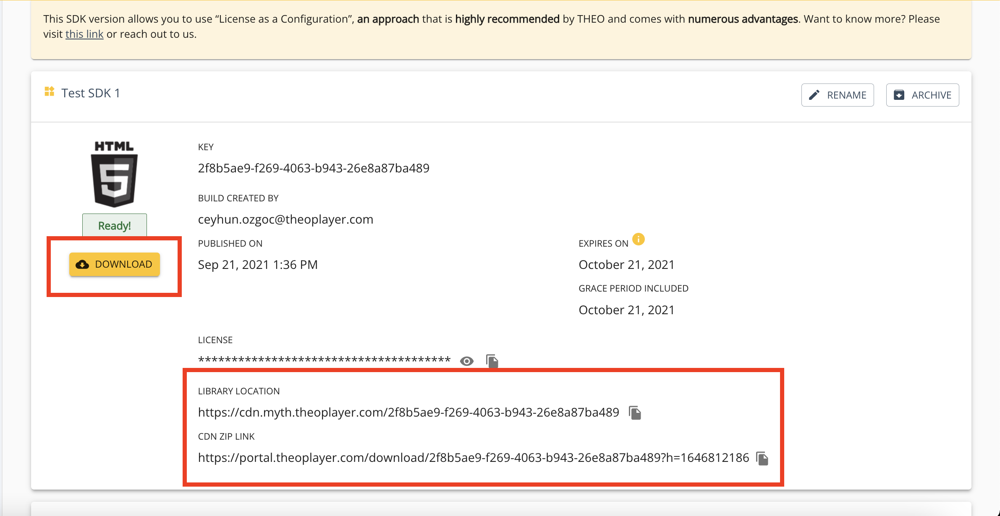
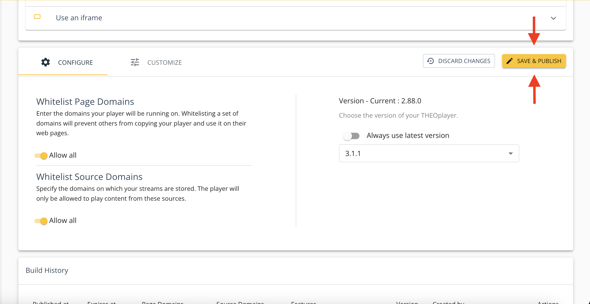

# How to update an SDK?

This how-to guide describes how to update to a new version of the THEOplayer SDK.

:::info

Starting from version 2.79.0, you can make use of License as a Configuration with Web SDK. This allows you to reuse the same library when changing your license. It also allows you to make use of our NPM modules instead of using the THEOplayer zip-file. In order to use this functionality, there is a change needed in your THEOplayer integration. You can read more about this [here](../../how-to-guides/12-license/00-introduction.md).

We highly recommend using this new license system due to all the advantages it brings.

:::

## Update Web SDK

Typically, next to using [NPM](https://www.npmjs.com/package/theoplayer), you grab a CDN URL or a downloadable ZIP file through [https://portal.theoplayer.com](https://portal.theoplayer.com), which gives you access to URLs like those below:

- LIBRARY LOCATION: `https://cdn.myth.theoplayer.com/<license-key>/`
- CDN ZIP LINK: `https://portal.theoplayer.com/download/<license-key>?h=1643658986`

Configuring THEOplayer through the "Library Location" implies a **cloud-hosted (CDN)** approach.
Downloading (and configuring) the ZIP (or using NPM) implies a **self-hosted (ZIP file)** approach.

### 1. Cloud-hosted

Every SDK that you create through [https://portal.theoplayer.com/](https://portal.theoplayer.com/) is associated with a specific THEOplayer version.
When you're doing cloud hosting, you're referring to THEOplayer's CDN to load the relevant JavaScript, for example `https://cdn.myth.theoplayer.com/<license-key>/THEOplayer.js`.

To change the version of this specific SDK, you use the GUI at [https://portal.theoplayer.com/](https://portal.theoplayer.com/) to change it to a different version,
and hit the "Save & Publish" button after making your changes. Your video player will now automatically start using this new version, but do note that the CDN and browser cache might still be referring to your older version for a little while. If your browser is still not fetching the new JS libraries, try hard refreshing your browser tab first.

### 2. Self-hosted

Alternatively, you could extract the included zip file and host the library yourself.

In this case, the steps are similar to the above steps, but you'll also need to re-download your SDK to grab the new THEOplayer files.

When you extract the ZIP file, you will see the following 'helper files':

- `theoplayer.d.js`
- `theoplayer.e.js`
- `theoplayer.p.js`

It is **important** these files are placed in the **same directory as the core library (THEOplayer.js)**.

**It is crucial to also update the libraryLocation as seen in the snippet above. Not doing will result in playback failure.**

If you're using [THEOplayer through NPM](https://www.npmjs.com/package/theoplayer), then you should replace the version of THEOplayer in your `package.json` file.

## Other SDKs

Updating the iOS SDK, Android SDK and Roku SDK is similar with regards to self-hosting the SDK.

The iOS SDK and Android SDK can also be managed through Cocoapods and Maven respectively. You cannot "cloud host" these SDKs.
