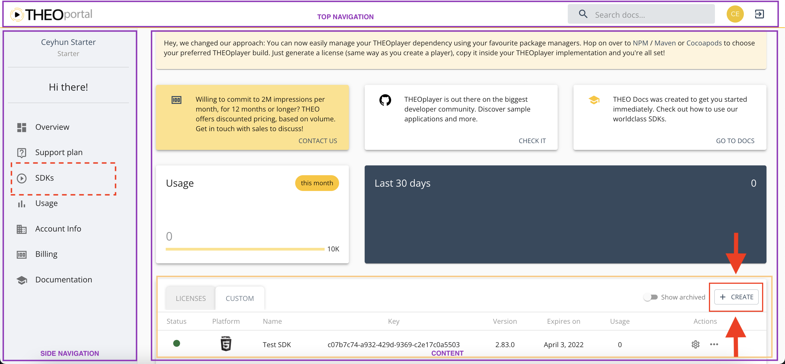
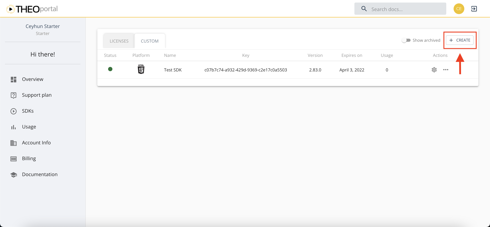
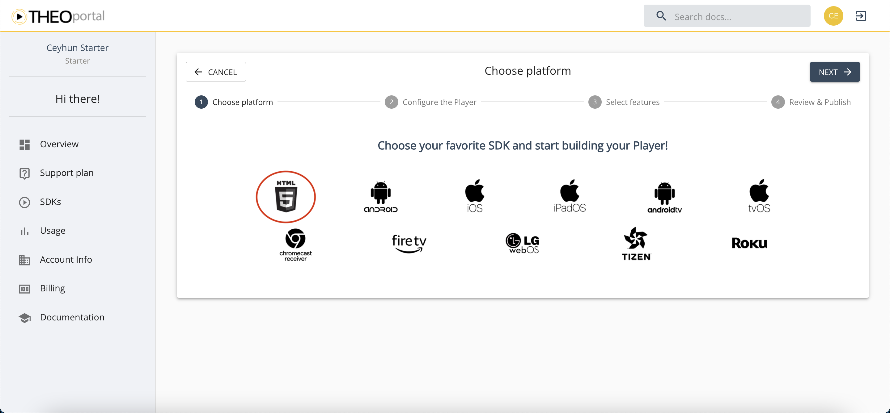
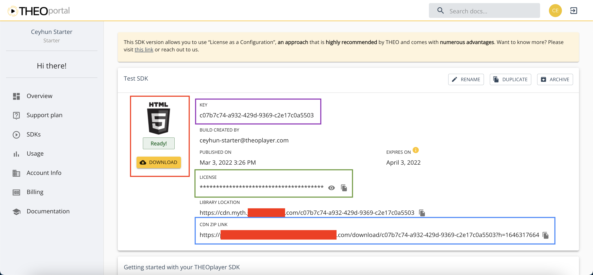
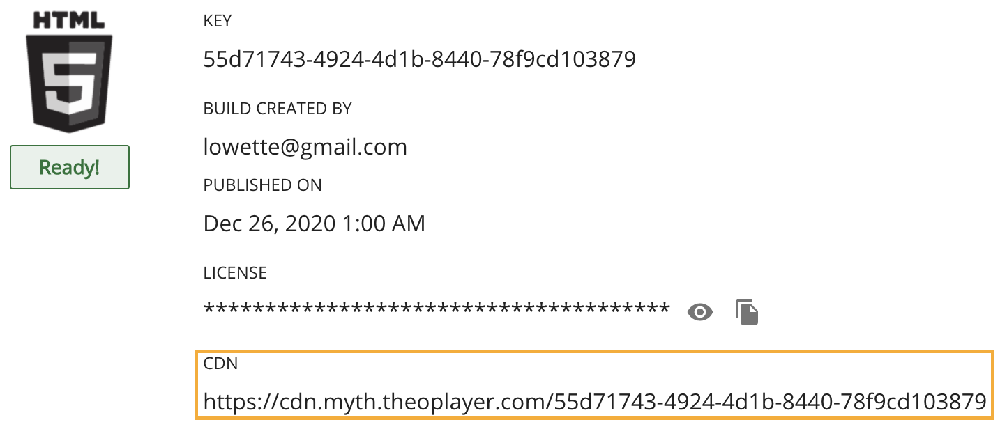
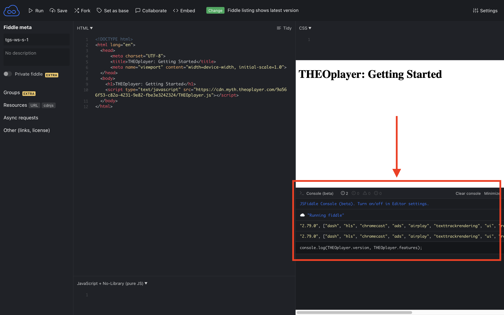
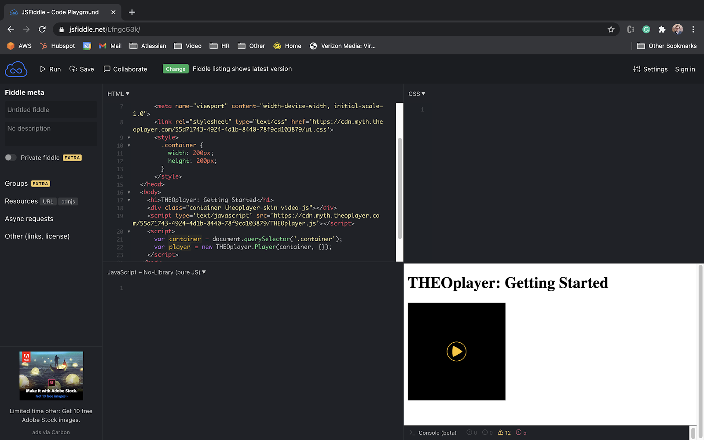
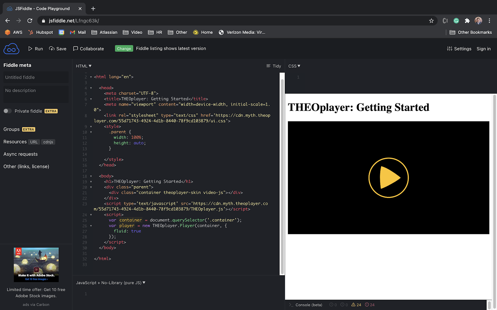
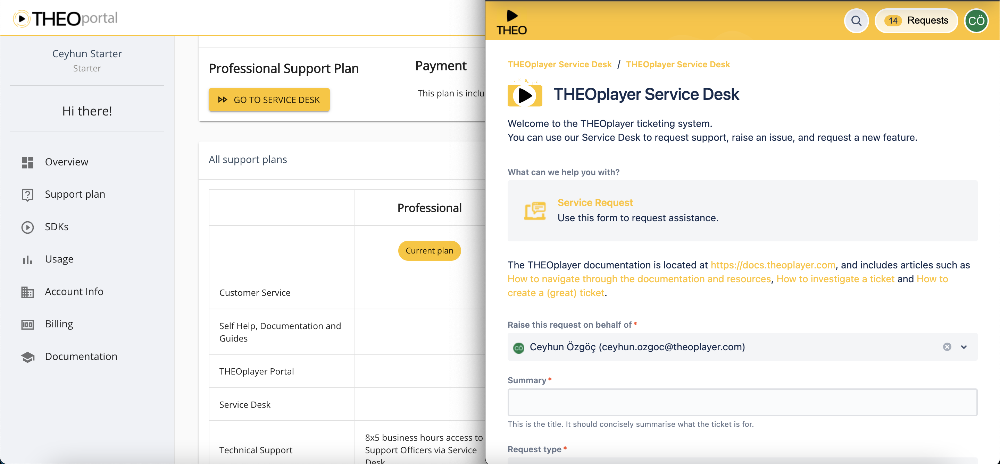

# Getting started on Web (Extended)

This guide explains how to implement the THEOplayer <abbr title="A Software Development Kit (SDK) is a collection of (software) libraries. Often, you use an API to interact with an SDK.">SDK</abbr> in a web application.
The THEOplayer Web SDK is a video player which adds support for adaptive video streaming protocols such as <abbr title="HTTP Live Streaming is an adapative video streaming protocol maintained by Apple.">HLS</abbr> and <abbr title="MPEG-DASH is an adaptive video streaming protocol maintained by DASH-IF.">MPEG-DASH</abbr> to your website or web app.
You can complete this guide within 10 minutes, but we recommend you to take your time.

<div style="background: #f7f7f7; padding: 5px 10px 5px 10px; border-radius: 5px 5px; margin-bottom: 20px;">
    <p style="margin-bottom: 10px;"><span class="material-icons" style="font-size: 1em; position: relative; top: 2px;">info</span> NPM</p>
    <p>THEOplayer v2.82.0 and above can be managed through NPM. Refer to <a href="https://www.npmjs.com/package/theoplayer" target="_blank">https://www.npmjs.com/package/theoplayer</a> for more information.</p>
</div>

Here's what you'll do:

- Create and configure a THEOplayer Web SDK
- Include an SDK in a development environment
- Configure a video player and play a video stream

You'll work towards implementing and understanding the following code in nine steps.
This code includes the THEOplayer SDK in an HTML page and configures a video player.

```html{numberLines: true}
<!DOCTYPE html>
<html lang="en">
  <head>
      <meta charset="UTF-8">
      <title>THEOplayer Web SDK: Getting Started</title>
      <meta name="viewport" content="width=device-width, initial-scale=1.0">
      <link rel="stylesheet" type="text/css" href="SDK-LIBRARY-LOCATION/ui.css">
  </head>
  <body>
    <div class="theoplayer-container theoplayer-skin video-js vjs-16-9"></div>
    <script type="text/javascript" src="SDK-LIBRARY-LOCATION/THEOplayer.js"></script>
    <script>
      var element = document.querySelector(".theoplayer-container");
      var player = new THEOplayer.Player(element, {
        libraryLocation : "SDK-LIBRARY-LOCATION",
        license: "YOUR-LICENSE"
      });
      player.source = {
        sources : [{
          src : "https://cdn.theoplayer.com/video/elephants-dream/playlist.m3u8",
          type : "application/x-mpegurl"
        }]
      };
    </script>
  </body>
</html>
```

Note that copy-pasting the above code in a development environment won't give you a valid video player, because its license (i.e. `YOUR-LICENSE`) and library location (i.e. `SDK-LIBRARY-LOCATION`) contain invalid placeholder values.
This guide tackles how to address an invalid license, for example by changing the included JavaScript and CSS libraries, `libraryLocation` and `license`.

## Create an SDK

This section explains how you create a THEOplayer SDK at <a href="https://portal.theoplayer.com" target="_blank">https://portal.theoplayer.com</a>, which is the THEOplayer Developer Portal.

<div style="background: #f7f7f7; padding: 5px 10px 5px 10px; border-radius: 5px 5px; margin-bottom: 20px;">
    <p style="margin-bottom: 10px;"><span class="material-icons" style="font-size: 1em; position: relative; top: 2px;">info</span> This section may be optional to you.</p>
    <ul style="padding-left: 0; color: #344a5e; margin-bottom: 0; font-size: 0.9em;">
    <li>Skip to "<a href="#include-an-sdk">Include an SDK</a>" if you already have an SDK.</li>
    <li>Skip to "<a href="#locate-sdks-and-initiate-sdk-creation">Locate SDKs and initiate SDK creation</a>" if you are signed in to the Portal, but do not know how to create an SDK.</li>
    </ul>
</div>

You create a Web SDK through the following steps on the Portal:

1. [Register and sign in](#register-and-sign-in)
2. [Locate SDKs and initiate SDK creation](#locate-sdks-and-initiate-sdk-creation)
3. [Build, configure and publish SDK](#build-configure-and-publish-sdk)

### Register and sign in

You register with your Github or Google account through the <a href="https://portal.theoplayer.com/login" target="_blank">sign-in page</a>, or complete the <a href="https://portal.theoplayer.com/register" target="_blank">signup form</a>.
You sign in with your Github or Google account, or with your credentials, through the sign-in page.

### Locate SDKs and initiate SDK creation

The THEOplayer Developer Portal is a dashboard with a <span style="border: 2px solid purple; padding: 1px">top navigation</span> panel, a <span style="border: 2px solid purple; padding: 1px">side navigation</span> panel and a <span style="border: 2px solid purple; padding: 1px">content panel</span>, as shown in the screenshot below.
The content panel contains multiple sub-panels, with one of them being the <span style="border: 2px solid #e6b000; padding: 1px">SDKs</span> panel.
Click the <span style="border: 2px solid red; padding: 1px">Create</span> button in the SDKs panel, as annotated with a red arrow in the following screenshot.



Alternatively, you create an SDK through the SDKs page.

- You click the <span style="border: 2px dashed red; padding: 1px;">SDKs</span> item in the side navigation panel (annotated with a dashed red rectangle in the screenshot above) to navigate to the overview of your existing SDKs.
- The content panel of the SDKs page presents action buttons. Click the <span style="border: 2px solid red; padding: 1px;">Create</span> button to initiate the SDK creation process, as highlighted in the screenshot below.



### Build, configure and publish SDK

Building your Web SDK involves four steps.

1. Choose platform – Select the HTML5 icon highlighted with the red circle in the following screenshot. HTML5 applications (i.e. websites, progressive web apps) use the THEOplayer Web SDK.
2. Configure SDK – Name the SDK and configure your domain whitelisting settings. The latter allows your SDK to only function for some websites and/or streams.
3. Select features – Enable certain features (e.g. HLS advertising) and disable others (e.g. Chromecast). You can also change the default colors of your player, and the setup of certain integrations.
4. Review and publish – Validate your configuration and click "Publish", or go back.



After you complete the fourth step, "Review and Publish", it'll take the portal a couple of minutes to generate your unique SDK.
Once you see the <span style="border: 2px solid red; padding: 1px;">Ready!</span> button, as the screenshot below highlights with the red rectangle, you know that your SDK is available.


In the next section, you'll learn the importance of the <span style="border: 2px solid purple; padding: 1px;">"KEY"</span>, <span style="border: 2px solid green; padding: 1px;">"LICENSE"</span> and <span style="border: 2px solid #1868ff; padding: 1px;">"CDN"</span> values in the above screenshot, and how it relates to including an SDK and initializing a video player.

## Include an SDK

This section explains how you include the THEOplayer Web SDK in a development environment.

The code snippet below represents "step-0", and is your starting point. This snippet is a near-empty HTML5 page. You will expand this snippet throughout the next sections through a total of nine steps.

```html{numberLines: true}
<!DOCTYPE html>
<html lang="en">
  <head>
      <meta charset="UTF-8">
      <title>THEOplayer Web SDK: Getting Started</title>
      <meta name="viewport" content="width=device-width, initial-scale=1.0">
  </head>
  <body>
     <h1>THEOplayer Web SDK: Getting Started</h1>
  </body>
</html>
```

Throughout this guide, you may copy-paste code snippets into your own development environment.
Owning a development environment can be as simple as opening <a href="https://jsfiddle.net/" target="_blank">https://jsfiddle.net/</a> in a browser tab.
When you copy-paste the snippet above into JSFiddle, it should look similar to the result below.

<iframe class="box-shadow" width="100%" height="300" src="//jsfiddle.net/thijsl/zs39fgj5/1/embedded/result" allowfullscreen="allowfullscreen" allowpaymentrequest frameborder="0"></iframe>

<details><summary style="background: #f7f7f7; padding: 5px 5px 5px 10px; border-radius: 5px 5px;">Setting up a development environment</summary>
<div style="background: #f7f7f7; padding: 5px 10px 5px 10px; border-bottom-right-radius: 5px 5px;">
<p>Consider one of two approaches to set up a development environment.

1. Online. An online development environment runs in your browser. Popular online development environments include <a href="https://jsfiddle.net/" target="_blank">https://jsfiddle.net</a>,
   <a href="http://codepen.io/" target="_blank">http://codepen.io</a>, <a href="http://codesandbox.io" target="_blank">http://codesandbox.io</a>, and <a href="https://repl.it/" target="_blank">https://repl.it</a>.
   Take this approach for rapid testing.
2. Local. A local development environment runs on your own machine. You use the IDE/HTML editor of your choice. We will not discuss setting up a local environment in this guide.
</p></div></details>
<details><summary style="background: #f7f7f7; padding: 5px 5px 5px 10px; border-radius: 5px 5px;">What is in the THEOplayer Web SDK?</summary>
<div style="background: #f7f7f7; padding: 5px 10px 5px 10px; border-bottom-right-radius: 5px 5px;">
<a name="sdkcdn"></a>
The THEOplayer Web SDK is a collection of library files hosted on a web server or CDN.
The THEOplayer Developer Portal hosts these library files automatically on its CDN, as can be seen in the screenshot below.
You can find this view by navigating to your newly created Web SDK.



We use the terms "library location" and "CDN" interchangeably throughout this guide.
During this guide, `SDK-LIBRARY-LOCATION` represents your library location, which is `https://cdn.myth.theoplayer.com/55d71743-4924-4d1b-8440-78f9cd103879` in the screenshot above.

The THEOplayer Web SDK contains the following components:

- a core JavaScript library, which is `THEOplayer.js`. This library is the heart of the THEOplayer SDK.
  - an alternative chromeless core JavaScript library, which is `THEOplayer.chromeless.js`. This library offers the same functionality, but without any of the styling features. Developers use this library instead in advanced use-cases where they want a 100% custom video player skin.
- a CSS stylesheet, which is `ui.css`. This stylesheet skins the default UI of the video player.
- helper files, which are `theoplayer.d.js`, `theoplayer.e.js`, `theoplayer.p.js` and `iframe.html`. These background files have specific tasks, such as extracting and decrypting video files.

Note that when you [configure features for your SDK](#build-configure-and-publish-sdk) at the THEOplayer Developer Portal,
you may impact the above components. For example, if you disable the UI feature, you won't have `THEOplayer.js` and `ui.css`.
Alternatively, when you disable the HLS feature,you won't have the helper files.

</div></details>

<div style="background: #f1d2d2; padding: 5px 10px 5px 10px; border-radius: 5px 5px; color: #721c24; margin-bottom: 20px;" id="library-location-explanation">
    <p style="margin-bottom: 10px;"><span class="material-icons" style="font-size: 1em; position: relative; top: 2px;">warning</span> Throughout this guide, you will often see <code class="language-text">SDK-LIBRARY-LOCATION</code> and <code class="language-text">YOUR-LICENSE</code>:</p>
    <ul style="padding-left: 0; color: #344a5e; margin-bottom: 0; font-size: 0.9em;">
    <li>Change the value of <code class="language-text">SDK-LIBRARY-LOCATION</code> to your actual CDN value. The <span style="border: 2px solid #1868ff; padding: 1px;">blue rectangle</span> in the screenshot below annotates an example <code class="language-text">SDK-LIBRARY-LOCATION</code> value.</li>
    <li>Change the value of <code class="language-text">YOUR-LICENSE</code> to your actual license value. The <span style="border: 2px solid #5a8235; padding: 1px;">green rectangle</span> in the screenshot below annotates an example <code class="language-text">YOUR-LICENSE</code> value.</li>
    </ul>
    <p>Failing to replace these values results in errors as you'll be loading non-existent files.
    Our advice is to copy-paste these two values in a text editor so that you can quickly access them for the remainder of this guide.</p>
    
    <p>The blue rectangle in the above screenshot annotates the <code class="language-text" style="border: 2px solid #1868ff; padding: 1px;">SDK-LIBRARY-LOCATION</code>.
    The green rectangle in the above screenshot annotates <code class="language-text" style="border: 2px solid green; padding: 1px;">YOUR-LICENSE</code>.</p>
</div>

Including the THEOplayer Web SDK involves two steps.

1. [Including the JavaScript](#including-the-javascript)
2. [Including the CSS](#including-the-css)

### Including the JavaScript

You interact with the THEOplayer Web SDK through <abbr title="JavaScript is a programming language made for website development.">JavaScript</abbr>.
To access the library, you need to include the JavaScript library of the THEOplayer Web SDK on your web page.

You include the THEOplayer JavaScript library file, THEOplayer.js, through the `<script>`-tag.

```html{numberLines: true}
<script type="text/javascript" src="SDK-LIBRARY-LOCATION/THEOplayer.js"></script>
```

There are two valid values for `SDK-LIBRARY-LOCATION`:

1. https://cdn.theoplayer.com/dash/theoplayer. This URL points to the generic THEOplayer SDK. This SDK is always the latest version, and contains all possible features.
2. The specified value of <a href="#sdkcdn">"CDN" on your SDK page</a>.

The following code represents step-1, and includes the THEOplayer JavaScript library.

```html{numberLines: true}
<!DOCTYPE html>
<html lang="en">
  <head>
      <meta charset="UTF-8">
      <title>THEOplayer Web SDK: Getting Started</title>
      <meta name="viewport" content="width=device-width, initial-scale=1.0">
  </head>
  <body>
    <h1>THEOplayer Web SDK: Getting Started</h1>
    <script type="text/javascript" src="SDK-LIBRARY-LOCATION/THEOplayer.js"></script>
  </body>
</html>
```

Note that this step by itself doesn't initialize your video player. This step just makes the THEOplayer JavaScript API accessible.

<details><summary style="background: #f7f7f7; padding: 5px 5px 5px 10px; border-radius: 5px 5px;">How to validate that you loaded the JavaScript?</summary>
<div style="background: #f7f7f7; padding: 5px 10px 5px 10px; border-bottom-right-radius: 5px 5px;">
You can validate a successful load of the THEOplayer JavaScript library by typing <code>THEOplayer.version</code> and <code>THEOplayer.features</code> in the developer console of your browser,
as demonstrated in the screenshot below.

</div></details>

### Including the CSS

THEOplayer offers a default skin. You make this default skin accessible by importing the <abbr title="Cascading Style Sheets (CSS) is a markup language which alters the presentation of websites.">CSS</abbr> file representing this skin.
This file is called ui.css, and is located at your library location.

You include the CSS file through the `<link>`-tag.

```html{numberLines: true}
<link rel="stylesheet" type="text/css" href="SDK-LIBRARY-LOCATION/ui.css">
```

The following code represents step-2, and includes the THEOplayer CSS file.

```html{numberLines: true}
<!DOCTYPE html>
<html lang="en">
  <head>
      <meta charset="UTF-8">
      <title>THEOplayer Web SDK: Getting Started</title>
      <meta name="viewport" content="width=device-width, initial-scale=1.0">
      <link rel="stylesheet" type="text/css" href="SDK-LIBRARY-LOCATION/ui.css">
  </head>
  <body>
    <h1>THEOplayer Web SDK: Getting Started</h1>
    <script type="text/javascript" src="SDK-LIBRARY-LOCATION/THEOplayer.js"></script>
  </body>
</html>
```

Note that this step just makes the THEOplayer CSS formatting accessible.
You're not yet leveraging the stylesheet after including it.

The next section, "Configure a video player", explains how to leverage the included JavaScript and CSS files.

## Configure a video player

This section explains how to play a video by leveraging the included THEOplayer Web SDK. You will execute the following steps:

1. [Initialize a video player](#initialize-a-video-player)
2. [Configure a video](#configure-a-video)

### Initialize a video player

This subsection explains how to initialize a THEOplayer video player instance.
You need such an instance because, in the next step, you configure the video stream for this instance.
This subsection goes through the following tasks:

1. How you [create a container](#create-container) through HTML to render a video inside this container later on
2. How you [reference the newly created container](#create-reference) through JavaScript to access the THEOplayer API
3. How you [create a THEOplayer video instance](#create-theoplayer-instance) to associate with a video later on
4. How you [load the default skin](#load-default-skin) to give the video player a default UI
5. How you [configure the library location](#configure-library-location) to load helper files
6. How you [configure your license](#configure-license) to check the validity of the SDK

#### Create container

You load a video player into a container. A container is your video player's “position on the website”,
comparable to how you would position an image.
Other literature may refer to this video container as a video frame or video placeholder.
A `<div>`-element represents this container in HTML.

We set `theoplayer-container` as the initial class name of this `<div>`-element. Setting a class name allows you to configure specific (CSS) styling for your frame, and also allows you to reference the `<div>`-element through JavaScript.

```html{numberLines: true}
<div class="theoplayer-container"></div>
```

The following code represents step-3, and adds the div container to your HTML page.

```html{numberLines: true}
<!DOCTYPE html>
<html lang="en">
  <head>
    <meta charset="UTF-8">
    <title>THEOplayer Web SDK: Getting Started</title>
    <meta name="viewport" content="width=device-width, initial-scale=1.0">
    <link rel="stylesheet" type="text/css" href="SDK-LIBRARY-LOCATION/ui.css">
  </head>
  <body>
    <h1>THEOplayer Web SDK: Getting Started</h1>
    <div class="theoplayer-container"></div>
    <script type="text/javascript" src="SDK-LIBRARY-LOCATION/THEOplayer.js"></script>
  </body>
</html>
```

#### Create reference

You'll now start using JavaScript. Include a JavaScript `<script>`-tag below your `<div>`-element, as this tag allows you to embed JavaScript code.
The snippet below demonstrates how you can use the `document.querySelector` API to store a reference to your `<div>`-element (with the `theoplayer-container` class).

```html{numberLines: true}
<script>
   var container = document.querySelector(".theoplayer-container");
</script>
```

The following code represents step-4, and creates the reference to your `<div>`-element.

```html{numberLines: true}
<!DOCTYPE html>
<html lang="en">
  <head>
    <meta charset="UTF-8">
    <title>THEOplayer Web SDK: Getting Started</title>
    <meta name="viewport" content="width=device-width, initial-scale=1.0">
    <link rel="stylesheet" type="text/css" href="SDK-LIBRARY-LOCATION/ui.css">
  </head>
  <body>
    <h1>THEOplayer Web SDK: Getting Started</h1>
    <div class="theoplayer-container"></div>
    <script type="text/javascript" src="SDK-LIBRARY-LOCATION/THEOplayer.js"></script>
    <script>
      var container = document.querySelector(".theoplayer-container");
    </script>
  </body>
</html>
```

You will use this reference in the next step when creating your THEOplayer instance.

#### Create THEOplayer instance

Create a THEOplayer `"Player"` instance by using the <a href="https://docs.theoplayer.com/api-reference/web/theoplayer.player.md#constructor" target="_blank">THEOplayer constructor API</a>.
This is the first time you'll use the THEOplayer API.
Pass along the reference to your container, and set an empty configuration object `{}`. You will update this configuration in a later step.

The following snippet creates a `"Player"` instance through the THEOplayer constructor API, and stores it in the `player` variable.

```javascript
var player = new THEOplayer.Player(container, {});
```

The following code represents step-5, and creates the initial THEOplayer instance.

```html{numberLines: true}
<!DOCTYPE html>
<html lang="en">
  <head>
    <meta charset="UTF-8">
    <title>THEOplayer Web SDK: Getting Started</title>
    <meta name="viewport" content="width=device-width, initial-scale=1.0">
    <link rel="stylesheet" type="text/css" href="SDK-LIBRARY-LOCATION/ui.css">
  </head>
  <body>
    <h1>THEOplayer Web SDK: Getting Started</h1>
    <div class="theoplayer-container"></div>
    <script type="text/javascript" src="SDK-LIBRARY-LOCATION/THEOplayer.js"></script>
    <script>
      var container = document.querySelector(".theoplayer-container");
      var player = new THEOplayer.Player(container, {});
    </script>
  </body>
</html>
```

The widget below demonstrates the output of a similar snippet in JSFiddle.
(Remind yourself to update the value of [`SDK-LIBRARY-LOCATION`](#library-location-explanation) in the above snippet to your actual key value.)

<iframe class="box-shadow" width="100%" height="600" src="//jsfiddle.net/georgechoustoulakis/uymLn9vj/50/embedded/result/" allowfullscreen="allowfullscreen" allowpaymentrequest frameborder="0"></iframe>

You currently have a THEOplayer instance, but the styling is off. You'll fix this by loading the default skin.

#### Load default skin

The THEOplayer CSS file offers CSS classes which add default styling to your container.
You leverage these classes by adding `theoplayer-skin` and `video-js` to the class-attribute of your container.
Furthermore, add `vjs-16-9` to the class-attribute to make your container respect the 16:9 aspect ratio.
(16:9 is the most popular video aspect ratio.)
If you do not set a size (e.g. through the `vjs-16-9` class), your container would resize to the dimension of the video frame - something which you probably don't want.

The following code represents step-6, and configures the default skin.

```html{numberLines: true}
<!DOCTYPE html>
<html lang="en">
  <head>
    <meta charset="UTF-8">
    <title>THEOplayer Web SDK: Getting Started</title>
    <meta name="viewport" content="width=device-width, initial-scale=1.0">
    <link rel="stylesheet" type="text/css" href="SDK-LIBRARY-LOCATION/ui.css">
  </head>
  <body>
    <h1>THEOplayer Web SDK: Getting Started</h1>
    <div class="theoplayer-container theoplayer-skin video-js vjs-16-9"></div>
    <script type="text/javascript" src="SDK-LIBRARY-LOCATION/THEOplayer.js"></script>
    <script>
      var container = document.querySelector(".theoplayer-container");
      var player = new THEOplayer.Player(container, {});
    </script>
  </body>
</html>
```

Running this code in your developer environment gives you the first visual preview of what is to come.
The following widget demonstrates a modified snippet in JSFiddle.

<iframe class="box-shadow" width="100%" height="600" src="//jsfiddle.net/georgechoustoulakis/23yuvcjp/3/embedded/result/" allowfullscreen="allowfullscreen" allowpaymentrequest frameborder="0"></iframe>

<details><summary style="background: #f7f7f7; padding: 5px 5px 5px 10px; border-radius: 5px 5px;">Setting the size of the container</summary>
<div style="background: #f7f7f7; padding: 5px 10px 5px 10px; border-bottom-right-radius: 5px 5px;">
There are other approaches to setting the size of your container instead of using <code class="language-text">vjs-16-9</code>.
For example, you could omit the <code class="language-text">vjs-16-9</code> class, and instead configure the width and height of container class through CSS,
as demonstrated in the screenshot below.

Alternatively, you set your container to be responsive to its parent node by setting your configuration to <code class="language-text">"fluid: true"</code>,
as demonstrated by the following screenshot.

There is no wrong or right. It's up to you to decide which approach is best for your use-case.
</div></details>

<div style="background: #f7f7f7; padding: 5px 10px 5px 10px; border-radius: 5px 5px; margin-bottom: 20px;">
    <p style="margin-bottom: 10px;"><span class="material-icons" style="font-size: 1em; position: relative; top: 2px;">info</span> Video.js</p>
    <p style="margin-bottom: 5px;">THEOplayer uses a modified version of Video.js v5 for its default styling.
       You can leverage Video.js APIs to customize your video player.
     <!--  (e.g. <a href="https://demo.theoplayer.com/adding-buttons-text-overlay-to-theoplayer" target="_blank">insert a custom button</a>)--></p>
</div>

#### Configure library location

You configure the library location of your player instance because the SDK needs to fetch helper files from this location.
Having these helper files may be mandatory for your video streams. For example, your HLS streams won't work if you misconfigure the library location.

Until this step, you were configuring an empty player configuration object `{}` as the second parameter of your `new THEOplayer.Player` constructor.

```javascript{numberLines: true}
var player = new THEOplayer.Player(container, {});
```

You configure the library location by setting `libraryLocation` as a key of this configuration object, and your actual library location as its value.
A quick reminder: your library location is the same as the <a href="#sdk-cdn.png">CDN value on your SDK page</a>.
The snippet below configures a library location - albeit an illegal one, due to [`SDK-LIBRARY-LOCATION`](#library-location-explanation) not being a valid URL.

```javascript
var player = new THEOplayer.Player(container, {
  libraryLocation: "SDK-LIBRARY-LOCATION"
});
```

The following code represents step-7, and sets your `libraryLocation`.

```html{numberLines: true}
<!DOCTYPE html>
<html lang="en">
  <head>
    <meta charset="UTF-8">
    <title>THEOplayer Web SDK: Getting Started</title>
    <meta name="viewport" content="width=device-width, initial-scale=1.0">
    <link rel="stylesheet" type="text/css" href="SDK-LIBRARY-LOCATION/ui.css">
  </head>
  <body>
    <h1>THEOplayer Web SDK: Getting Started</h1>
    <div class="theoplayer-container theoplayer-skin video-js vjs-16-9"></div>
    <script type="text/javascript" src="SDK-LIBRARY-LOCATION/THEOplayer.js"></script>
    <script>
      var container = document.querySelector(".theoplayer-container");
      var player = new THEOplayer.Player(container, {
        libraryLocation: "SDK-LIBRARY-LOCATION"
      });
    </script>
  </body>
</html>
```

You can also configure other flags in the player configuration object besides the `libraryLocation`.
For example, in the next section, you'll configure the license through this configuration object.

#### Configure license

Every SDK you build through the THEOplayer Developer Portal has a unique license.
This license contains information about the validity of your SDK, such as the whitelisted domains.

You set your license through the license key of your player configuration object.
If you don't set your license, you won't be able to authenticate your license with the SDK.
This authentication is important for a number of use-cases, such as remotely configuring your whitelisted domains.

The green rectangle in the following screenshot points out where you find the value of your <span style="border: 2px solid green; padding: 1px;">license</span> on the page of your SDK.


The following code represents step-8, and sets your `license`.

```html{numberLines: true}
<!DOCTYPE html>
<html lang="en">
  <head>
    <meta charset="UTF-8">
    <title>THEOplayer Web SDK: Getting Started</title>
    <meta name="viewport" content="width=device-width, initial-scale=1.0">
    <link rel="stylesheet" type="text/css" href="SDK-LIBRARY-LOCATION/ui.css">
  </head>
  <body>
    <h1>THEOplayer Web SDK: Getting Started</h1>
    <div class="theoplayer-container theoplayer-skin video-js vjs-16-9"></div>
    <script type="text/javascript" src="SDK-LIBRARY-LOCATION/THEOplayer.js"></script>
    <script>
      var container = document.querySelector(".theoplayer-container");
      var player = new THEOplayer.Player(container, {
        libraryLocation: "SDK-LIBRARY-LOCATION",
        license: "YOUR-LICENSE"
      });
    </script>
  </body>
</html>
```

Correct the values of [`SDK-LIBRARY-LOCATION`](#library-location-explanation) and [`YOUR-LICENSE`](#library-location-explanation) in the above snippet, and paste it into your development environment.
(You might notice that the `"The baked-in license is used. Please update the configuration with your license."` warning in your console is now gone.)

Clicking the big play button won't do anything, because you still need to associate a video stream with your video player instance.

## Configure a video

Configuring the video source of your video player is the last crucial step of this guide.
You use the <a href="https://docs.theoplayer.com/api-reference/web/theoplayer.chromelessplayer.md#source" target="_blank"><code class="language-text">source</code></a> property of your `player` instance to configure a video.
The snippet below exemplifies how you could configure an HLS stream through `player.source`.

```javascript
player.source = {
  sources: [
    {
      src: "https://cdn.theoplayer.com/video/elephants-dream/playlist.m3u8",
      type: "application/x-mpegurl"
    }
  ]
};
```

Let's break down the above snippet.

1. You specify an object when using the `source` property.
2. Inside this object, the sources key represents your video stream(s), and holds a list of sources.
3. You define at least one source object in this list, and you configure its `src` and `type` property.
   1. Note that other items in this list are an alternative representation of your stream. For example, when configuring [DRM](#drm),
      you want to provide an HLS and an MPEG-DASH representation of your stream.
      This list does not grant you the capability to configure a playlist of streams which play in sequence.
4. The value of the `src` property is the URL of your (HLS or MPEG-DASH) stream.
5. The value of the `type `property is the MIME type of your (HLS or MPEG-DASH) stream.
   1. The MIME type of an HLS stream is `application/x-mpegurl`.
   2. The MIME type of an MPEG-DASH stream is `application/dash+xml`.

In an alternative code example, you configure an MPEG-DASH stream by changing the type to its appropriate MIME type, and by setting the URL of an MPEG-DASH manifest as the `src`.
The following snippet demonstrates this for MPEG-DASH.

```javascript
player.source = {
  sources: [
    {
      src: "//amssamples.streaming.mediaservices.windows.net/634cd01c-6822-4630-8444-8dd6279f94c6/CaminandesLlamaDrama4K.ism/manifest(format=mpd-time-csf)",
      type: "application/dash+xml"
    }
  ]
};
```

The following code represents step-9, and configures an HLS stream.

```html{numberLines: true}
<!DOCTYPE html>
<html lang="en">
  <head>
    <meta charset="UTF-8">
    <title>THEOplayer Web SDK: Getting Started</title>
    <meta name="viewport" content="width=device-width, initial-scale=1.0">
    <link rel="stylesheet" type="text/css" href="SDK-LIBRARY-LOCATION/ui.css">
  </head>
  <body>
    <h1>THEOplayer Web SDK: Getting Started</h1>
    <div class="theoplayer-container theoplayer-skin video-js vjs-16-9"></div>
    <script type="text/javascript" src="SDK-LIBRARY-LOCATION/THEOplayer.js"></script>
    <script>
      var container = document.querySelector(".theoplayer-container");
      var player = new THEOplayer.Player(container, {
        libraryLocation: "SDK-LIBRARY-LOCATION",
        license: "YOUR-LICENSE"
      });
      player.source = {
        sources: [{
          src: "https://cdn.theoplayer.com/video/elephants-dream/playlist.m3u8",
          type: "application/x-mpegurl"
        }]
      };
    </script>
  </body>
</html>
```

If you paste the snippet above into your development environment, and update the value of [`SDK-LIBRARY-LOCATION`](#library-location-explanation) and [`YOUR-LICENSE`](#library-location-explanation), you should be able to click the big play button.
The following widget demonstrates a successful configuration.

<iframe class="box-shadow" width="100%" height="600" src="//jsfiddle.net/georgechoustoulakis/21fphaqL/5/embedded/result,html/" allowfullscreen="allowfullscreen" allowpaymentrequest frameborder="0"></iframe>

<p><strong>Congratulations! 🎉 You now know how build a THEOplayer SDK, include it on your web page, configure a video player and play a stream.</strong><br />
Go through the next section to learn more about THEOplayer, its API, and some use-cases.</p>

## Bonus: next steps

Building, loading and configuring your first THEOplayer is a great start.
Next, you'll want to explore the following topics:

- [API](#api) (because you want to understand how to access and manipulate THEOplayer for your use-case)
- [UI](#ui) (because you want to customize the look and feel of your video player)
- [DRM](#drm) (because you want to protect your content with FairPlay, Widevine and PlayReady)
- [Advertising](#advertising) (because you want to monetize your content with client-side or server-side ads)
- [Analytics](#analytics) (because you want to track the performance of your video experience)
- [Frameworks](#frameworks) (because you're integrating THEOplayer in popular frameworks such as React or Angular)
- [Support](#support) (because you're stuck on something and need help from our team)

You'll also want to get familiar with the following resources:

- <a href="https://docs.theoplayer.com" target="_blank">https://docs.theoplayer.com</a>: documentation portal — use this to find documentation
  - <a href="https://docs.theoplayer.com/api-reference/web/theoplayer.md" target="_blank">https://docs.theoplayer.com/api-reference/web/theoplayer.md</a>: API Reference
- <a href="https://github.com/THEOplayer" target="_blank">https://github.com/THEOplayer</a>: Github — use this to find code samples
  - <a href="https://github.com/THEOplayer/samples-html5-sdk" target="_blank">https://github.com/THEOplayer/samples-html5-sdk</a>: samples
    - <a href="https://codesandbox.io/s/github/THEOplayer/samples-web" target="_blank">https://codesandbox.io/s/github/THEOplayer/samples-web</a>: code preview of the above repository
- <a href="https://www.theoplayer.com" target="_blank">https://www.theoplayer.com</a>: homepage — use this to find demos and product information
  - <a href="https://www.theoplayer.com/theoplayer-demo-overview" target="_blank">https://www.theoplayer.com/theoplayer-demo-overview </a>: demos
  - <a href="https://www.theoplayer.com/test-your-stream-hls-dash-hesp" target="_blank">https://www.theoplayer.com/test-your-stream-hls-dash-hesp</a>: stream tester
- <a href="https://www.theoplayer.com/blog" target="_blank">https://www.theoplayer.com/blog</a>: blog
- <a href="https://portal.theoplayer.com" target="_blank">https://portal.theoplayer.com</a>: developer portal — use this to manage your SDKs and monitor usage

### API

The API reference of the THEOplayer Web SDK is available at <a href="https://docs.theoplayer.com/api-reference/web/theoplayer.md" target="_blank">https://docs.theoplayer.com/api-reference/web/theoplayer.md</a>.
The API is also widely referred to in our guides at <a href="https://docs.theoplayer.com/" target="_blank">https://docs.theoplayer.com</a>.
The JavaScript API offers the following:

- Constructors (e.g. `var player = new THEOplayer.Player(..)`)
- Methods (e.g. `player.play()`)
  - Event listeners (e.g. `player.addEventListener(‘play', console.log)`)
- Getters (e.g. `player.muted`) and setters (e.g. `player.muted = true`)

The top-level interface is the <a href="https://docs.theoplayer.com/api-reference/web/theoplayer.chromelessplayer.md" target="_blank">Player API</a>.
A <a href="https://docs.theoplayer.com/api-reference/web/theoplayer.playereventmap.md" target="_blank">map of events</a> is available in the Player API,
such as the `playing` and `volumechange` event.

<details><summary style="background: #f7f7f7; padding: 5px 5px 5px 10px; border-radius: 5px 5px;">HTML5 MediaElement interface</summary>
<div style="background: #f7f7f7; padding: 5px 10px 5px 10px; border-bottom-right-radius: 5px 5px;">
The THEOplayer interface mimics the <a href="https://developer.mozilla.org/en-US/docs/Web/API/HTMLMediaElement" target="_blank">HTML5 MediaElement interface</a>. All commonly used properties,
functions and events are available, allowing you to replace a standard HTML5 video element with THEOplayer.
For more advanced features, it might be needed to use THEOplayer specific APIs.
</div></details>

Let's explain four popular features of the THEOplayer API.

1. [Autoplay](#autoplay) – the stream should start playing automatically (if the browser allows it)
2. [Poster](#poster) – the stream should show a poster image before playback starts
3. [Preload](#preload) – the stream should preload some data to reduce the buffering time when the viewer requests playback
4. [Quality Startup](#quality-startup) – the stream should start playing in the highest quality

#### Autoplay

You add support for autoplay by setting <a href="https://docs.theoplayer.com/api-reference/web/theoplayer.mutedautoplayconfiguration.md" target="_blank"><code class="language-text">player.autoplay = true</code></a>.
Additionally, we set <a href="https://docs.theoplayer.com/api-reference/web/theoplayer.mutedautoplayconfiguration.md" target="_blank"><code class="language-text">mutedAutoplay: "all"</code></a> in the player configuration, to <a href="https://docs.theoplayer.com/faq/02-how-to-combat-autoplay-policies.md" target="_blank">combat autoplay policies</a>.
Combating autoplay policies through `mutedAutoplay: "all"` means: doing muted autoplay when unmuted autoplay isn't permitted.
The following snippet adds support for the described autoplay.

```javascript
var player = new THEOplayer.Player(container, {
  libraryLocation: "SDK-LIBRARY-LOCATION",
  license: "YOUR-LICENSE",
  mutedAutoplay: "all"
});
player.autoplay = true;
player.source = {
  sources: [
    {
      src: "https://cdn.theoplayer.com/video/elephants-dream/playlist.m3u8",
      type: "application/x-mpegurl"
    }
  ]
};
```

Setting `autoplay` to `false` means that autoplay is disabled.

#### Poster

A poster is the image which is shown in your video player before the video is playing.
You configure the `poster` property of the `player.source` by pointing it to an image.

```javascript
player.source = {
  sources: [
    {
      src: "https://cdn.theoplayer.com/video/elephants-dream/playlist.m3u8",
      type: "application/x-mpegurl"
    }
  ],
  poster: "https://cdn.theoplayer.com/video/elephants-dream.png"
};
```

THEOplayer shows a black background if you don't set a poster or preload.

#### Preload

Preloading a stream means: downloading some data from that stream in advance,
which in turns reduces the waiting time for your viewers when they click play.

You enable preloading by setting `player.preload = "auto"`.

```javascript
player.preload = "auto";
player.source = {
  sources: [
    {
      src: "https://cdn.theoplayer.com/video/elephants-dream/playlist.m3u8",
      type: "application/x-mpegurl"
    }
  ]
};
```

<a href="https://docs.theoplayer.com/api-reference/web/theoplayer.preloadtype.md" target="_blank">Other valid preload values</a> are:

- `"metadata"` (which fetches some metadata, like its duration, but no actual segments)
- `"none"` (which explicitly disables all forms of preloading)

#### Quality Startup

An adaptive video stream consists of multiple video qualities. This is core concept of HTTP video streaming, and allows
a video player to adapt to any internet speed, device and screen size. When doing video startup, there is a trade-off
between the quality and the speed. For example, starting in a higher quality means spending more time downloading the initial data
compared to starting in the lowest quality.

You let the video instance start in the highest video quality by setting `player.abr.strategy = {type: "quality"}`.

```javascript
player.abr.strategy = { type: "quality" };
player.source = {
  sources: [
    {
      src: "https://cdn.theoplayer.com/video/elephants-dream/playlist.m3u8",
      type: "application/x-mpegurl"
    }
  ]
};
```

Other valid values for type are <a href="https://docs.theoplayer.com/api-reference/web/theoplayer.abrstrategytype.md#abrstrategytype-type" target="_blank"><code class="language-text">performance</code> and <code class="language-text">bandwidth</code></a>.

- `Performance` makes sense if you want your video to start as fast as possible, because it'll do startup with the lowest video quality.
- `Bandwidth` is the default value and uses historical data to find an optimal ABR strategy.

### UI

You might want to change the appearance and behavior of your video player. There are two approaches:

1. You alter the default skin
2. You create a brand new skin

#### Alter default skin

THEOplayer uses a variation of the Video.js v5 skin. This skin is responsive, thus scaling correctly on any device and viewport.

If you want to change the color scheme of the default skin, you can use the skin editor on the THEOplayer Developer Portal.
This editor generates CSS which you can include in your web application.
The following video demonstrates how you use this tool in combination with step-9.

<div style="position:relative;padding-bottom:56.25%;margin-bottom:20px;">
<iframe src="https://cdn.theoplayer.com/demos/getting-started/web-sdk/portal.html" title="Embedded THEOplayer" frameborder="0" scrolling="no" width="100%" height="100%" style="width:100%;height:100%;position:absolute;left:0;top:0;" allow="accelerometer; autoplay; encrypted-media; fullscreen; gyroscope; picture-in-picture" allowfullscreen=""></iframe>
</div>

You can also change the appearance of buttons in the default UI, add overlays and insert new elements.
Consider the following resources for more information:

<!-- * <a href="https://demo.theoplayer.com/adding-buttons-text-overlay-to-theoplayer" target="_blank">Adding buttons and text to the default UI</a>-->

- <a href="https://docs.theoplayer.com/how-to-guides/11-ui/00-introduction.md" target="_blank">Common UI-related inquiries</a>

#### Create new skin

You are given the option to create a new skin through the Chromeless API.
The article on "<a href="https://docs.theoplayer.com/how-to-guides/11-ui/06-how-to-build-chromeless-ui.md" target="_blank">How to build a Chromeless UI</a>" helps you understand how to approach this.
Some quick notes:

- You'll include the Chromeless library through `SDK-LIBRARY-LOCATION/THEOplayer.chromeless.js` instead of `SDK-LIBRARY-LOCATION/THEOplayer.js`.
- You'll use the Chromeless constructor `new THEOplayer.ChromelessPlayer` instead of the Chromeful constructor `new THEOplayer.Player`.
- You no longer need to include the CSS file at `SDK-LIBRARY-LOCATION/ui.css` (because you'll need to create your own CSS).
- You are responsible for building the entire UI and UX by leveraging the THEOplayer API as your building blocks.
  For example, you need to insert your own play button, and connect it with the `player.play()` API, through a combination of JavaScript/CSS/HTML.

<details><summary style="background: #f7f7f7; padding: 5px 5px 5px 10px; border-radius: 5px 5px;">When to go Chromeless?</summary>
<div style="background: #f7f7f7; padding: 5px 10px 5px 10px; border-bottom-right-radius: 5px 5px;">
You decide whether you want to modify the existing UI or build a new one. As a rule of thumb: go Chromeless...
… if you need to implement a strict design which looks "really different" from THEOplayer's default skin;
… if you are spending more time "hacking and reverse-engineering" the default skin, than actually making progress with the implementation of your design.
</div></details>

### DRM

Digital Rights Management (DRM in short) is a technology which adds a layer of security to your videos.
Most of the time, configuring DRM means configuring Widevine, FairPlay and PlayReady.
Check our <a href="https://docs.portal.theoplayer.com/how-to-guides/04-drm/00-introduction.md" target="_blank">introduction on DRM</a> and our <a href="https://github.com/THEOplayer/samples-drm-integration" target="_blank">Github repository on the DRM API</a> to learn more about setting up DRM.

### Advertising

THEOplayer adds support for client-side and server-side advertising.
Refer to our <a href="https://docs.theoplayer.com/how-to-guides/01-ads/00-introduction.md" target="_blank">advertisement guides</a> to get started with concepts such as
<a href="https://docs.theoplayer.com/how-to-guides/01-ads/03-how-to-set-up-vast-and-vmap.md#vast" target="_blank">mid-rolls</a>, <a href="https://docs.theoplayer.com/how-to-guides/01-ads/03-how-to-set-up-vast-and-vmap.md#google-ima" target="_blank">Google IMA</a>,
<a href="https://docs.theoplayer.com/how-to-guides/01-ads/01-block-detection.md" target="_blank">ad block detection</a>, and others.

Let's consider adding support for pre-rolls advertisements as a preview. Pre-roll advertisements play before the main video content.
You add an `ads` key to the `player.source` object. This key holds a list of <a href="https://docs.theoplayer.com/api-reference/web/theoplayer.addescription.md" target="_blank">ad descriptions</a>. Each ad description is an advertisement.
For each ad description, you configure its `sources` property (which is the link to the ad tag) and its `timeOffset` (which is the position of the advertisement).
Set `timeOffset` to `start` to specify that it's a pre-roll. Set the `timeOffset` value to `end` to specify it's a post-roll, or set a timestamp (e.g. "00:00:15") to specify it's a mid-roll.

The snippet below is an altered version of `player.source` in step-9, and configures a pre-roll advertisement.

```javascript
player.source = {
  sources: [
    {
      src: "https://cdn.theoplayer.com/video/elephants-dream/playlist.m3u8",
      type: "application/x-mpegurl"
    }
  ],
  ads: [
    {
      sources: "//cdn.theoplayer.com/demos/preroll.xml",
      timeOffset: "start"
    }
  ]
};
```

You may also find the advertisement tester at <a href="https://www.theoplayer.com/theoplayer-demo-advertisement-tester-vpaid-vast-vmap" target="_blank">https://www.theoplayer.com/theoplayer-demo-advertisement-tester-vpaid-vast-vmap</a> to be useful.

### Analytics

Measuring video performance is a common requirement. Consider any of the following approaches to integrate an analytics service into THEOplayer:

1. Check whether a "connector" for your analytics vendor exists at <a href="https://github.com/THEOplayer" target="_blank">https://github.com/THEOplayer</a>, and, if so, leverage it.
   Connectors are premade integrations, but you can still modify them due to their open-source nature.
2. Check whether a "pre-integration" exists at <a href="https://docs.theoplayer.com/how-to-guides/02-analytics/00-introduction.md" target="_blank">https://docs.theoplayer.com/how-to-guides/02-analytics/00-introduction.md</a>, and, if so, leverage it.
   (Note: we are in the process of refactoring closed-source "pre-integrations" into open-source "connectors".
   Hence, you should prefer connectors over pre-integrations.)
3. Build your own integration by leveraging the THEOplayer API.

### Frameworks

THEOplayer can be integrated in frameworks such as React and Angular.
Check our <a href="https://docs.theoplayer.com/getting-started/02-frameworks/01-angular/00-getting-started.md" target="_blank">getting started guides</a>,
or our <a href="https://github.com/THEOplayer" target="_blank">Github</a>, for examples.

### Support

Our <a href="https://docs.theoplayer.com/" target="_blank">documentation portal</a> contains many answers,
but you might get stuck on something regardless.
You can request technical support through a Standard (or higher) support plan.
Such plans give you access to the THEOplayer Service Desk, where you can ask for help, request features and raise issues.

The following screenshot shows you two windows. The left window shows you where to find the "Support plan" on the THEOplayer Developer Portal.
The right window shows you what Service Desk looks like.



<em>We hope that you enjoyed this Getting Started Guide! <a href="https://github.com/THEOplayer/documentation/issues" target="_blank">Let us know through Github</a> if you know how we could improve this introduction.</em>
